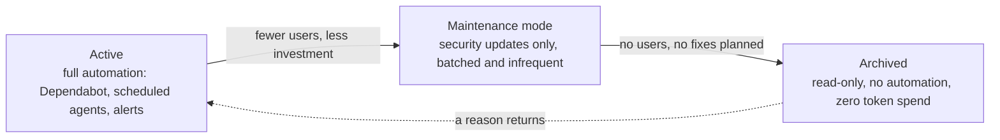

When agents do the maintenance, every repository you keep is a subscription to future work, and the subscription is paid in tokens.
The instinct at scale is to automate harder, Dependabot on everything, a scheduled agent per repository, alerts routed to a bot.
That instinct treats each repository as its own problem, and at fleet scale the fleet itself is the problem.
**Agentic maintenance is fleet management: deciding which repositories deserve work at all, deciding what work they deserve, and reusing every decision across as many repositories as it applies to.**

## Every repository is a standing work order

A repository that sits active in an organization is never neutral.
Its Dependabot config opens version-bump pull requests on a schedule.
Its security alerts accumulate.
Any scheduled agent that sweeps the fleet reads all of it as a backlog.
A repository that humans would quietly ignore, agents cannot, because an agent's correct behavior when pointed at a repository full of signals is to act on them.

When I maintained five repositories, ignoring a dead one cost me a guilty glance once a month.
With fifty, ignoring is no longer possible, because the automation keeps generating work regardless of whether anyone wants it.
The cost is not per decision anymore, it is per repository per unit of time, whether or not anyone looks.
**Adding a repository to the fleet is adding a standing order for future work, and canceling that order is a maintenance task in itself.**

## Automation does not read intent

Dependabot has no strategy.
It does not know that the library it wants to bump was superseded by another one, that the project is in maintenance mode, or that the product behind the repository was deprecated last quarter.
It opens the pull request because a newer version exists, and it will keep opening them until someone makes it stop.
The same is true for every scheduled agent: an agent that finds dependency alerts in a repository treats them as its work queue, because that is what it was told work looks like.

A dependency bump in a repository nobody is investing in is pure waste.
It costs tokens to generate, CI minutes to validate, attention to review, and merge effort, and the value delivered is zero because nobody is deploying the result.
Multiply by the number of dead repositories and the number of updates per year, and the fleet is running a small factory that manufactures unneeded pull requests.
**Bots generate work at a fixed rate per repository, independent of that repository's value, so the value decision has to be made somewhere else, by you, before the bots run.**

## Archiving is the off switch

The cheapest way to stop work on a repository is to [archive it](https://docs.github.com/en/repositories/archiving-a-github-repository/archiving-repositories).
An archived repository becomes read-only: issues, pull requests, and code can no longer be changed, which means Dependabot has nowhere to open its pull requests, alerts have nowhere to be fixed, and scheduled agents have no work to perform.
The archive state is also a legible signal.
GitHub describes it as marking a repository as no longer actively maintained, so bots, agents, and humans all read the same message: no future work here.

I used to think of archiving as an admission of failure, a small funeral for a project.
That framing is what keeps dead repositories alive, because nobody schedules funerals.
When I finally ran this pass over my own fleet, most of the repositories went straight to the archive, and the guilt I had been carrying about them turned out to be a bug in my process, not a flaw in my priorities.
The better framing is mechanical: archiving is the off switch for automated work, and a repository that will not receive maintenance should be switched off.
**A repository that is archived cannot waste tokens, and a repository that is merely neglected wastes them on schedule.**

If the project matters again later, GitHub supports unarchiving, so the downside of a wrong archive decision is small.
The downside of the opposite mistake, keeping a dead repository live, compounds every week the bots keep running.

The lifecycle has three tiers, and the automation should differ on each one:

## Write the policy where the agents will read it

Not everything belongs in the archive, and not everything active deserves full service.
A library with real users but no development might deserve security bumps only, batched monthly.
A template repository might deserve updates once a quarter.
The tier matters only if the machines can read it.

The Dependabot config can encode part of the policy: [version update schedules](https://docs.github.com/en/code-security/how-tos/secure-your-supply-chain/secure-your-dependencies/configure-version-updates) can be set to daily, weekly, or monthly, with per-dependency ignore rules for anything the policy declines.
But the part that matters most to agents lives in the repository's agent instructions, the AGENTS.md layer, because that is the file agents actually obey.
"Dependency pull requests: security alerts only, otherwise close with a pointer to the maintenance policy" is a sentence an agent can execute.
No policy at all is also an instruction, and the instruction it gives is "everything here is worth maintaining".
**An agent faced with an unannotated repository will invent a policy, and the invented policy is always maximum effort.**

## Sweep the portfolio, do not fight per-repository fires

The wrong way to run maintenance agents at scale is one agent per repository on a timer.
That design multiplies cost by the repository count and makes the agent re-learn the same context on every run.
The right granularity is the portfolio sweep: one scheduled run that walks every repository, collects the signals, and produces a ranked list of what deserves action this week.

**The sweep output is a triage report, not a pile of pull requests.**
Agents then get dispatched only at the top of the list, where the value is, and everything below the line gets a note instead of a token budget.
A sweep also sees what per-repository agents cannot: the same change suggested everywhere.

## The same suggestion everywhere is one change

Dependabot does not coordinate across repositories.
It will open the same GitHub Actions version bump in thirty repositories, each one arriving as an independent pull request that looks like independent work.
Read as a pile, that is thirty tasks.
Read as a list, it is one upgrade.
**Aggregating the suggestions before acting on any of them is what turns the pile into a list, and the list is where the economies live.**

The decision is the expensive part, and the decision does not often change per repository.
Deciding whether actions/upload-artifact should move from v3 to v4 costs the same investigation whether you run it once or thirty times: what breaks, which workflows depend on the old behavior, what the migration needs.
The per-repository work is the applying, and applying a decided change is mechanical, cheap, and fully delegable to an agent.
So decide once, write the rationale once, and send the same answer to all thirty pull requests, applying the change in every repository and flagging the few that need an exception.
**The application happens once per repository either way, the saving comes from paying the decision once across all of them.**

A suggestion that keeps returning is also a design signal.
If every repository carries its own copy of the same workflow steps, every upstream action bump becomes thirty pull requests again next quarter, and the decision cost recurs with them.
Move the repeated piece into a shared component, a reusable workflow or a composite action that lives in one repository and is called by all the others, and the next bump happens in one place by construction.
**The best fix for a maintenance task that repeats across the fleet is to stop repeating it, by giving the change exactly one home.**

## Measure maintenance in tokens

Human-scale maintenance was measured in hours, and hours were scarce enough to force triage on their own.
Agentic maintenance is measured in tokens, and tokens are cheap enough that the waste hides until the invoice arrives.
So make the bill visible: track tokens spent per repository per month, alongside how much of that spend produced merged work.

The numbers feed the pruning loop.
A repository that burns a large share of the budget while producing no merges is either misconfigured or dead, and either way the fix is the same conversation: what is this repository for, who uses it, and should it still be in the fleet.
**The token ledger is the portfolio review, and the portfolio review is where the fleet decisions come from: what to keep active, what to demote to maintenance, and what to archive.**

## What to Do Next

1. List every repository you maintain and mark each one with the tier it deserves: active, maintenance mode, or archive.
2. Archive everything in the third bucket today, and turn off its dependency automation before you do.
3. For every repository that stays, write its maintenance policy into its agent instructions: what kinds of updates are wanted, at what cadence, and what should be declined automatically.
4. Replace per-repository scheduled agents with one portfolio sweep that produces a ranked list, and dispatch agents only at the top of the list.
5. Aggregate the open suggestions across repositories before acting on any of them: group identical changes, make the decision once, and apply it everywhere with the same rationale.
6. Centralize the pieces that repeat, such as shared workflows and composite actions, so the next change lands in one place.
7. Track tokens per repository per month, and let the biggest spenders with the fewest merged outcomes lead the next round of archive decisions.

**Maintenance at scale is not a stack of per-repository chores, it is the management of a fleet: admit work deliberately, decide once where the same change repeats, and keep the automation pointed at the repositories that matter.**

## See also

- [Too Many Agent Sessions: Archiving Is Cleanup, Admission Is the Fix](../too-many-agent-sessions-archiving-is-cleanup-admission-is-the-fix/index.md) - the session-list version of the archive decision, where admission control beats cleanup
- [What Needs Updating When Agents Do the Work](../what-needs-updating-when-agents-do-the-work/index.md) - the maintenance loop agents run after a change lands, the machinery this article says to point only at repositories that matter
- [I Specify Open Source Projects I Don't Maintain](../i-specify-open-source-projects-i-dont-maintain/index.md) - a deliberate answer to which upstream work deserves attention, the dependency-side version of portfolio triage
- [Every Decision You Change Pays Once Per File](../every-decision-you-change-pays-once-per-file/index.md) - the same decision-copy economics inside one project, where centralizing a decision is the fix for shotgun-surgery maintenance
- [The Self-Evolving Repository](../the-self-evolving-repository/index.md) - the end state where a repository maintains itself, which only makes sense to build for repositories that earned a place in the fleet
- [The Codebase Gardener](../the-codebase-gardener/index.md) - why maintenance is gardening rather than construction, and why gardens need beds retired, not just watered

## References

- [GitHub Docs, "Archiving repositories"](https://docs.github.com/en/repositories/archiving-a-github-repository/archiving-repositories) - the read-only semantics of archived repositories and the unarchive path, which ground the claim that archiving stops automated work
- [GitHub Docs, "Configuring Dependabot version updates"](https://docs.github.com/en/code-security/how-tos/secure-your-supply-chain/secure-your-dependencies/configure-version-updates) - the scheduling and per-ecosystem controls that encode maintenance tiers in the Dependabot config
