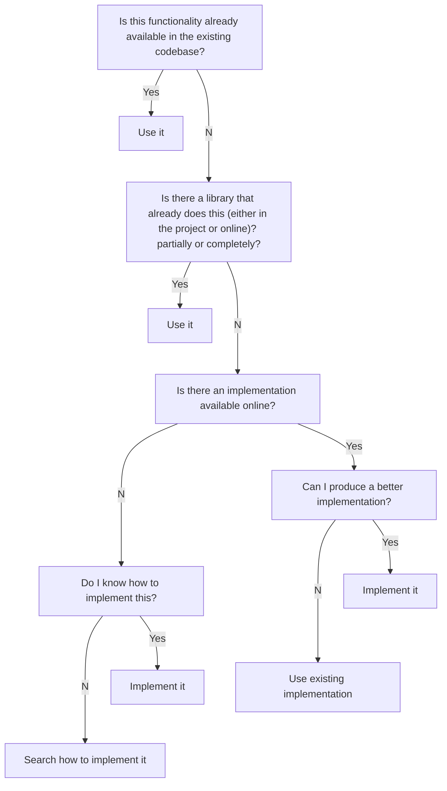

## Context

## Learned in this study

## Things to explore
* What are the steps one goes through when writing a program/algorithm to solve a specific problem?

# Overview
When I want to write a program, may it be small or big, I generally approach it in a top down fashion. This means I first go over the high level concepts that I will need to make my program work. Then I drill down into each concept and break it down until I get to the implementation details.

Here's a list of the many things that are considered while writing a program:

* Pre-requirements (what is needed in order to develop it)
* Relationships (what will depend on it and what it will depend on)
	* Dependencies (what it needs to know about when running)
	* Dependents (what will depend on it)
* Requirements (what does it need to do)
* Performance (what are its constraints)
	* Time (how fast should it return a result)
	* Space (how much space should it use to do its task)

Here's a few questions I will ask myself before writing any code:

* Is this functionality already available in the existing codebase?
* Is there a library that already does this (either in the project or online)? partially or completely?
* Is there an implementation already available online? Can I produce a better implementation?
* Do I know how to implement this?
* What can I safely extrapolate this new feature will need to be able to do in the future? Can I account for any of it in my current design?

Most of the time a single straightfoward solution will fit the bill for all the given requirements and implementation will be the next step. However, it happens from time to time that multiple solutions valid and you will have to determine the pros/cons of each solution in order to make the best choice for the given situation. In any case, one will want to:

* Reduce risk
* Maximize flexibility
* Minimize coupling
* Plan for the solution to be potentially replaced by another one

# See also
* [Automated programming](../automated-programming)

# References