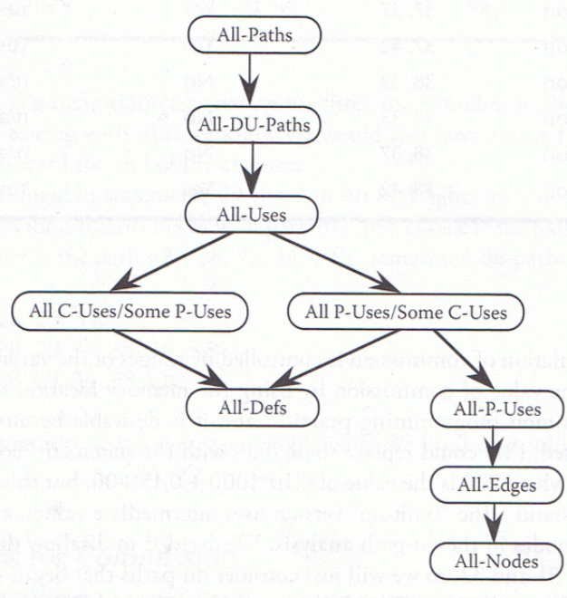

## Context

## Learned in this study

## Things to explore

# Overview

# Notes
## 1 - A Perspective on Testing
* Error: Mistake, bug
* Fault: result of an error
	* Fault of comission: we enter something into a representation that is incorrect
	* Fault of omission: we fail to enter correct information (missing information)
* Failure: when the code corresponding to a fault executes
* Incident: The symptoms associated with a failure occurrence
* Test: The act of exercising software with test cases
	* 2 goals:
		* find failures
		* demonstrate correct execution
* Test case: A set of inputs and expected outputs

## 1.5 Fault Taxonomies
* Input/Output Faults
* Logic Faults
* Computation Faults
* Interface Faults
* Data Faults

## 1.6 Levels of Testing
* White-box testing at the unit level
* Black-box testing at the system (integration) level

# 4 - Graph Theory for Testers
## 4.1.6 Condensation Graphs
* Given a graph G = (V, E), its condensation graph is formed by replacing each component by a condensing node
* The condensation graph of a given graph is unique

## 4.1.7 Cyclomatic Number
* The cyclomatic number of a graph G is given by V(G) = e - n + p where
	* e is the number of edges in G
	* n is the number of nodes in G
	* p is the number of components in G

## 4.2.2 Types of Nodes
* A node with indegree = 0 is a source node
* A node with outdegree = 0 is a sink node
* A node with indegree != 0 and outdegree != 0 is a transfer node
* A node that is both a source and a sink node is an isolated node

## 4.2.5 Reachability Matrix
* The reachability matrix of a directed graph D = (V, E) with m nodes is an $m \times m$ matrix R = (r(i, j)), where r(i, j) is a 1 if and only if there is a path from node i to node j; otherwise the element is 0
* The reachability matrix of a directed graph D can be calculated from the adjacency matrix A as $R = I + A + A^2 + A^3 + \ldots + A^k$, where k is the length of the longest path in D, and I is the identity matrix

### 4.2.6 n-Connectedness
* Two nodes $n_i$ and $n_j$ in a directed graph are
	* 0-connected iff no path exists between $n_i$ and $n_j$
	* 1-connected iff a semipath but no path exists between $n_i$ and $n_j$
	* 2-connected iff a path exists between $n_i$ and $n_j$
	* 3-connected iff a path goes from $n_i$ to $n_j$ and a path goes from $n_j$ to $n_i$

## 4.2.7 Strong Components
* A strong component of a directed graph is a maximal set of 3-connected nodes
* Strong components let us simplify by removing loops and isolated nodes

## 4.3 Program Graphs
* Nodes are program statements, and edges flow of control
* Nodes are either entire statements or fragments of a statement, and edges represent flow of control

## 5 Boundary Value Testing
* Four variations of boundary value testing
	* Normal boundary value testing
	* Robust boundary value testing
	* Worst-case boundary value testing
	* Robust worst-case boundary value testing
* The rationale behind boundary value testing is that errors tend to occur near the extreme values of an input variable
* The single fault assumption: Failures are only rarely the result of the simultaneous occurrence of two (or more) faults

## 6 Equivalence Class Testing
* Two problems occur with robust forms
	* The specification does not define what the expected output for an invalid input should be
	* Strongly typed languages eliminate the need for the consideration of invalid inputs

## 6.1 Equivalence Classes
* The idea of equivalence class testing is to identify test cases by using one element from each equivalence class. If the equivalence classes are chosen wisely, this greatly reduces the potential redundancy among test cases

## 6.3.1 Weak Normal Equivalence Class Testing
* Weak normal equivalence class testing is accomplished by using one variable from each equivalence class (interval) in a test case
* What can we learn from a weak normal equivalence class test case that fails, that is, one for which the expected and actual outputs are inconsistent?
	* There could be a problem with $x_1$, or a problem with $x_2$, or maybe an interaction between the two

## 6.3.2 Strong Normal Equivalence Class Testing
* Strong normal equivalence class testing is based on the multiple fault assumption, so we need test cases from each element of the Cartesian product of the equivalence classes

## 6.3.3 Weak Robust Equivalence Class Testing
* The process of weak robust equivalence class testing is a simple extension of that for weak normal equivalence class testing - pick test cases such that each equivalence class is represented

## 6.3.4 Strong Robust Equivalence Class Testing
* We obtain test cases from each element of the Cartesian product of all the equivalence classes, both valid and invalid

## 7 Decision Table-Based Testing
## 7.1 Decision Tables
* Decision tables in which all the conditions are binary are called Limited Entry Decision Tables (LETDs)
* If conditions are allowed to have several values, the resulting tables are called Extended Entry Decision Tables (EEDTs)

## 7.7 Guidelines and Observations
* The decision table technique is indicated for applications characterized by any of the following:
	* Prominent if-then-else logic
	* Logical relationships among input variables
	* Calculations involving subsets of the input variables
	* Cause-and-effect relationships between inputs and outputs
	* High cyclomatic complexity
* Decision tables do not scale up very well. There are several way to deal with this - use extended entry decision tables, algebraically simplify tables, "factor" large tables into smaller ones, and look for repeating patterns of condition entries

## 8 Path Testing
## 8.2 DD-Paths
* A DD-path is a sequence of nodes in a program graph such that
	* Case 1: It consists of a single node with indeg = 0 (single sink)
	* Case 2: It consists of a single node with outdeg = 0 (single source)
	* Case 3: It consists of a single node with indeg >= 2 or outdeg >= 2
	* Case 4: It consists of a single node with indeg = 1 and outdeg 1
	* Case 5: It is a maximal chain of length >= 1

## 8.3 Program Graph-Based Coverage Metrics
* Given a set of test cases for a program, they constitute node coverage if, when executed on the program, every node in the program graph is traversed
* Given a set of test cases for a program, they constitute edge coverage if, when executed on the program, every edge in the program graph is traversed
* Given a set of test cases for a program, they constitute chain coverage if, when executed on the program, every chain of length greater or equal to 2 in the program graph is traversed
* Given a set of test cases for a program, they constitute path coverage if, when executed on the program, every path from the source node to the sink node in the program graph is traversed

## 8.3.3.5 Modified Condition Decision Coverage
* MCDC requires
	1. Every statement must be executed at least once
	2. Every program entry point and exit point must be invoked at least once
	3. All possible outcomes of every control statement are taken at least once
	4. Every nonconstant Boolean expression has been evaluated to both true and false outcomes
	5. Every nonconstant condition in a Boolean expression has been evaluated to both true and false outcomes
	6. Every nonconstant condition in a Boolean expression has been shown to independently affect the outcomes (of the expression)
* 1 and 2 translate to node coverage
* 3 and 4 translate to edge coverage
* Unique-Cause MCDC (requires) a unique cause (toggle a single condition and change the expression result) for all possible (uncoupled) conditions
* Unique-Cause + Masking MCDC (requires) a unique cause (toggle a single condition and change the expression result) for all possible (uncoupled) conditions. In the case of strongly coupled conditions, masking (is allowed) for that condition only, i.e., all other (uncoupled) conditions will remain fixed
* Masking MCDC allows masking for all conditions, coupled and uncoupled (toggle a single condition and change the expression result) for all possible (uncoupled) conditions. In the case of strongly coupled conditions, masking (is allowed) for that condition only (i.e., all other (uncoupled) conditions will remain fixed)

## 8.4.1 McCabe's Basis Path Method
* The cyclomatic number of a strongly connected graph is the number of linearly independent circuits in the graph
* We can force this to begin to look like a vector space by defining notions of addition and scalar multiplication: path addition is simply one path followed by another path, and multiplication corresponds to repetitions of a path
* We can check the independence of paths by examining the path/edges traversed incidence matrix. The edges that appear in exactly one path must be independent
* A path is independent if it cannot be expressed in terms of the other paths without introducing unwanted edges
* The baseline method
	* Select a baseline path, which should correspond to some "normal case" program execution (it is advised to choose a path with as many decision nodes as possible)
	* The baseline path is retraced, and in turn each decision is "flipped". When a node of outdegree >= 2 is reached, a different edge must be taken

## 9 Data Flow Testing
## 9.1 Define/Use Testing
* Node $n \in G(P)$ is a defining node of the variable $v \in V$, written as DEF(v, n), if and only if the value of variable $v$ is defined as the statement fragment corresponding to node $n$
* Node $n \in G(P)$ is a usage node of the variable $v \in V$, written as USE(v, n), if and only if the value of the variable $v$ is used as the statement fragment correspond to node n
* A usage node USE(v, n) is a predicate use (denoted as P-use) if and only if the statement $n$ is a predicate statement; otherwise, USE(v, n) is a computation use (denoted C-use)
	* The nodes corresponding to predicate uses always have an outdegree >= 2, and nodes corresponding to computation uses always have an outdegree <= 1
* A definition/use path with respect to a variable v (denoted du-path) is a path in PATHS(P) such that, for some $v \in V$, there are define and usage nodes DEF(v, m) and USE(v, n) such that $m$ and $n$ are the initial and final nodes of the path
* A definition-clear path with respect to a variable v (denoted dc-path) is a definition/use path in PATHS(P) with initial and final nodes DEF(v, m) and USE(v, n) such that no other node in the path is a defining node of $v$

## 9.1.7 Define/Use Test Coverage Metrics
* T is a set of paths in the program graph G(P) of a program P, with the set V of variables
* The set T satisfies the All-Defs criterion for the program P if and only if for every variable $v \in V$, T contains definition-clear paths from every defining node of $v$ to a use of $v$
* The set T satisfies the All-Uses criterion for the program P if and only if for every variable $v \in V$, T contains definition-clear paths from every defining node of $v$ to every use of $v$, and to the successor node of each USE(v, n)
* The set T satisfies the All-P-Uses/Some C-Uses criterion for the program P if and only if for every variable $v \in V$, T contains definition-clear paths from every defining node of $v$ to every predicate use of $v$; and if a definition of $v$ has no P-uses, a definition-clear path leads to at least one computation use
* The set T satisfies the All-C-Uses/Some P-Uses criterion for the program P if and only if for every variable $v \in V$, T contains definition-clear paths from every defining node of $v$ to every computation use of $v$; and if a definition of $v$ has no C-uses, a definition-clear path leads to at least one predicate use
* The set T satisfies the All-DU-paths criterion for the program P if and only if for every variable $v \in V$, T contains definition-clear paths from every defining node of $v$ to every use of $v$ and to the successor node of each USE(v, n), and that these paths are either single loop traversals or they are cycle free

## 9.2 Slice-Based Testing
* A program slice is a set of program statements that contributes to, or affects the value of, a variable at some point in a program
* Given a program P and a set V of variables in P, a slice on the variable set V at statement n, written S(V, n), is the set of all statements fragments in P that contribute to the values of variables in V at node n
* Backward slices refer to statement fragments that contribute to the value of v at statement n
* Forward slices refer to all the program statements that are affected by the value of v and statement n
* In a backward slice S(v, n), statement n is nicely understood as a Use node of the variable v, that is, Use(v, n)
* Given a program P and a program graph G(P) in which statements and statement fragments are numbered, and a set V of variables in P, the static, backward slice on the variable set V at statement fragment n, written S(V, n), is the set of node numbers of all statement fragments in P that contribute to the values of variables in V at statement fragment n
* Five form of USE:
	* P-use: used in a predicate (decision)
	* C-use: used in computation
	* O-use: used for output
	* L-use: used for location (pointers, subscripts)
	* I-use: used for iteration (internal counters, loop indices)
* Two forms of definition nodes:
	* I-def: defined by input
	* A-def: defined by assignment

## 10 Retrospective on Unit Testing
* Low to high semantic content
	* Code-based testing
		* Path testing
		* Data flow testing
		* Slice testing
	* Spec-based testing
		* Boundary value testing
		* Equivalence class testing
		* Decision table testing

## 10.3 Evaluating Test Methods
* We can use the notion of program execution paths, which provide a good formulation of test effectiveness
* When a particular path is traversed more than once, we might question the redundancy
* We assume that a specification-based testing technique M generates m test cases, and that these test cases are tracked with respect to a code-based metric S that identifies s elements in the unit under test. When the m test cases are executed, they traverse n of the s structural elements
* The coverage of a methodology M with respect to a metric S is the ratio of n to s. We denote it as C(M, S)
	* Deals with gaps
	* When this value is less than 1, there are gaps in the coverage with respect to the metric
	* When C(M, S) = 1, algebra forces R(M, S) = NR(M, S)
* The redundancy of a methodology M with respect to a metric S is the ratio of m to s. We denote it as R(M, S)
	* The bigger the value, the greater the redundancy
* The net redundancy of a methodology M with respect to a metric S is the ratio of m to n. We denote it as NR(M, S)
	* The things actually traversed, not to the total space of things to be traversed

## 10.5 Guidelines
* Testing for faults that are not likely to be present is pointless
* The attributes that are most helpful in choosing specification-based testing methods are
	* Whether the variables represent physical or logical quantities
	* Whether dependencies exist among the variables
	* Whether single or multiple faults are assumed
	* Whether exception handling is prominent
* If the variables refer to physical quantities, boundary value testing and equivalence class testing are indicated
* If the variables are independent, boundary value testing and equivalence class testing are indicated
* If the variables are dependent, decision table testing is indicated
* If the single-fault assumption is warranted, boundary value analysis and robustness testing are indicated
* If the multiple-fault assumption is warranted, worst-case testing, robust worst-case testing, and decision table testing are indicated
* If the program contains significant exception handling, robustness testing and decision table testing are indicated
* If the variables refer to logical quantities, equivalence class testing and decision table testing are indicated

## 11 Life Cycle-Based Testing
## 11.2 Testing in Iterative Life Cycles
* Functional decomposition can only be well done when the system is completely understood, and it promotes analysis to the near exclusion of synthesis
* Composition, on the other hand, is closer to the way people work: start with something known and understood, then add to it gradually, and maybe remove undesired portions

## 11.2.1 Waterfall Spin-Offs
* System testing is split into two steps - regression and progression testing
* The goal of regression testing is to ensure that things that worked correctly in the previous build still work with the newly added code
* Progression testing assumes that regression testing was successful and that the new functionality can be tested

## 12 Model-Based Testing
## 12.1 Testing Based on Models
* The essence of MBT is this sequence of steps:
	* Model the system
	* Identify threads of system behavior in the model
	* Transform these threads into test cases
	* Execute the tests cases (on the actual system) and record the results
	* Revise the model(s) as needed and repeat the process

## 12.2 Appropriate Models
## 12.2.1 Peterson's Lattice
* Given an application, good practice dictates choosing a model that is both necessary and sufficient - neither too weak nor too strong.
	*If a model is too weak, important aspects of the application will not be modeled, and hence not tested
	* If a model is too strong, the extra effort to develop the model may be unnecessary

## 12.2.3 Modeling Issues
* There are two fundamental types of requirements specification models: those that describe structure (what a system is) and those that describe behavior (what a system does)

## 13 Integration Testing
* Craftspersons are recognized by two essential characteristics:
	* they have a deep knowledge of the tools of their trade
	* they have a similar knowledge of the medium in which they work so that they understand their tools in terms of how they work with the medium

## 13.1 Decomposition-Based Integration
* The goal of decomposition-based integration is to test the interfaces among separately tested units

## 13.1.1 Top-Down Integration
* Begins with the main program (the root of the tree)
* Any lower-level unit that is called by the main program appears as a "stub," where stubs are pieces of throwaway code that emulate a called unit
* The "theory" of top-down integration is that, as stubs are replaced one at a time, if there is a problem, it must be with the interface to the most recently replaced stub
* The problem is that functional decomposition is deceptive
	* Because it is derived from the lexicographical inclusion required by most compilers, the process generates impossible interfaces

## 13.1.2 Bottom-Up Integration
* A "mirror image" to the top-down order, with the difference that stubs are replaced by drivers modules that emulate units at the next level up in the tree

## 13.1.3 Sandwich Integration
* A combination of top-down and bottom-up integration
* There will be less stub and driver development effort, but this will be offset to some extent by the added difficulty of fault isolation that is a consequence of big bang integration

## 13.2 Call Graph-Based Integration
## 13.2.1 Pairwise Integration
* The idea behind pairwise integration is to eliminate the stub/driver development effort. Instead of developing stubs and/or drivers, why not use the actual code?
* We restrict a session to only a pair of units in the call graph
* Pairwise integration results in an increased number of integration sessions when a node (unit) is used by two or more other units
* The main advantage of pairwise integration is the high degree of fault isolation
	* If a test fails, the fault must be in one of the two units
* The biggest drawback is that, for units involved on several pairs, a fix that works in one pair may not work in another pair

## 13.2.2 Neighborhood Integration
* The neighborhood of a node in a graph is the set of nodes that are one edge away from the given node
* Neighboorhoods = nodes - sink nodes
* Neighborhood integration usually yields a reduction in the number of integration test sessions, and it reduces stub and driver development

## 13.3 Path-Based Integration
## 13.3.1 New and Extended Concepts
* A source node in a program is a statement fragment at which program execution begins or resumes.
* A sink node in a program is a statement fragment at which program execution terminates
* A module execution path is a sequence of statements that begins with a source node and ends with a sink node, with no intervening sink nodes
* A message is a programming language mechanism by which one unit transfers control to another unit, and acquires a response from the other unit
* An MM-path is an interleaved sequence of module execution paths and messages
* Given a set of units, their MM-path graph is the directed graph in which nodes are module execution paths and edges correspond to messages and returns from one unit to another
* A program path is a sequence of DD-paths, and an MM-path is a sequence of module execution paths

## 14 System Testing
* The goal is not to find faults but to demonstrate correct behavior

## 14.1 Threads
* A scenario of normal usage
* A system-level test case
* A stimulus/response pair
* Behavior that results from a sequence of system-level inputs
* An interleaved sequence of port input and ouput events
* A sequence of transitions in a state machine description of the system
* An interleaved sequence of object messages and method executions
* A sequence of machine instructions
* A sequence of source instructions
* A sequence of MM-paths
* A sequence of ASFs

## 14.1.2 Thread Definitions
* An Atomic System Function (ASF) is an action that is observable at the system level in terms of port input and output events
* In an event-driven system, ASFs are separated by points of event quiescence; these occur when a system is (nearly) idle, waiting for a port input event to trigger further processing
* Given a system defined in terms of ASFs, the ASF graph of the system is the directed graph in which nodes are ASFs and edges represent sequential flow
* A source is an Atomic System Function that appears as a source node in the ASF graph of a system; similarly, a sink ASF is an Atomic System Function that appears as a sink node in the ASF graph
* A system thread is a path from a source ASF to a sink ASF in the ASF graph of a system

## 14.2 Basis Concepts for Requirements Specification
## 14.2.1 Data
* The focus is on the information used and created by the system
* We describe data in terms of variables, data structures, fields, records, data stores, and files

## 14.2.2 Actions
* Actions have inputs and outputs, and these can be either data or port events
* Synonyms: transform, data transform, control transform, process, activity, task, method, and service

## 14.2.3 Devices
* These are the sources and destinations of system-level inputs and outputs

## 14.2.4 Events
* An event is a system-level input (or output) that occurs on a port device
* Events are like actions in the sense that they are the translation point between real-world physical events and internal logical manifestations of these

## 14.2.5 Threads
* A sequence of actions

## 14.2.6 Relationships among Basis Concepts
* An action can occur in several threads, and a a thread is composed of several actions

## 14.4 Use Case-Based Threads
## 14.4.1 Levels of Use Cases
* High level
* Essential
* Expanded essential
* Real

## 14.4.4 Converting Use Cases to Event-Driver Petri Nets
* At a minimum, a well-formed use case should conform to these requirements
	* The event sequence cannot begin with an output event. This could just be considered as a precondition
	* The event sequence cannot end with an input event. This could be considered as a postcondition
	* Preconditions must be both necessary and sufficient to the use case. There are no superfluous preconditions, and every precondition must be used or needed by the use case. Similarly for postconditions
	* There must be at least one precondition and at least one postcondition

## 14.6 How Many Use Cases?
## 14.6.1 Incidence with Input Events
* Customer/user and developers identify port-level input events
* Use cases provoke the recognition of port inputs events, and they, in turn, suggest additional use cases

## 14.6.2 Incidence with Output Events
* Similar to Incidence with Input Events, but with outputs

## 14.6.3 Incidence with All Ports Events
* The combination of both Incidence with Input and Output Events

## 14.6.4 Incidence with Classes
* Develop an incidence matrix showing which classes are needed to support which use cases

## 14.8 Supplemental Approaches to System Testing
## 14.8.1 Operational Profiles
* Zipf's law (applied to system testing): For a system with many threads, 80% of the execution traverses only 20% of the threads
* The distribution of faults in a system is only indirectly related to the reliability of the system
* The simplest view of system reliability is the probability that no failure occurs during a specific time interval
* The idea of operational profiles is to determine the execution frequencies of various threads and to use this information to select threads for system testing

## 14.8.2 Risk-Based Testing
* Risk-based testing is a refinement of operational profiles
* Risk = cost * (probability of occurrence)
* Steps to risk-based testing
	* Group the system into risk categories
		* Four risk categories suggested
			* Catastrophic
			* Damaging
			* Hindering
			* Annoying
	* Assess cost weighting
		* Logarithmic weighting is suggested
			* 1 for low cost of failure
			* 3 for medium
			* 10 for high

## 15 Object-Oriented Testing
* One of the original hopes for object-oriented software was that objects could be reused without modification or additional testing. This was based on the assumption that well-conceived objects encapsulate functions and data "that belong together," and once such objects are developed and tested, they become reusable components

## 15.1 Issues in Testing Object-Oriented Software
## 15.1.1 Units for Object-Oriented Testing
* A unit is the smallest software component that can be compiled and executed
* A unit is a software component that would never be assigned to more than one designer to develop

## 15.1.2 Implications of Composition and Encapsulation
* The main implication of composition is that, even presuming very good unit-level testing, the real burden is at the integration testing level
* Good encapsulation results in classes that can more easily be composed (and thus reused) and tested

## 15.1.3 Implications of Inheritance
* If a given class inherits attributes and/or operations from super classes, the stand-alone compilation criterion of a unit is sacrificed
	* Binder suggests "flattened classes" as an answer. A flattened class is an original class expanded to include all the attributes and operations it inherits

## 15.1.4 Implications of Polymorphism
* Considering classes as units implies that any issues of polymorphism will be covered by the class/unit testing
* The redundancy of testing polymorphic operations sacrifices hoped-for economies

## 15.1.5 Levels of Object-Oriented Testing
* Four levels
	* Operation/method (unit testing)
	* Class (intraclass)
	* Integration (interclass)
	* System

## 16 Software Complexity
* Most discussions of software complexity focus on two main models - cyclomatic (or decisional) complexity, and textual complexity as measured by the Halstead metrics

## 16.1 Unit-Level Complexity
## 16.1.1 Cyclomatic Complexity
## 16.1.1.2 Node Outdegrees and Cyclomatic Complexity
* The reduced outdegree of a node n in a directed graph is one less than the outdegree of n
	* reducedOut(n) = outDeg(n) - 1
* Theorem: Given a directed graph G of n nodes, the cyclomatic complexity V(G) of G is given by the sum of the reduced outdegrees of the nodes of G plus 1

$$
V(G) = 1 + \sum_{i=1}^n \textrm{reducedOut}(i)
$$

## 16.1.2 Computational Complexity
## 16.1.2.1 Halstead's Metrics
* The number of distinct operators, $n_1$
* The number of distinct operands, $n_2$
* The total number of operators, $N_1$
* The total number of operands, $N_2$
* Program length $N = N_1 + N_2$
* Program vocabulary $n = n_1 + n_2$
* Program volume $V = N\log_2(n)$
* Program difficulty $D = (n_1N_2)/2n_2$

## 16.4 Object-Oriented Complexity
## 16.4.1 WMC - Weighted Methods per Class
* Counts the number of methods in a class and weights them by their cyclomatic complexity
* This metric is a good predictor of implementation and testing effort

## 16.4.2 DIT - Depth of Inheritance Tree
* Large values of the DIT metric imply good reuse
* It also increases testing difficulty
* Current guidelines recommend a limit of DIT = 3

## 16.4.3 NOC - Number of Child Classes

## 16.4.4 CBO - Coupling between Classes
* Coupling is increased when one unit refers to variables in another unit

## 16.4.5 RFC - Response for Class
* The length of the message sequence that results from an initial message

## 16.4.6 LCOM - Lack of Cohesion of Methods
* The number of methods that use a given instance variable in the class, and is computed for each instance variable

## 17 Model-Based Testing for Systems of Systems
## 17.1 Characteristics of Systems of Systems
* Initial definition
	* A "super system"
	* A collection of cooperating systems
	* A collection of autonomous systems
	* A set of components systems
* Maier begins his distinction by noting two fundamental differences: systems of systems are either directed or collaborative
* More specific attributes
	* They are built from components that are (or can be) independent systems
	* They have managerial/administrative independence
	* They are usually developed in an evolutionary way
	* They exhibit emergent (as opposed to preplanned) behaviors
* Maier's definition
	* A directed system of systems is designed, built, and managed for a specific purpose
	* A collaborative system of systems has limited centralized management and control
	* A virtual system of systems has no centralized management and control
* Two essential requirements that a potential system of systems must satisfy:
	* The constituent systems must be stand-alone systems in their own right
	* Each constituent has administrative independence from the other constituents

## 18 Exploratory Testing
## 18.1 Exploratory Testing Explored
* Five essential characteristics of exploratory testing:
	* It is interative
	* It involves concurrent cognition and execution
	* It is highly creative
	* It intends to produce results quickly
	* It reduces the traditional emphasis on formal test documents
* A professor giving an oral examination to a student
	* The first similarity is that the professor clearly has extensive domain knowledge
	* Second, the professor wishes to explore the extent to which the student has mastered the subject matter
	* The third, and most instructive, similarity is that, when the student shows a weakness, the professor asks follow-up questions to explore the extent of the weakness; thus, knowledge gained from the answer to one question provokes a related question
	* This pattern is called adaptive testing

## 21 Evaluating Test Cases
* How can a set of test cases be tested? One answer has been around for more than 30 years - mutation testing
	* A more recent addition, "fuzzing," is closer to random testing

### 21.1 Mutation Testing
* Mutation testing begins with a unit and a set of test cases for that unit, such that all the test cases pass when executed. Then a small change is made to the original unit, and the test cases are run on the mutant. If all the test cases pass, we know that the mutant was undetected. At this point tehre are two possibilities - either the small change resulted in a logically equivalent program, or the set of test cases was incapable of detecting the change
* This raises one of the problems of mutation testing - identification of equivalent mutants

## 21.1.1 Formalizing Program Mutation
* A mutant P' of a program P is the result of making a change to the source code of the original program P
* Given a program P, a mutant P', a set of test cases T such that every $t \in T$ passes for P, the mutant P' is killed if at least one test case $t \in T$ fails
* Given a program P, a mutant P', a set of test cases T such that every $t \in T$ passes for both P and P', the mutant P' is considered to be a live mutant
* Suppose a program P, and a set M of mutations of P, and a set of test cases T results in x killed mutants out of y total mutants in M. Then, the ratio x/y is the mutation score of P with respect to M
	* Higher values of mutation score increase the confidence in the utility of the original test set T

## 21.2 Fuzzing
* "Fuzzers" are programs that present random strings of characters as inputs to both command line and interactive applications
* The random strings are an advantage in that they can reveal situations a tester would never think of

## 22 Software Technical Reviews
## 22.2 Roles in a Review
## 22.2.1 Producer
* This is the person who created the work product being examined
* At the end of all types of technical reviews, the producer will be the person who resolves the action items identified during the review meeting

## 22.2.2 Review Leader
* Review leaders are responsible for the overall success of the review
* They have the following duties:
	* Schedule the actual review meeting
	* Ensure that all membersof the review team have the appropriate review materials
	* Conduct the actual review meeting
	* Write the review report
* A poorly run business meeting:
	* Participants see them as a waste of time
	* The wrong peoplea re at the meeting
	* There is no agenda, or if there is, it is not followed
	* There is no prior preparation
	* No issues are identified
	* The discussion is easily side-tracked
	* Time is spent fixing problems rather than just identifying them

## 22.2.3 Recorder
* The recorder takes notes during the review meeting

## 22.2.4 Reviewer
* The individual reviewers are responsible for objectively reviewing the work product
* The reviewers identify issues and assign a severity level to each item
* Before the review meeting, each reviewer submits a review ballot that contains the following information:
	* Reviewer name
	* Review preparation time
	* A list of issues with severity
	* An overall review disposition recommendation (OK as is, accept with minor rework, major rework with a new review needed)

## 22.3 Types of Reviews
* There are three fundamental types of software reviews
	* Walkthroughs
	* Technical inspections
	* Audits
* Reasons to conduct a review:
	* Communication among developers
	* Training, especially for new personnel, or for personnel recently added to the project
	* Management progress reporting
	* Defect discovery
	* Performance evaluation (of the work product producer)
	* Team morale
	* Customer (re)assurance

# See also

# References
* Jorgensen, Paul C. Software Testing: A Craftsman’s Approach. CRC press, 2016.