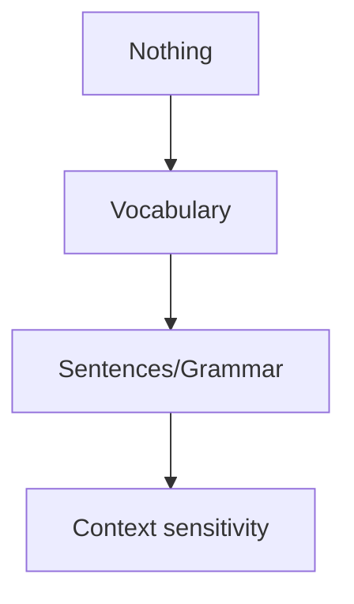
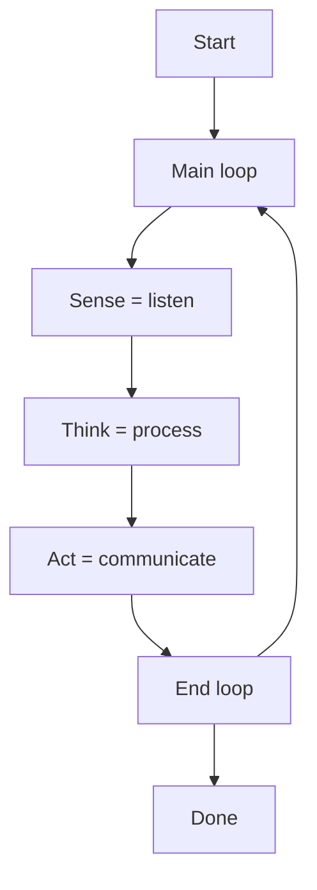

## Context
Based on the Turing Test, it seems that one important aspect of having human intelligence is the ability to communicate with humans. As such, one goal might be to produce an agent that is able to hold a meaningful conversation with another human being, making it believe it is actually interacting with another human being.

## Learned in this study
* A machine can generate sentences that are grammatically and syntactically correct, but void of any semantical sense

## Things to explore
* How can a machine learn to exchange simply from text (no other input sensors/reward feed)?
* Attempt to reproduce the internal chatter we all have in our mind
* How do we tell when the subject of a conversation has changed such that we may forget our current mental context?
	* Is it related to common sense (things being too far apart -> different subject)?
* Can a chatbot learn to talk with others without ever having a physical experience?

# Overview

# Objectives
* Starts and maintains multiple conversation threads (with different people and about different topics)
* Knows many facts about the world
* Does not attempt to deceive its interlocutor (make it think it is something that it is not)

# Corpus construction
* Set of letters -> allow to discover anagrams

# Sequence of language learning
* Store all sentences heard and repeat them word for word
	* Nothing new is ever said
* Build a Markov chain of all heard sentences and generate sentences
	* Nothing new is ever said as Markov chains are simply the encoding of the probability a "path sentence" being heard
	* Generated sentences can however be novel depending on the rules used to construct the Markov chain (for instance, using bigrams/trigrams/n-grams). If we build the Markov chain based on whole sentences, then we fall back to the previous case and nothing new is ever said (every sentence is a repetition of an heard sentence)
* Teach it valid grammar and vocabulary for a language
	* Can generate a lot of grammatically valid sentences but void of any meaning
* Infer/build a grammar/vocabulary based on experience
	* Limited to what has been seen (which is fine)
	* Can be taught or can learn incorrect grammar/vocabulary
* Build a network of "concepts" = words
	* Used alone, would simply generate a random arrangement of words
	* Builds upon other strategies to generate sentences as this is more related to generating concept-related sentences

## The constructive nature of language

# Problems
* Simply repeating what they've heard
* Creating grammatically valid sentences void of any meaning
* What is said has no relation to what is being discussed (not considering the context)

# *Things* it needs to be able to do
* Construct grammatically valid sentences
* Reply with context relevant content

# Construction of sentences
* Learn about as many words as possible (learn in the sense of knowing how they are formed, not their significance)
* Learn about the valid relations that the word can been seen in (before or after certain words)
* Attempt to generalize a valid grammar

Construction of sentences at this level means that the chatbot has no intent. Sentences may make grammatical/syntactical sense, but semantically they don't mean anything.

By constructing a relation graph between words, the chatbot may *begin* to be able to make semantical sense. For instance, if it has seen **red car** often, it may be able to infer that **red** can be replaced by any other color. To do so, it will have to be able to know that red, blue, green, yellow, orange, etc. are **colors**, and that *colors* maybe changed for one another in some *contexts*. This construct is known as **is-a[^is-a]**. The question then becomes, how can I tell what is the type of relation between two words? Is it a **is-a/type-of** (hyponym-hypernym), **has-a** (holonym-meronym), **part-of** (meronym-holonym) or **member-of** (meronym-holonym)?

Is it possible, simply by looking at enough examples and without supervision to determine classes of words?

* Noun
* Pronoun
* Adjective
* Verb
* Adverb
* Preposition
* Conjunction
* Interjection
* Article

# Context
Reward feed: If the bot says something to someone and that person replies with the name of the agent and +1/-1 to indicate whether what the bot said is relevant or not, the bot can build knowledge of what to say/not say based on "context" (vaguely undefined here)

* How can context be built and used?
	* Store what others are saying and use the words they've used to create an overlay over the word network the bot already possess

# Internal dialog loop
Each and everyone of us has an internal voice we talk to ourselves with. In this same fashion, the internal dialog loop of a chatbot keeps thinking to itself what to discuss next as well as listening to whomever is currently talking.

<!-- Doesn't say much of value -->
The general process is that while you are in a dialog (to simplify things), your interlocutor will be speaking. During that time, you are processing what is being said (parse words, construct images, etc.) as well as activating a network of related memories within your brain (words, ideas, images, etc.). As things are said, different things will go through your mind, but soon enough you'll have something to convey to your interlocutor. Depending on the type of conversation, you may have assessed the validity/cogency of his argument, and you will want either to clarify or argue against what was said.

## IBM Watson Dialog Service
Request
* A client id
* A conversation id
* An input string

Response
* A client id
* A conversation id
* An input string
* An html formatted response

The replies that are generated contains "actionables". It appears that dialogs are oriented around specific domains and thus it will generate responses that may have data specifically formatted for the purpose of the application.

**Source**
* https://new-console.ng.bluemix.net/catalog/services/dialog/

## Microsoft Bot Framework
Microsoft Bot Framework works in the same fashion as IBM Watson Dialog Service: the develop defines the actionables, in other words, what will make the bot progress in state, and the user requests are simply processed in order to attempt to extract information about the action the user wants to take.

**Source**
* https://dev.botframework.com/
* http://docs.botframework.com/sdkreference/csharp/forms.html

# Use an existing dictionary
* https://github.com/first20hours/google-10000-english
* http://norvig.com/ngrams/count_1w.txt
* https://books.google.com/ngrams/info
* http://storage.googleapis.com/books/ngrams/books/datasetsv2.html

# Topics of interest
* https://en.wikipedia.org/wiki/Is-a

# References
## Grammar
* https://en.wikipedia.org/wiki/English_grammar
* https://en.wikipedia.org/wiki/Grammar_checker
* http://englishgrammar101.com/
* https://en.wikipedia.org/wiki/Formal_grammar
* https://en.wikipedia.org/wiki/Chomsky_hierarchy

## Part of speech
* https://en.wikipedia.org/wiki/Part_of_speech
* https://en.wikipedia.org/wiki/Part-of-speech_tagging
* https://en.wikipedia.org/wiki/Moby_Project
* http://wordlist.aspell.net/
* http://wordlist.aspell.net/pos-readme
* https://wordnet.princeton.edu/
* http://ucrel.lancs.ac.uk/claws/

## Language
* https://en.wikipedia.org/wiki/Formal_language

[^is-a]: https://en.wikipedia.org/wiki/Is-a
