## Learned in this study

## Things to explore
* Study the difference with the current analysis of graphs as programs when we include start/end nodes
	* Should while-true loop programs have to terminate?
* In a conditional statement such as while(X) or if(X), should the evaluation of the statement and the branch jump be considered as two steps?

# Overview

## Properties of interest
* Stability

## Architectures
### Layered
* Easy to do forward/backward propagation

### Fully connected
* <tbc></tbc>

### Random
* <tbc></tbc>

# Analysis of graphs as programs
For this study, we will analyze simple control structures (programs) in order to identify increase order of complexity. To simplify the study, we'll assume that these structures will run on a single thread (in other words, no parallel processing will be done). Do note that some of the graphs below may make sense if executed in a parallel environment: each disjoint graph may be executed by a single thread.

## 1 node, 0 edge
Statement
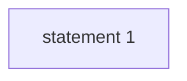

## 1 node, 1 edge
While-true loop
Program never terminates
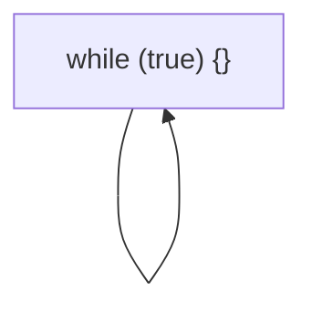

## 2 nodes, 0 edge
Not valid (could be considered valid in a parallel architecture as long as *statement 1* and *statement 2* are independent)
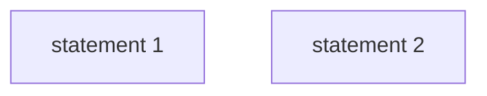

## 2 nodes, 1 edge
Sequential statements
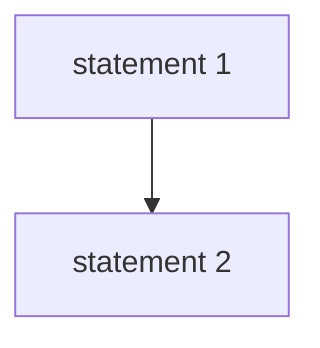

Not valid
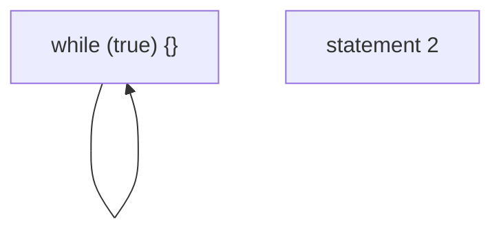

Not valid
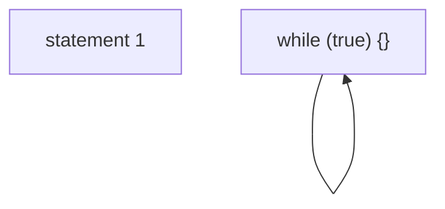

## 2 nodes, 2 edges
While-true loop - Statement
Program never terminates
Statement 1 is never executed
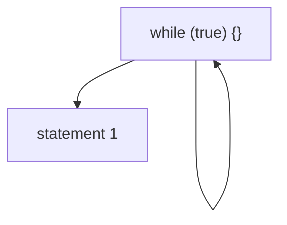

Statement - while-true loop
Program never terminates
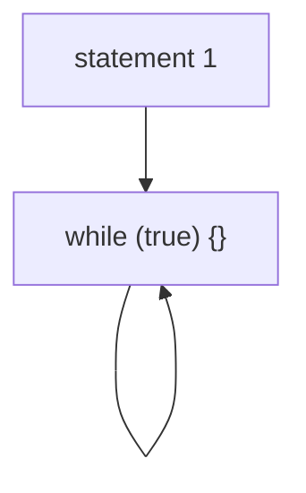

Do-while-true
Program never terminates
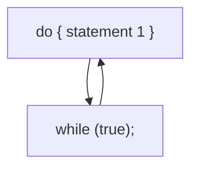

Not valid
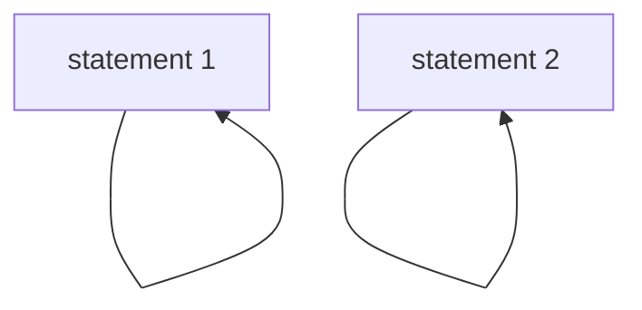

## 2 nodes, 3 edges
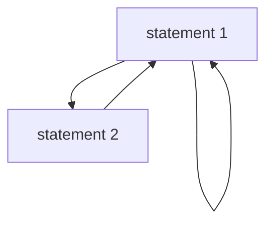

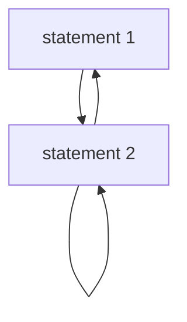

Sequential double while-true loop
Program never terminates
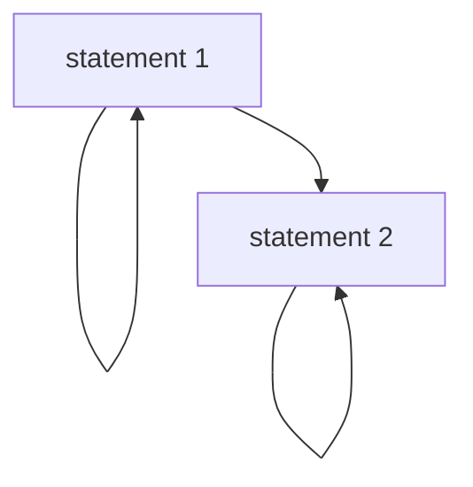
