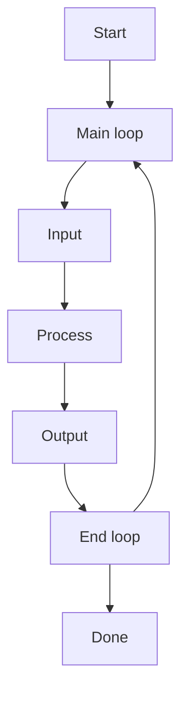

## Learned in this study

## Things to explore

# Overview

The brain can be seen as a single function machine. It receives inputs, processes them, and finally return some instructions as to what to do next. However, what this function does is a complete mystery to all of us.

The input -> process -> output model is very easily to understand, however each part in itself is filled with questions: how is the input formatted? how much data do different channels contain? is all data processed in the same way? are there any priority channels? is data processed the same way every time? how is the same information processed faster the next time it is observed? how does the brain know how to make use of its available outputs? how does it know what outputs are available? what processes are used to make recalling faster/more accurate when needed? what is the most barebone requirements for each of the components?

The following document will attempt to answer those questions by providing an architecture/framework which attempts to put together all of the existing knowledge about AGI. Obviously, since AGI development is a new field, there are many schools of thought as to how one should be built, and how I suggest it be built is one of many ways we *might* end up building one. Don't take any of what I say for granted but as a source of ideas for your own architecture.

Feel free to drop me a comment or any questions down below (at the end of the article).

# Layers

# Pre-requisites

## Layer 1 - Storage

Storage is the primary source of knowledge and experience which can later on be used for action-reaction type of response to stimuli. Without storage, we can at best give an initial set of immutable action-reaction instructions to the AGI (similar to the code of a program which cannot be modified).

# Input

## Layer 2 - Processing/Pattern detection

### Layer 2.1 - Data streams

The main source of information we receive is based on time. We see one thing after the other and thus it is important to be able to process what we perceive in the same fashion as computer process data streams (as opposed to batches of data).

Data stream processing will require to interact a lot with the storage as it were the patterns will be stored. Furthermore, much like a computer the AGI will need to have various levels of caches available to it in order to store frequently/recently used patterns for fast access/retrieval.

What appear to make the most sense here is some form of hierarchical pattern detection algorithm, where what is to processed is determined in a binary manner. Thus, pattern detection would be executed similarly to [binary search](https://en.wikipedia.org/wiki/Binary_search_algorithm) (in its simplest form). If it is however possible to compare the stimulus against multiple patterns at once, we may compare the process to something like a [B-tree](https://en.wikipedia.org/wiki/B-tree) search.

### Layer 2.2 - Data batches

Send data to the data stream layer

For the purpose of being able to process data that is given to us by other AGI agent, it will be useful to be able to go through this information in a batch. Information can however be transferred and processed as a data stream for which the timestamp is already provided.

## Layer X - Input filtering/Attention

*(might be mergeable into the processing/pattern detection layer)*

As computing power increases, it may be possible to reduce the amount of data filtered in favor of processing more data.

# Process

## Layer 3 - Decision

Once we have recorded and processed information from the environment, the next step is to decide if we'll want to do anything with it.

### Layer 3.1 - Simple reflex/Automated responses

### Layer 3.2 - Model-based/Analysis/Prediction

### Layer 3.3 - Goal-based

### Layer 3.4 - Utility-based

# Output

## Layer 4 - Plan execution

*this will need to be divided into many more components or the plan execution should be short lived and work off feedback (running through the whole process again and again, replanning as required)*

Given a decision by the previous layer, the plan execution layer is tasked with sending the appropriate signal to the required systems (may it be to store some information for later recall, activate motors to move a limb at the appropriate location, etc.).

# Specialized layers

## Layer N - Natural language processing

## Layer N.1 - Understanding

## Layer N.2 - Meta data recording

Remember where the information came from (conversation, document, who were involved)

## Layer M - Logic

# Arrival of new data

1. The data is taken as a single unit. An **Identifier** is produced to uniquely identify it.
2. An **OrderedSet** is produced. It is uniquely identified by the **Identifier** that was just produced.
3. The data received is stored in a single **Chunk**. That **Chunk** is pointed to by the **OrderedSet** that was produced in step 2.

# Arrival of new data with existing and overlapping data

-----

# Conjectures
* Compression can only occur if there is duplication in data
