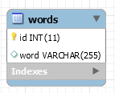
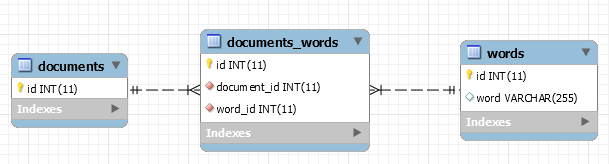

## Context

## Learned in this study

## Things to explore

* Splay tree memory access

# Overview

The goal of this article is to detail my process of developing an initial implementation of a "brain" in PHP. As a  initial version, I want to lay down the tools that will help me build such thing so that it may be decomposed into libraries of reusable components.

# Components

* Stopwatch/Time monitoring
* Memory monitoring
* Tokenizer
* Token cleanup
* Database
* Cache layers

# Construction

The first step in order to be able to do anything is to be able to store information. In our case, we will use wikipedia articles as a source of information.

## Naïve in-memory implementation

A naïve first implementation will simply store the article tokens in a huge array we'll call a `stream`. When we add tokens, we also build up a dictionary or word lookup table, which allows us to return the index of a given word in the `stream`. Doing so allows us to quickly retrieve (dictionary lookup should be O(1)) whether we've already seen a word previously or not at the cost of memory.

This simple construct allows us to store and retrieve strings relatively rapidly. However, as its knowledge base increases in size, it becomes more and more memory hungry (increases linearly with how much data we insert) and slower to test if a particular query string has been seen (a simplistic layered token filtering algorithm will perform badly on frequent/common words).

With this simple "study" of document insertion and retrieval, we can observe two properties we'd like to respect:

* Given a specific amount of memory space for storage and temporary computation, the process should stay within these boundaries at the price of losing existing information.
* Querying for a string should be done in constant time. Given a deadline, the result should either be a result or a failure to find the answer. Common knowledge should be more readily accessible than less frequently used knowledge. In the latter case, it is acceptable to spend more time retrieving said information (similar to how splay tree would optimize their tree).

In order to have a common knowledge base during the rest of our tests, we will build on a small subset of articles from wikipedia. The list can be found [here](assets/txt/articles.txt). It consists of about 200 articles with varying amount of content.

Using an implementation of the previously mentioned strategy yields the following results:

| Min (s) | Mean (s) | Max (s) | StdDev (s) |
|---------|----------|---------|------------|
| 0.001000 | 0.208460 | 0.737043 | 0.173586 |

Thus, on average it takes ~210ms to process a query of length varying from 0 to 100 words with a standard deviation of ~175ms.

## Upgrading to a database

### The relational database approach

The next obvious step is to move from an in-memory data store to a database such as MySQL. Doing so allows us to make use of more efficient means of data storage and retrieval.

In order to store our articles, we have a couple of ways to structure the information:
* Create a `documents` table where we have a field that contains the whole article in a single row
* Create a `words` table where we have a field that contains all the words of the article in a sequence over multiple rows


In the `documents` table approach, we cannot "quickly" retrieve if a word is contained within the knowledge base. It is necessary to go through each article and search for the given word.



In the `words` table approach however we can quickly retrieve if a word is contained within the knowledge base but we cannot tell from which article it came.

| Min (s) | Mean (s) | Max (s) | StdDev (s) |
|---------|----------|---------|------------|
| 0.005000 | 0.187026 | 0.240013 | 0.031417 |


Thus the next approach is to make an hybrid of both: a table such that we have a column that identifies the article containing the word.

Here, we can reconstruct the whole sentence by querying for a given `document_id` and ordering by id. If you are familiar with [database normalization](https://en.wikipedia.org/wiki/Database_normalization), you will probably notice very soon that the word column will most likely contains hundreds, if not thousands and more, copies of the same word. Thus, it'll most likely be appropriate to move this dictionary of unique words to its own table.



Given enough time, one will probably end up with a data structure like the following:


This database contains relations going from corpus down to word. We could even go a little bit further and deconstruct words into characters.

The biggest issue with such a design is that querying for sentences become very complicated. You basically need to do as many `JOIN` as you have words in your lookup query. Each query must then also make sure that words are sequential within the given sentence (that is, the `id` field is increasing). One thing that can be done is to add an `order` column to the `sentence_word` table such that the words "this is a sentence" look as such:

| word | order |
|------|-------|
| this | 0 |
| is | 1 |
| a | 2 |
| sentence | 3 |

This allows us to tell the query that `W2.order =  W1.order + 1` (that the order of the word 2 `W2` must be one more than the order of word 1 `W1`). However all of this is very cumbersome to work with (although it could definitely be hidden from developers/users once a query generator is built to create such requests).

### The key-value database approach

If you recall our initial in-memory approach, we used a simple dictionary approach to store and retrieve information. In other words, we used a key-value storage approach, for which key-value databases such as Redis have been built.

To reproduce the same behavior has we had in memory, we'll create the following keys:

* stream: A list of all the words we've seen in order
* stream.$word: A list per word we can use to lookup all the index at which the word can be found in the `stream` list

If we reuse the same ideas of the naïve in-memory implementation, but apply it to a key-value datastore such as Redis, we get the following results:

| Min (s) | Mean (s) | Max (s) | StdDev (s) |
|---------|----------|---------|------------|
| 0.507029 | 5.694373 | 13.236758 | 3.798500 |

As you can probably tell, these results are terrible. This is mainly caused by the fact that we need to check if every word is available in the datastore (n queries) and then we need to fetch the list of each word in order to search for the word sequence. Furthermore, like we initially discovered in the naïve implementation analysis, common words will produce a lot of indexes. In this particular case, it makes the search worse as we'll be receiving thousands of indexes (for instance the word "of" will return approximately 59k results).

In this particular case, it seems obvious that getting rid of very frequent words could help us deal with this issue. For example we could skip any word that has more than 1000 indexes (we'll refer to this as the cutoff parameter). When we are asked to search a sequence A * C (where * is a frequent word), we simply ignore checking the frequent word and match any word instead. This is more permissive than previous testing methods and will return incorrect results. With this change, we get the following results:

| Min (s) | Mean (s) | Max (s) | StdDev (s) |
|---------|----------|---------|------------|
| 0.000000 | 0.074198 | 0.344020 | 0.084238 |

If we play with the cutoff parameter and decrease it to 100 (from 1000), performance improve quite considerably (at the cost of generating more wildcard words).

| Min (s) | Mean (s) | Max (s) | StdDev (s) |
|---------|----------|---------|------------|
| 0.000000 | 0.006155 | 0.052003 | 0.008185 |

## Back to the in-memory implementation

With a little bit of thinking, it is possible to improve our performances tremendously. Before we go into the details of those improvements, lets first look into what kind of improvement we're talking about:

| Min (s) | Mean (s) | Max (s) | StdDev (s) |
|---------|----------|---------|------------|
| 0.000000 | 0.001622 | 0.020001 | 0.001414 |

You read that right, that is about 2ms on average per query, with a standard deviation of 1.5ms. That is a 100x improvement on our original naïve implementation. What is even more interesting is that the maximum of 20ms is due to PHP garbage collection. If we use `gc_disable();`, we can get the maximum value at around 5ms instead of 20ms. This, at the same time, lowers the standard deviation down to approximately 1ms.

The way we get to these results is straightforward. First, try to return as soon as possible. In other words, try to figure out as early as possible if you're going to be unable to find any results before proceeding onto more costly operations. For instance, the first thing we want to do is to iterate through the list of unique tokens of the query. You will have noticed the word `unique`. Yes, there is no point in checking if a given token is known more than once. That is our first optimisation.

Once we've verified that all the query tokens are known, we proceed, otherwise we terminate here as there are tokens we do not know, and thus will never be able to match.

While we're checking if tokens are known, we are also building a dictionary of token => count. In other words, we want to know how frequent each token is. This information will be of great value when we'll want to search for the tokens.

With that dictionary built, we order it from the least frequent token to the most frequent token. We also build a dictionary that gives us the token => first index in the query.

At this point we're ready to proceed with the "critical" part of the algorithm, the string matching.

What we will be doing is iterate through the dictionary of token => count, which is sorted from least frequent token to most frequent token. We'll fetch the list of indexes of the given token.

In the first part of the loop, we'll be building what we'll call our matching indexes, that is, the indexes that have the potential to be valid results for our query. Since our current token is at some position X within the query, we'll have to calculate its offset from the start of the query string. Thus, if the token is at position X and this same token is known at index Y and Z, then Y-X and Z-X are potential matching indexes.

All subsequent iterations of the loop will consist is obtaining the token offset from the start of the query string and then attempting to find these indexes with the list of indexes of the given token. As we progress further down the list of token, less and less matching indexes will respond to the previous criteria.

At the end of the loop, we are left only with  matching indexes.

# Serial vs parallel

So far we've been exploring various ways to store information in a sequential fashion, document by document. This obviously simplifies reflecting about the whole system because we do not have to consider concurrent interations. But this also means that we are limited to doing things in a sequential manner which is more likely going to be a bottleneck further down the road.

# A little program

## Run

```php
sense();
think();
act();
```

In a high level overview, the brain has only one process, which is the conscious stream. Input and output are comparable to events in the sense that we are more interested in the differences/changes that occur than the bare signal itself.

It is however critical to understand and accept that without any input/environment, the brain has no purpose. In a sense, the sole purpose of the brain is to process/perceive the signal it receives from the environment. I think we could compare this to the idea of a function without any parameter. This type of function can do a lot, but it generally means that its output (if any) will not be based on anything within the environment (let say here that we do not allow it to ask for things like environment variables nor the time or any files in the filesystem, as all of these are considered as interacting with the environment). This parameterless function could although output an infinite and irregular string from which any environment could be described if taken at the appropriate starting index. But this is too theoretical and does not help us a lot.

The more common type of function is the one that has at least one parameter, and thus receives information from the environment. Again, we can establish a similar parallel with programming in the sense that one can pass an argument that will not be changed to a function while in other cases the given argument will be modified by the function (immutable vs mutable).

If we decide to go with a sequential approach, where one senses, then think and finally act, we observe an important limitation. If we do not limit the amount of time given to each step, we may end up missing inputs from the environment, our thinking might be out of sync with the environment, or out actions may be irrelevant at the given moment. We may give ourselves two levels of deadline: first, a step by step deadline, that is, 5ms to formulate an input, 20ms to think and 5ms to produce an output, and second, a high level deadline, such as 30ms per iteration cycle. What this means is that if the input and output process steps take less than 10ms, we can give their inactive time to the thinking process, so that it may end up taking from 20ms to 30ms of the iteration cycle. We may also decide that the thinking step may take up to its deadline duration and then it is forced to go through another iteration cycle.

Another approach is to treat sensing, thinking and acting as three parallel processes. In the same fashion as parallel programming, each process may communicate with the other two through some shared memory means. In this particular case, instead of having the steps being executed sequentially, they may be interlaced. In a system where these three processes can be executed simultaneously instead of sharing time on a single processor, this means that we have more instantaneous action/reaction.

## Sense

```php
autonomic();
somatic();
```

There are two parts to sensing, first there's autonomous sensing and then there's non-autonomous/manual sensing. For instance, there's a lot of sensing that happens on the skin but is never really "transmitted" up to the brain (the information is not important enough). Similarly to the nervous system, there are two types of systems: the somatic and the autonomic/enteric systems. The somatic system mediates voluntary movement. The autonomic/enteric systems manage involuntary functions.

One important thing to note is that it is not because something is sensed that it will necessarily be immediately processed in the thinking phase. At best, it means that senses can be queued but have to be processed within a certain time frame in order to properly represent how senses work in the human body as well as allowing for the capability to infer causality/correlation.

Sensing can also come with some form of degradation or length of life. In other words, a sensation should have a life time as well as a potential function expressing the input signal based on time.

Every sense is different, but at the end of it, everything is a neurotransmitter/chemical signal. Thus, there's a lot of layers that goes between those chemical and abstract thoughts. What is important to remember is that at every level, everything is built upon the previous level, and thus patterns at the layer 0 become a single recognized pattern at the layer 1. The activation of many patterns of layer 1 then go on to activate patterns at the layer 2 and so on (similar to how NN models are built).

## Think

```php
$process = stream_priorities.pop();
$process();
```

May not start from input nor end up generating any output.

Most of the work done in the "thinking" phase is what we will consider as internal processing within the brain. In other words, processing our internal stream of "consciousness".

One thing that seems appropriate is having some form of priority queue (most likely some form of heap) that mediates what is the most important thing to be thinking about/working on.

## Act

I think it is safe to consider that we, much like computers, may be acting in a sequential fashion even though we appear to be doing various actions in parallel. In computer terms, we call it multi-tasking.

One important thing to notice is that it rarely appears that we are conflicted between doing various actions on the same body member. For instance, it is rare that our arm will stay frozen in place if we're trying to catch a ball due to the fact that we're trying to catch the ball and also scratch our nose. What this means is that a "task" will generally have precedence/privilege over other tasks when attempting to do something that requires other body parts.

One other example of this ability to control body functions through a single task is when we're talking with other people. Except due to mental disabilities and for children that are currently learning, one's dialog will never be unstructured, that is to say that what they say will always appear to be somewhat coherent and the structure of their sentence will be decipherable to others. If two processes were able to control the mouth and vocal chords at the same time, one could technically express two different thoughts at once.


# See also

# Sources
