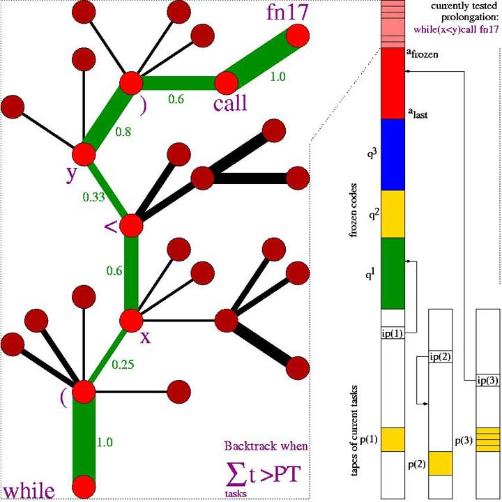

## Context

## Learned in this study

## Things to explore

# Overview
* J. Good (1965): Informal remarks on an "intelligence explosion" through recursively self-improving (RSI) "super-intelligences"
* 1987: First concrete RSI: Genetic programming recursively applied to itself, to obtain meta-GP and meta-meta-GP
* 1997: Reinforcement learning: Lifelong meta-learning with self-modifying policies
	* 2 agents, 2 doors, 2 keys
	* Through recursive self-modifications only, went from 300000 steps per trial down to 5000
* A program is constructed such that it has a probability distribution over the actions/functions it should run at any time t
* Some functions amongst this program are specifically designed to modify the probability distribution themselves, which will influence the future probabilistic program behavior
* How can we make sure that this self-referential system learn "useful" modifications?
* An algorithm is used to verify that the reward for the last [X, now] time steps has been higher than the reward for the previous [X - (now - X),X] time steps
	* If it is superior, then the newer program is better
	* If it is not, then we revert to the previous program
* 2004: Optimal Ordered Problem Solver (OOPS): Time-optimal incremental search and transfer learning in program space
	* Branches of search tree are program prefixes)

* The fundamental deep learning problem
	* As you are backpropagating errors from the future to the past, the error diminishes exponentially or explodes exponentially
* 1991: Unsupervised pretraining for hierarchical temporal memory (stack of RNN) -> history compression -> speed up supervised learning
* 1997: Replaced by the long short-term memory (LSTM)
* 2006: Connectionist Temporal Classification (CTC)
* One network which is modeling/prediction the environment while another is executing the actions

# See also

# References
* [How to Learn an Algorithm](https://www.youtube.com/watch?v=mF5-tr7qAF4)
