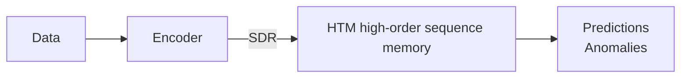

## Context

## Learned in this study

## Things to explore

# Overview

## Why will machines intelligence be based on cortical principles?
* The cortex uses a common learning algorithm
* The cortical algorithm is incredibly adaptable
* It has a network effects: hardware and software efforts will focus on the most universal/generic solution

# Cortical facts
Sensory systems:
* Retina
* Cochlear
* Somatic

Patterns of action potential, firing of neural fibers.
The brain deals with patterns.
The neocortex learns a model from fast changing sensory data. With the model, it can generate
* predictions
* anomalies
* actions

The neocortex learns what is called a **sensory-motor model** of the world.
The brain is a sheet of cells which is remarkably uniform.
It is organized as a hierarchy.
Within a level of the hierarchy are cellular layers.
Within those layers there's an organisation called mini-columns.
At the *end* are neurons.
Learning is about modifying synaptic weights, but also about degenesis/neogenesis of synaptic connections.

# Cortical theory (HTM)
## Overview
1. Hierarchy of identical regions
2. Each region learns sequences (time-based patterns)
3. Stability increases going up the hierarchy if input is predictable
4. Sequences unfold going down

## Questions
* What does a region do?
* What do the cellular layers do?
* How do neurons implement this?
* How does this work in hierarchy?

## Cellular layers
1-6 layers, 2 to 3 layers of feed forward (2-3-4) and 2 layers of feedback (5-6)
Each layer is implementing a type (variation) of a common sequence memory algorithm
Layers 2-3-4 are doing inference
Layer 5 is doing motor behavior
Layer 6 is doing attention

The input to a particular region arrives at the layer 4 (L4) and then projects to L3 which then projects down to the lower layer of the hierarchy
The motor behavior is also passed in at the same time
Thus, what is received is the information that is perceived as well as the recent behaviors of the body

L4: Learns sensory-motor sequences
If the layer is able to predict properly the sequence, it forms a stable representation that is passed onto L3
if it is unable to predict, it passes through the change to L3

L3: Learns high-order sequences

## The neuron
### Biological neuron
10% of the synapses are close to the cell body
Feedfoward input
Added linearly
Generate spikes

2 regions
Basal dendrites (bottom, close to the cell)
Apical dendrites (top, far from the cell)
They are non-linear
Dendritic action potentials depolarize soma

### HTM neuron
Feedforward
Linear summation
Binary activation

Distal synapses
Modeled as a set of coincidence detector
Threshold coincidence detectors
Puts the cell in a predicted state

### Biological synapses
Learning is mostly formation of new synapses
Synapses are low fidelity

### HTM synapses
Scalar permanence
Binary weight

## Sparse distributed representations (SDRs)
Called *The language of intelligence*

Many bits (thousands)
Few 1's, mostly 0's
Each bit has semantic meaning
Learned

## SDR properties
1. Similarity
	shared bits = semantic similarity
2. Store and compare
	store indices of active bits
	subsampling is OK
3. Union membership
	can ask "is this pattern part of the union?"

A cell can recognize many unique patterns on a single dendritic branch

A cell activates from dozens of feedforward patterns
It predicts its activity in hundreds of contexts

## Learning transitions
1. Feedforward activation
2. Inhibition which generates sparse cell activation
3. Formation of connections with nearby cells which were previously active cells (give them the ability to predict future activity)

If a pattern is input, many cells will indicate that they predict to be activated next
It can predict A-B, A-C, A-D
This is known as a first order sequence memory
It cannot learn A-B-C-D vs X-B-C-Y
Mini-columns turn this into a high-order sequence memory

## Forming high-order representations
If there is no prediction, all cells within a column become active
If there is a prediction, only the predicted cells will become active (the other will be inhibited)

## HTM temporal memory (aka cellular layer)
Converts input to sparse activation of columns
Recognizes and recalls high-order sequences

### Desirable traits
* Continuous learning
* High capacity
* Local learning rules
* Fault tolerant
* No sensitive parameters
* Semantic generalization

# Research roadmap

## Applications using HTM high-order inference

# Thoughts on machine intelligence
* Cortical (HTM)
* ANNs (deep learning)
* AI (Watson)

| | Cortical | ANNs | AI |
|-|----------|------|----|
| Premise | Biological | Mathematical | Engineered |
| Data | Spatial-temporal | Spatial-temporal | Language |
|      | Behavior         |                  | Documents |
| Capabilities | Prediction             | Classification | NL Query |
|              | Classification         |                |          |
|              | Goal-oriented behavior |                |          |
| Valuable? | Yes | Yes | Yes |
| Path to machine intelligence? | Yes | Probably not | No |

# See also

# References
* Video: https://www.youtube.com/watch?v=6ufPpZDmPKA
* Slides: http://www.slideshare.net/numenta/2014-10-17-numenta-workshop
