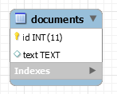
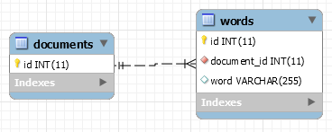
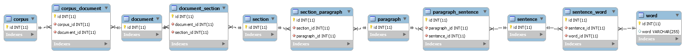
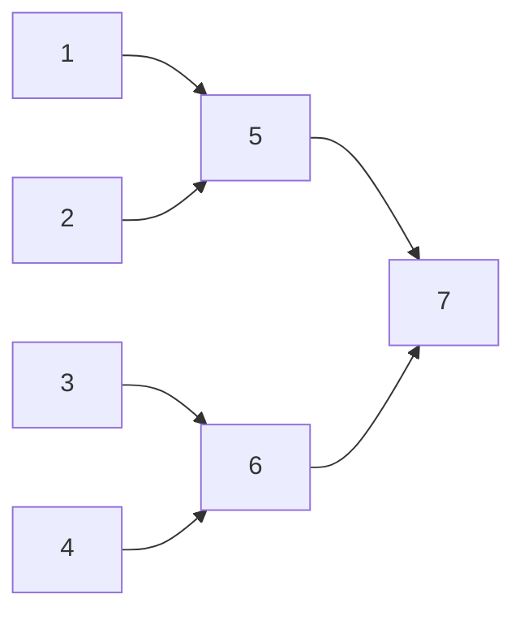
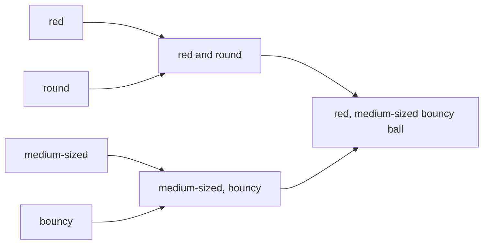
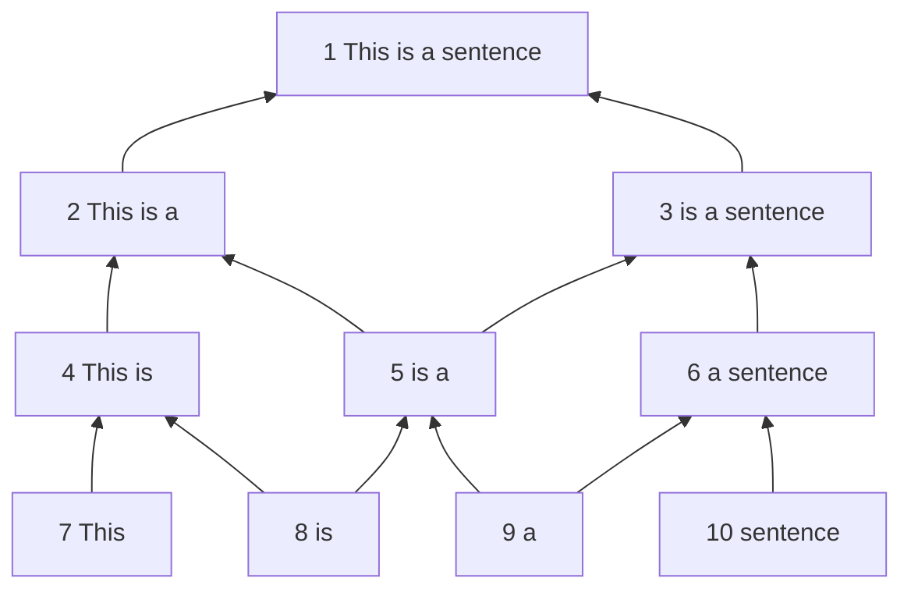
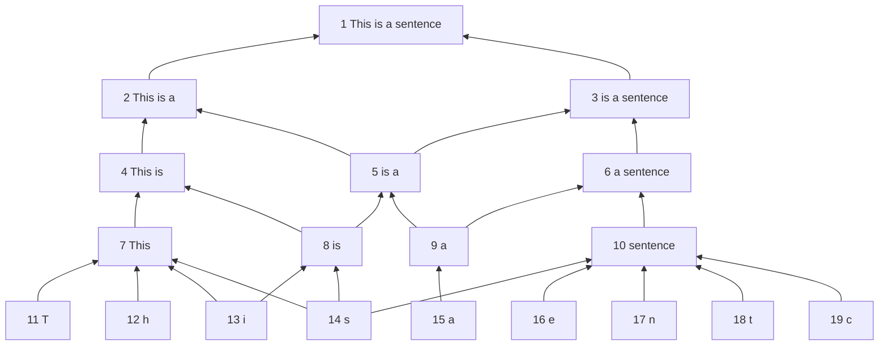
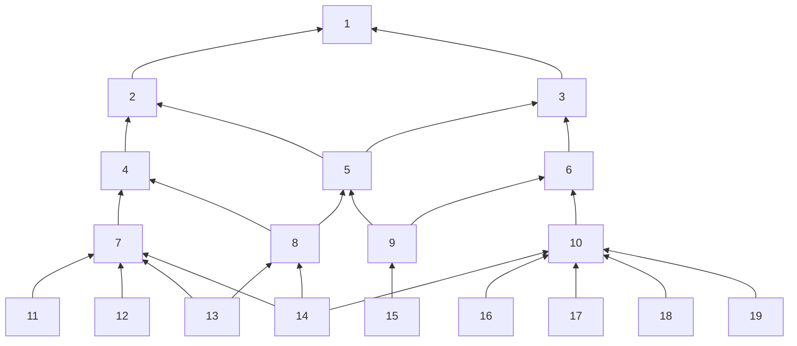

## Context

## Learned in this study

## Things to explore
* Splay tree memory access
* Write about learning and information idempotence
* How should deadlines be enforced? This sounds like an OS problem
* DNA as initial source code for body construction, what about source code for mental processes?
* How are feedback loops implemented? If the brain sends some signal to the arm, how can it tell if the sent signal did what was expected?
* How can a stimuli be mapped to a brain activation? Considering the brain action map will most likely change over time, how can we track a concept? Do we need to provide it as input and record what the activation state looks like?

# Overview
The goal of this article is to detail my process of developing an initial implementation of a "brain" in PHP. As a  initial version, I want to lay down the tools that will help me build such thing so that it may be decomposed into libraries of reusable components.

# Components
* Stopwatch/Time monitoring
* Memory monitoring
* Tokenizer
* Token cleanup
* Database
* Cache layers

# Construction
The first step in order to be able to do anything is to be able to store information. In our case, we will use Wikipedia articles as a source of information.

## Naïve in-memory implementation
A naïve first implementation will simply store the article tokens in a huge array we'll call a `stream`. When we add tokens, we also build up a dictionary or word lookup table, which allows us to return the index of a given word in the `stream`. Doing so allows us to quickly retrieve (dictionary lookup should be O(1)) whether we've already seen a word previously or not at the cost of memory.

This simple construct allows us to store and retrieve strings relatively rapidly. However, as its knowledge base increases in size, it becomes more and more memory hungry (increases linearly with how much data we insert) and slower to test if a particular query string has been seen (a simplistic layered token filtering algorithm will perform badly on frequent/common words).

With this simple "study" of document insertion and retrieval, we can observe two properties we'd like to respect:

* Given a specific amount of memory space for storage and temporary computation, the process should stay within these boundaries at the price of losing existing information.
* Querying for a string should be done in constant time. Given a deadline, the result should either be a result or a failure to find the answer. Common knowledge should be more readily accessible than less frequently used knowledge. In the latter case, it is acceptable to spend more time retrieving said information (similar to how splay tree would optimize their tree).

In order to have a common knowledge base during the rest of our tests, we will build on a small subset of articles from Wikipedia. The list can be found [here](assets/txt/articles.txt). It consists of about 200 articles with varying amount of content.

Using an implementation of the previously mentioned strategy yields the following results:

| Min (s) | Mean (s) | Max (s) | StdDev (s) |
|---------|----------|---------|------------|
| 0.001000 | 0.208460 | 0.737043 | 0.173586 |

Thus, on average it takes ~210 ms to process a query of length varying from 0 to 100 words with a standard deviation of ~175 ms.

## Upgrading to a database
### The relational database approach
The next obvious step is to move from an in-memory data store to a database such as MySQL. Doing so allows us to make use of more efficient means of data storage and retrieval.

In order to store our articles, we have a couple of ways to structure the information:
* Create a `documents` table where we have a field that contains the whole article in a single row
* Create a `words` table where we have a field that contains all the words of the article in a sequence over multiple rows



In the `documents` table approach, we cannot "quickly" retrieve if a word is contained within the knowledge base. It is necessary to go through each article and search for the given word.


In the `words` table approach however we can quickly retrieve if a word is contained within the knowledge base but we cannot tell from which article it came.

| Min (s) | Mean (s) | Max (s) | StdDev (s) |
|---------|----------|---------|------------|
| 0.005000 | 0.187026 | 0.240013 | 0.031417 |



Thus the next approach is to make an hybrid of both: a table such that we have a column that identifies the article containing the word.

Here, we can reconstruct the whole sentence by querying for a given `document_id` and ordering by id. If you are familiar with [database normalization](https://en.wikipedia.org/wiki/Database_normalization), you will probably notice very soon that the word column will most likely contains hundreds, if not thousands and more, copies of the same word. Thus, it'll most likely be appropriate to move this dictionary of unique words to its own table.


Given enough time, one will probably end up with a data structure like the following:



This database contains relations going from corpus down to word. We could even go a little bit further and deconstruct words into characters.

The biggest issue with such a design is that querying for sentences become very complicated. You basically need to do as many `JOIN` as you have words in your lookup query. Each query must then also make sure that words are sequential within the given sentence (that is, the `id` field is increasing). One thing that can be done is to add an `order` column to the `sentence_word` table such that the words "this is a sentence" look as such:

| word | order |
|------|-------|
| this | 0 |
| is | 1 |
| a | 2 |
| sentence | 3 |

This allows us to tell the query that `W2.order =  W1.order + 1` (that the order of the word 2 `W2` must be one more than the order of word 1 `W1`). However all of this is very cumbersome to work with (although it could definitely be hidden from developers/users once a query generator is built to create such requests).

### The key-value database approach
If you recall our initial in-memory approach, we used a simple dictionary approach to store and retrieve information. In other words, we used a key-value storage approach, for which key-value databases such as Redis have been built.

To reproduce the same behavior has we had in memory, we'll create the following keys:

* stream: A list of all the words we've seen in order
* stream.\$word: A list per word we can use to lookup all the index at which the word can be found in the `stream` list

If we reuse the same ideas of the naïve in-memory implementation, but apply it to a key-value datastore such as Redis, we get the following results:

| Min (s) | Mean (s) | Max (s) | StdDev (s) |
|---------|----------|---------|------------|
| 0.507029 | 5.694373 | 13.236758 | 3.798500 |

As you can probably tell, these results are terrible. This is mainly caused by the fact that we need to check if every word is available in the datastore (n queries) and then we need to fetch the list of each word in order to search for the word sequence. Furthermore, like we initially discovered in the naïve implementation analysis, common words will produce a lot of indexes. In this particular case, it makes the search worse as we'll be receiving thousands of indexes (for instance the word "of" will return approximately 59k results).

In this particular case, it seems obvious that getting rid of very frequent words could help us deal with this issue. For example we could skip any word that has more than 1000 indexes (we'll refer to this as the cutoff parameter). When we are asked to search a sequence A * C (where * is a frequent word), we simply ignore checking the frequent word and match any word instead. This is more permissive than previous testing methods and will return incorrect results. With this change, we get the following results:

| Min (s) | Mean (s) | Max (s) | StdDev (s) |
|---------|----------|---------|------------|
| 0.000000 | 0.074198 | 0.344020 | 0.084238 |

If we play with the cutoff parameter and decrease it to 100 (from 1000), performance improve quite considerably (at the cost of generating more wildcard words).

| Min (s) | Mean (s) | Max (s) | StdDev (s) |
|---------|----------|---------|------------|
| 0.000000 | 0.006155 | 0.052003 | 0.008185 |

## Back to the in-memory implementation
With a little bit of thinking, it is possible to improve our performances tremendously. Before we go into the details of those improvements, lets first look into what kind of improvement we're talking about:

| Min (s) | Mean (s) | Max (s) | StdDev (s) |
|---------|----------|---------|------------|
| 0.000000 | 0.001622 | 0.020001 | 0.001414 |

You read that right, that is about 2 ms on average per query, with a standard deviation of 1.5 ms. That is a 100x improvement on our original naïve implementation. What is even more interesting is that the maximum of 20 ms is due to PHP garbage collection. If we use `gc_disable();`, we can get the maximum value at around 5 ms instead of 20 ms. This, at the same time, lowers the standard deviation down to approximately 1 ms.

The way we get to these results is straightforward. First, try to return as soon as possible. In other words, try to figure out as early as possible if you're going to be unable to find any results before proceeding onto more costly operations. For instance, the first thing we want to do is to iterate through the list of unique tokens of the query. You will have noticed the word `unique`. Yes, there is no point in checking if a given token is known more than once. That is our first optimisation.

Once we've verified that all the query tokens are known, we proceed, otherwise we terminate here as there are tokens we do not know, and thus will never be able to match.

While we're checking if tokens are known, we are also building a dictionary of token => count. In other words, we want to know how frequent each token is. This information will be of great value when we'll want to search for the tokens.

With that dictionary built, we order it from the least frequent token to the most frequent token. We also build a dictionary that gives us the token => first index in the query.

At this point we're ready to proceed with the "critical" part of the algorithm, the string matching.

```php
// dictionary of known words from corpus listing all their starting indexes
$vocabulary = ['word' => [1, 2, 3, 5, 7]];

// Build token count dictionary
$tokenCounts = array_flip($tokens);
foreach ($tokenCounts as $token => $count) {
    if ( ! isset($vocabulary[$token])) {
        return [];
    } else {
        $tokenCounts[$token] = count($vocabulary[$token]);
    }
}

// Sort from least frequent to most frequent token
asort($tokenCounts);

// Build token index dictionary
$tokenIndexes = [];
foreach ($tokens as $index => $token) {
    if (isset($tokenIndexes[$token])) {
        continue;
    }

    $tokenIndexes[$token] = $index;
}
```

What we will be doing is iterate through the dictionary of token => count, which is sorted from least frequent token to most frequent token. We'll fetch the list of indexes of the given token.

In the first part of the loop, we'll be building what we'll call our matching indexes, that is, the indexes that have the potential to be valid results for our query. Since our current token is at some position X within the query, we'll have to calculate its offset from the start of the query string. Thus, if the token is at position X and this same token is known at index Y and Z, then Y-X and Z-X are potential matching indexes.

All subsequent iterations of the loop will consist is obtaining the token offset from the start of the query string and then attempting to find these indexes with the list of indexes of the given token. As we progress further down the list of token, less and less matching indexes will respond to the previous criteria.

At the end of the loop, we are left only with  matching indexes.

```php
$vocabulary = ['word' => [1, 2, 3, 5, 7]]; // as shown earlier
$firstToken = key($tokenCounts);
$matchingIndexes = [];
foreach ($tokenCounts as $token => $count) {
    $indexes = $vocabulary[$token];

    if ($token === $firstToken) {
        // Compute the starting index
        $delta = -$tokenIndexes[$token];

        foreach ($indexes as $index) {
            $matchingIndexes[] = $index + $delta;
        }
    } else {
        $delta = $tokenIndexes[$token];

        foreach ($matchingIndexes as $index => $matchingIndex) {
            if ( ! in_array($matchingIndex + $delta, $indexes)) {
                unset($matchingIndexes[$index]);
            }
        }

        if (empty($matchingIndexes)) {
            return [];
        }
    }
}
```

# Serial vs parallel
So far we've been exploring various ways to store information in a sequential fashion, document by document. This obviously simplifies reflecting about the whole system because we do not have to consider concurrent interactions. But this also means that we are limited to doing things in a sequential manner which is more likely going to be a bottleneck further down the road.

# A little program
## Run
From the point of view of a human body:
```php
sense();
think();
act();
```

From the point of view of a machine/function:
```php
input();
process();
output();
// or
output(process(input()));
```

In a high level overview, the brain has only one process, which is the conscious stream. Input and output are comparable to events in the sense that we are more interested in the differences/changes that occur than the bare signal itself.

It is however critical to understand and accept that without any input/environment, the brain has no purpose. In a sense, the sole purpose of the brain is to process/perceive the signal it receives from the environment. We could compare this to the idea of a function without any parameter. This type of function can do a lot, but it generally means that its output (if any) will not be based on anything within the environment (let say here that we do not allow it to ask for things like environment variables nor the time or any files in the file system, as all of these are considered as interacting with the environment). This parameterless function could although output an infinite and irregular string from which any environment could be described if taken at the appropriate starting index. But this is too theoretical and does not help us a lot.

The more common type of function is the one that has at least one parameter, and thus receives information from the environment. Again, we can establish a similar parallel with programming in the sense that one can pass an argument that will not be changed to a function while in other cases the given argument will be modified by the function (immutable vs mutable).

If we decide to go with a sequential approach, where one senses, then think and finally act, we observe an important limitation. If we do not limit the amount of time given to each step, we may end up missing inputs from the environment, our thinking might be out of sync with the environment, or out actions may be irrelevant at the given moment. We may give ourselves two levels of deadline: first, a step by step deadline, that is, 5 ms to formulate an input, 20 ms to think and 5 ms to produce an output, and second, a high level deadline, such as 30 ms per iteration cycle. What this means is that if the input and output process steps take less than 10 ms, we can give their inactive time to the thinking process, so that it may end up taking from 20 ms to 30 ms of the iteration cycle. We may also decide that the thinking step may take up to its deadline duration and then it is forced to go through another iteration cycle.

Another approach is to treat sensing, thinking and acting as three parallel processes. In the same fashion as parallel programming, each process may communicate with the other two through some shared memory means. In this particular case, instead of having the steps being executed sequentially, they may be interlaced. In a system where these three processes can be executed simultaneously instead of sharing time on a single processor, this means that we have more instantaneous action/reaction.

In the sequential case there is however an additional complexity, which is that we'll want to allocate an iteration deadline as well as a "global" deadline. You can think of a global deadline as thinking about some idea until a point X in time. However, because we are trying to do parallelism in a sequential manner, it means that this thinking will be executed in chunks (for instance, in chunk of 20 ms).

However, a deadline system does not make much sense when we attempt to relate it to how our brain works. Instead, the brain appears to be driven by some form of attention competition. In a single process application, this does not make sense since the process is given all the attention of the processor. Thus, this means that either we have to be assessing the state of various processes on a regular basis, or like a deadline would work, the attention given to a process decreases with time until it reaches a point where we might look into figuring out which process should be the next one to be elected as running.

"Interruption" can come from two places: within or outside of the process. In other words, it can be expected or unexpected. When it's expected, it means that we are asking ourselves from time to time "should I switch to something else", which would delegate this question to another process. When we don't expect it, it means that something else is forcing us out of what we are currently doing, similar to how an operating system would evict a running process when its quantum is completed. In the expected case, it means that we're somewhat okay with the idea of being evicted while in the unexpected case, we might be in the middle of something. In order for both cases to work out to be similar, it would mean that we are storing some form of state on a regular basis, such that if we're interrupted, we may lose a bit of computation, but we can still restore our state and proceed.

When we think, it isn't rare that we'll interrupt our thinking in order to think of something else. When we are done with this second thinking phase, we'll generally try to revert back to our initial thinking phase. However, since we are not consistent machines like computers, we do not push our thinking contexts onto stacks. Therefore, the reconstruction of our first thinking process context requires us to possibly start from scratch or to reconstruct it from partial details.

## Input/Sense
```php
autonomic();
somatic();
```

There are two parts to sensing, first there's autonomous sensing and then there's non-autonomous/manual sensing. For instance, there's a lot of sensing that happens on the skin but is never really "transmitted" up to the brain (the information is not important enough). Similarly to the nervous system, there are two types of systems: the somatic and the autonomic/enteric systems. The somatic system mediates voluntary movement. The autonomic/enteric systems manage involuntary functions.

One important thing to note is that it is not because something is sensed that it will necessarily be immediately processed in the thinking phase. At best, it means that senses can be queued but have to be processed within a certain time frame in order to properly represent how senses work in the human body as well as allowing for the capability to infer causality/correlation.

Sensing can also come with some form of degradation or duration of life. In other words, a sensation should have a life time as well as a potential function expressing the input signal based on time.

Every sense is different, but at the end of it, everything is a neurotransmitter/chemical signal. Thus, there's a lot of layers that goes between those chemical and abstract thoughts. What is important to remember is that at every level, everything is built upon the previous level, and thus patterns at the layer 0 become a single recognized pattern at the layer 1. The activation of many patterns of layer 1 then go on to activate patterns at the layer 2 and so on (similar to how NN models are built).

When we are in a crowded location, it is not possible for us to listen to every discussion occurring around us. However, it is still possible for us to focus on particular voices. In the same sense, it is possible for us not to be listening at all to someone that is talking to us when we are the only two people in the room. The sound may be "interpreted" by the ears and received by the brain, but no processing is done on it and thus it is never actively considered.

## Process/Think
```php
$process = stream_priorities.pop();
$process();
```

May not start from input nor end up generating any output.

Most of the work done in the "thinking" phase is what we will consider as internal processing within the brain. In other words, processing our internal stream of "consciousness".

One thing that seems appropriate is having some form of priority queue (most likely some form of heap) that mediates what is the most important thing to be thinking about/working on.

If we base ourselves on how the brain work, we can extrapolate that all it does it process signal patterns. In the case of the brain, the signal pattern is neuron activation.

Similarly to a neural network, the composition of a complex signal comes from the composition of simpler signals. For instance, in the diagram below, if 1, 2, 3 and 4 are activated, then it will activate 5 and 6, which will then activate 7.



If we replace numbers with concepts, we may end up with something like red (1), round(2), medium-sized (3), bouncy (4), red and round (5), medium-sized, bouncy (6), a red, medium-sized, bouncy ball (7).



In this example we are already at a quite high level. Lower levels would have things such as shape, size, texture, color and so forth. When we generalize a concept, such as bouncy ball, it is done through the unification of many examples of bouncy balls, such that when we perceive only a subset of signals, it is enough to trigger the bouncy ball concept.

It is simpler to think of signals in terms of number only. For instance, if we are to feed the system with a text, we could feed it the whole document, a list of paragraphs, a list of sentences, a list of words or a list of characters. However, those are different things and cannot really be compared to one another. However, if we decided to feed any of those or any combination of those items, and that the system simply assigned a number to each instance, then, through some oracle, it could be possible for the system to say "I've already seen this signal, it's #857278476856". Given a signal such as the sentence "This is a sentence" with ID = 1 and the words "This" (2), "is" (3) "a" (3), "sentence" (4), a small network can be composed:



A 4 word sentence can be broken down into 10 nodes. Nodes 7, 8, 9 and 10 are all valid words, while 2, 3, 4, 5, 6 are valid part of sentences. Finally, 1 is a complete sentence.

Were we to feed the system the ID 4 (this is) and 9 (a), what could happen is that
1. nodes 7 (this) and 8 (is) are activated by  node 4 (this is) since they compose it
2. nodes 8 (is) and 9 (a) are active, which  activates node 5 (is a)
3. nodes 4 (this is) and 5 (is a) are active, which activates node 2 (this is a)

During this process, surrounding nodes may be half activated (not completely). We'll call this pre-activation (in preparation of being activated). In the previous example, 6 (a sentence), 3 (is a sentence) and 1 (this is a sentence) would be pre-activated by the activation of 4 (this is) and 9 (a).

If we go further, we could have paragraphs, sections, chapters, documents being identified above (we could say that "This is a sentence" is a sentence that belongs to the document "PHP Brain"). The same can be done below the graph, where characters, and then strokes, could be stored.



A node an link/network architecture is very common for AGI. It is probably the currently best known way to represents concepts and their relations in a common vocabulary. Furthermore, links can have different types (association, dependency, generalization, instantiation, etc.) which makes it perfect for modeling knowledge. However, in order to keep things simple, we could accept to use only one type of relation, the "relates" relationship. We don't really care about the type of relation between the nodes, only that there's something that relate one to the other (such as having smelled something when a particular word was uttered).

If we get rid of the attached concepts and only keep the numbers, we can see the structure of a concept.



 If we wanted to optimize "storage" of such structure, we could for example record the structure and assign it a number. Given the same type of graph traversal algorithm for all structures (pre-order, in-order, post-order), we could recreate this graph many times with different concepts in place of these numbers.

| graph id | cell 1 | cell 2 | ... | cell n |

*(rambling)*
It probably is of interest to think about concepts such as locality when planning about how data should be structured. It would make sense for related concepts to be close to one another. Given that computer memory is linear, this means that we can only have linear proximity (data before and data after a given index). Given how much memory may be read during a single quantum of reading, we could also say that the number of memory cells represents the number of dimensions in which we can have a 1-distance relation with the given item of interest. For example, if we can read up to 1024 32-bits words at once, then we would be able to have 1024 items with a 1-distance of the item of interest. Obviously, we can have an infinite amount of 1-distance items if we give ourselves enough time to fetch those.

## Output/Act
It is safe to consider that we, much like computers, may be acting in a sequential fashion even though we appear to be doing various actions in parallel. In computer terms, we call it multi-tasking.

One important thing to notice is that it rarely appears that we are conflicted between doing various actions on the same body member. For instance, it is rare that our arm will stay frozen in place if we're trying to catch a ball due to the fact that we're trying to catch the ball and also scratch our nose. What this means is that a "task" will generally have precedence/privilege over other tasks when attempting to do something that requires other body parts.

One other example of this ability to control body functions through a single task is when we're talking with other people. Except due to mental disabilities and for children that are currently learning, one's dialog will never be unstructured, that is to say that what they say will always appear to be somewhat coherent and the structure of their sentence will be decipherable to others. If two processes were able to control the mouth and vocal chords at the same time, one could technically express two different thoughts at once.

# Decisions
* Sequential vs parallel
Are the input/process/output tasks done in a sequential or parallel manner? If done in a sequential manner, we need to manage how long the task may execute
* Internal vs external interruptions

# Notes
* Composition, inheritance, instantiation, generalization, dependency, association, aggregation

# Post-mortem

# See also

# References
* http://c2.com/cgi/wiki?HumanSourceCode
* http://c2.com/cgi/wiki?RefactoringTheHumanBody
* http://www.ncbi.nlm.nih.gov/pmc/articles/PMC2826883/
* https://en.wikipedia.org/wiki/Brain
* https://en.wikipedia.org/wiki/Sensory_system
* https://en.wikipedia.org/wiki/Multisensory_integration
* https://www.newscientist.com/article/2078821-facebooks-ai-is-learning-by-reading-loads-of-childrens-books/

## Brain vision
* https://www.youtube.com/watch?v=ETIp8kZPoBw
* https://www.youtube.com/watch?v=TbDFrbXiz2s

## String search
* http://www.dmi.unict.it/~faro/smart/index.php
* http://www-igm.univ-mlv.fr/~lecroq/string/

## OOPS and Gödel machine
* [The New AI: General & Sound & Relevant for Physics](http://arxiv.org/pdf/cs/0302012v2.pdf)