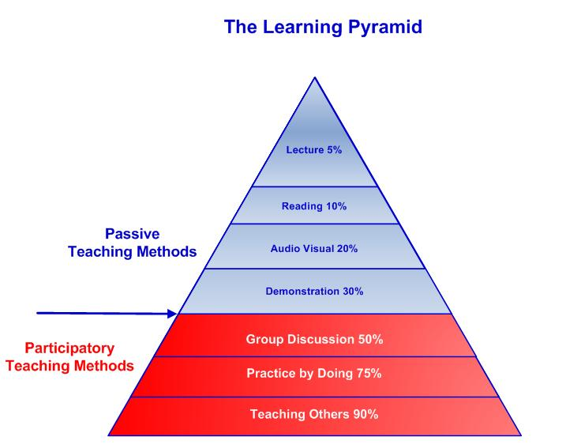

## Context

## Learned in this study

## Things to explore

* Which channel has the best retention rate?
* What is the rate of image creation within the mind?

# Overview

# Output

* Handwriting: 30 wpm [^5]
* Typing: 50-80 wpm [^5] [^4]
* Speech: 100-125 wpm, slide presentations - 150-160 wpm, audiobooks [^5]

# Input

* Listening: 100-125 wpm, slide presentations - 150-160 wpm, audiobooks [^5]
* Reading: 228±30 wpm (in English) [^5]

# Retention

> You remember approximately 30 percent of what you see.
> You remember approximately 50 percent of what you hear and see together.
> You remember approximately 70 percent of what you say (if you think as you are saying it).
> You remember approximately 90 percent of what you do.[^1]

Source: Darthmouth College

> We retain approximately 10 percent of what we see;
> 30 to 40 percent of what we see and hear;
> and 90 percent of what we see, hear, and do.
> We all have the capability to learn via all three styles, but are usually dominate in one. [^2]

Source: National Highway Institute

 [^3]

# See also

* [Senses](../senses)

# References

[^1]: http://www.dartmouth.edu/~acskills/docs/study_actively.doc
[^2]: https://www.nhi.fhwa.dot.gov/downloads/freebies/172/PR%20Pre-course%20Reading%20Assignment.pdf
[^3]: http://thepeakperformancecenter.com/educational-learning/learning/principles-of-learning/learning-pyramid/
[^4]: http://typefastnow.com/average-typing-speed
[^5]: https://en.wikipedia.org/wiki/Words_per_minute

* https://en.wikipedia.org/wiki/Forgetting_curve
