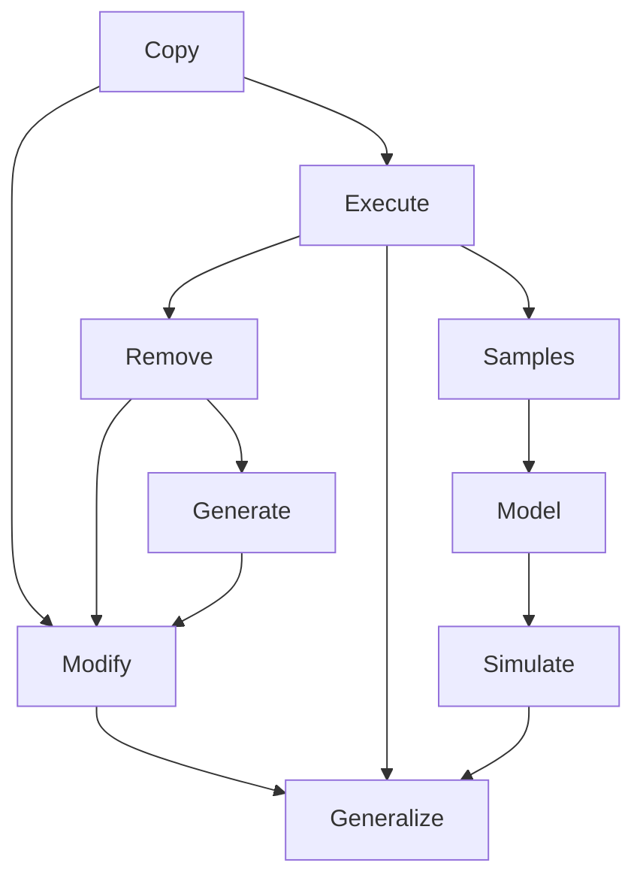

## Context
A seed AI is an initial computer program that is able to recursively self-improve. This means that once it is started, one of its main goals will be to improve its existing code into a better one and then switch to this newer implementation in order to benefit from the changes it has made to it.

Seed AIs are interesting because it would mean writing a very bad initial version which would then get improved by the algorithm itself. Furthermore, it would also mean that you might be able to give it external programs and it may be able to propose improvements to them.

In other words, a seed AI is a program that would learn and understand how programs work, what their purpose is and what meaningful improvements can be made.

## Learned in this study
* A program is a dictionary of functions
	* Like dictionary's definitions, functions are defined in terms of other functions
* **LLMs as Seeds:** Large Language Models can serve as the "bootstrap" for a seed AI by providing high-level reasoning and code generation capabilities from day one.
* **The Agentic Loop:** Recursive self-improvement can be implemented as an agentic loop (Write-Test-Reflect-Fix).

## Things to explore
* **LLM Self-Improvement:** Can an LLM effectively fine-tune a newer version of itself using synthetic data it generated?
* **Verification vs. Generation:** It is often easier to verify code (using compilers, tests, or formal methods) than to generate it. How can a seed AI leverage this asymmetry?
* **Architecture Search:** Can a seed AI design a better neural network architecture for its own next generation?
* **Prompt Engineering for Self-Improvement:** What are the optimal "system prompts" for a self-improving agent?
* What are the issues with writing a program generator?
* What are the tools that we currently have to solve those issues?
* Look at theoretical implications of program generation (probabilities)
* Define the problem and the goal
* There are infinite programs that can be built, what does that mean?
	* What does it mean if you consider those programs can help improve the existing program?
	* Is there such a thing as a *single* "perfect" program?
* Isomorphisms of programs considered/identified as integers
* What kind of analysis can be done in order to reduce/discover isomorphic programs?
* Are sleep() calls put into code *always* candidates for optimization?
* What is the impact of rand() in testing for algorithmic improvement?
* Generating programs amount to generating graphs, what does that imply?
* Learn "valuable" programs from a training set (SL), then use MCTS + Q-Learning (policy network + value network) to determine the direction in which newer programs should be searched (RL)
* Considering a seed AI will eventually create any function, what are the consequences of that?
* Programs are nothing more than a single huge integer (represented by the program binary executable)
* Data structure optimization through code analysis (how is this data used and could another structure be more efficient for that same purpose?)
* Self-improvement vs improvement vs learning
* What kind of analysis can be done in order to reduce/discover isomorphic programs?
* Can we use AST analysis to determine the number of potential programs of breadth b and depth d?
* What is the statistics on the number of parameters per function? (how many of arity 0, 1, 2, ...?)
* How can you, starting with a list of programs, create new (and valuable) programs?
* What kind of functions do we expect to see in a seed AI?
* How does one guide a seed AI to develop itself?
* Is there a way to classify/hierarchize seed AI programs in order to create families of programs (similar to Darwin's tree of life)?
	* Parent-children relations
		* A certain amount of behavior is shared with the parents, but a certain amount of it is changed due to mutation
	* Programs with similar behavior(s)
* How will it learn what functions do?
* What are the first things a baby learns to do?
* What are the mechanisms of learning already in place at birth?
* If learning had already started in the womb, then when did this start occurring?
* What are the necessary components to learning?
* Is the current problem with ANN is that we don't know what the architecture is? (And that the neuron model is correct/good enough)
* What can explain why we can remember at most 7 things?
* Is it possible to give it some kind of scaffolding such as functions signatures with no implementations or pieces of existing software?
* Should it learn a single programming language or many of them at once?
* Given that you can approximate a dataset up to a certain precision given a dataset, what is the best approach to recognize the constructs necessary to reconstruct the data using as few of them as possible? In other words, how do you find the shortest program that will generate a dataset?

# Overview
The goal of this study is to look into the constraints and requirements that go into building what is called a *Seed AI*, that is, a program that is able to improve itself.

The goal of building such a program is to then allow it to run free and hope that it will be able to rapidly (hopefully at an exponential rate) improve itself. With such rapid rate of improvement, it should be able to catch up with our intelligence rapidly (assuming intelligence is only a manifestation of the emergence of knowledge) and once it has surpassed us, *hopefully*, help us improve our understanding of the world and answer questions we haven't been able to answer ourselves yet.

We will obviously neglect to discuss about means to control this seed AI as well as any negative consequences related to building such an AI. Those are extremely important topics, however, they are not the focus of this article.

For most of the article, we'll consider that the seed AI will start from scratch and build up its own language, that is, its set of operations. We thus will assume that the lowest language available to it is the assembly language of the hardware architecture it is deployed on (most likely x86-64 if it were developed today). It seems obvious that at some point in time the seed AI will have to consider the hardware architecture it is running on such that it may improve it further.

Let us first start by designing a naive program generator, with the hope we can build something simple enough that it can run on its own and evolve.

# Understanding the "core" language
The original 8086/8088 instruction set had around 100 instructions[^1]. Given this set, the seed AI has two options on how to proceed:
* naively generate programs by concatenating instructions
* test each instruction and attempt to reason about the inputs and the outputs (registers and flags)
In all cases, we (as the seed AI programmer) will have no choice but to write some sort of bootstrap program.

Naively generating programs is easy. But it is also terribly inefficient.

Writing a bootstrap program that will be able to provide the seed AI with the capability to reason about its instructions and their impact is probably close to providing the seed AI with intelligence to begin with.

Based on these two results, is it still a possible or viable solution to look into seed AI? Maybe.

By trying to bootstrap the seed AI from scratch, we're faced with the issue that brute forcing our way in will take probably way too long to be of any value. What we can do to improve our chances is to look into providing the seed AI with a bigger bootstrap program. For example, by providing it with a standard library, it will be possible for it to copy and mutate existing bits of code. The hope here is that once we reach a critical point, the seed AI will start to behave more intelligently and gain momentum.

Another option is to move the core language of the seed AI to a high-level language such that it may not have to worry about low-level constructs (such as `MOV`, `JMP` and such) but higher levels one (function declaration, function calls and such). This idea could be applied at any programming language level, which means it could be possible to bootstrap the seed AI in any given language. Much like our current programming language paradigms, it is likely the seed AI will make use of various levels of abstraction while evolving, starting with rudimentary concepts such as adding, subtracting, dividing, copying, etc. to abstract concepts such as sorting, rendering shaders, sending data packets, etc. up until the point it can express what it does in a less formal language such as a natural language like English.

# The program tree
When we write programs, we can think of the all the code concatenated together as a single string. That string is the program.

We can think about each program as being part of a tree where the root is the empty program. If we assume the characters range used to describe programs are from ASCII 32 to 127, the branching factor of the tree is (127 + 1) - 32 = 96.

Each level **n** of the tree represent the strings of length **n**. The root of the tree has level **n** = 0 and thus has a length of 0 while a string at level **n** = 10 has a length of 10.

# Naive program generator
A 10 character long program in the range of ASCII 32 - 127 will have approximately $((127 + 1) - 32)^{10} = 6.6 \times 10^{19}$ (that's 66 quintillions) possible permutations.

To put 66 quintillions in perspective, let say we can test approximately 10^4 programs per second (ignoring the fact that the longer the programs get, the longer the compiler will take to *process* the program, but in the case of a 10 character program, it's negligible). We're left with about $2.1 \times 10^8$ years of computation to generate ($\frac{6.6 \times 10^{19} programs}{10^4 \frac{programs}{s} \times 365 \frac{day}{year} \times 24 \frac{h}{day} \times 60 \frac{m}{h} \times 60 \frac{s}{m}}$). Obviously we could use various methods to improve our odds of getting there faster, for instance by using parallelism (using multiple cores, multiple processors, multiple computers).

However, testing those 66 quintillion programs seems like a big waste of time, power, and resources. Only a certain percentage of those 66 quintillion permutations are valid code. Furthermore, it is likely that a good percentage of these permutations are also isomorphic, that is, they produce the same exact behavior, but are represented using different strings. Thus, it is obvious that generating all those permutations is a naive way to generate *potentially* valid programs.

Furthermore, to truly understand the issue here, we're talking about generating *only* the set of all valid strings of length 10, which is terribly small. Increase the length by one and you now have $((127 + 1) - 32)^{11} - ((127 + 1) - 32)^{(11 - 1)} = 6.3 \times 10^{21}$ (6 sextillion) of programs of length 11 to check (note that we excluded all programs of length 10 or less). Thus, building any *real* program that can get into the millions of lines of code and with an average of 10 characters per line, will require you to wait for a while.

One interesting problem here is that very small programs can be valid. For instance `0;` is a valid program. For that matter, any number should be a valid program in C (in our little 10 character program, we can generate $10^9$ programs based only on numbers: 9 numbers from 0-9 and a semi-colon (;) to create a syntactically correct program, considering all programs are wrapped within the obligatory `void main() { code here }`). This means we can basically generate many programs that basically do nothing other than creating giant numbers (or do nothing if they go through the optimizer). Furthermore, there's also a ton of programs that will do arithmetic but never print out anything, or print a ton of garbage/random. Maybe it is something we want... But often it's not (and such code is generally stripped by compilers during optimization).

It's also important to notice that a certain space of the program tree will represent equivalent code, just using different variable or function names. The same can be said about variable definition being permuted without any effect, or calculation order being permuted without having any effect.

From this little analysis, we can deduce a few *rules*:
* A program should *produce* something, in other word generate some sort of output (doing arithmetic without returning anything amounts to running NOPs). This can be rephrased by saying that any program that is completely composed of dead code should not be considered valuable.
* If it does not produce an output, then it should alter its own state. In doing so, the altered state IS the output of the program. In object-oriented languages, this is often what will happen (objects being altered internally).

# Improving the naive program generator
What we can do to greatly reduce the search space is to teach the program generator a little bit:
* Give it a grammar of the language it is using. There is no point in generating code that will not compile (it can be useful if what you're doing is verifying that the grammar is properly implemented).
* Promote function reuse. Once some functionality has been programmed, there's no point in writing that bit of code again. This means that we can remove/ignore all of the nodes in the program tree that have this code string located somewhere and replace those with a call to the reusable function.
* Recognize that there are a huge amount of programs that are exactly alike, but differ only because of variable name
* <tbc></tbc>

# Reducing the search scope
In an attempt to reduce the volume of valid, but isomorphic programs, we will spend a bit of time studying what make different programs (or functions) isomorphic (different at the high-level language but the same from a conceptual perspective).

We'll assume we're using a high-level language with typing such as C++/Java/PHP.

<pre><code class="language-cpp line-numbers">
C x(A a, B b) = C y(B b, A a)
</code></pre>

Two functions which have the exact same internal logic and return type but different parameters order are isomorphic. Furthermore, many functions which do not have the same syntax can have the same semantic (different code, same result). In order to reduce the number of functions generated with the same internal logic but different signature, we'll establish the following rule:

In order to simplify the "seed" language, we will prefer to use integers instead of function names. It makes the code much more difficult for human beings to read, but it makes it easier to reason about. For instance, the operation `1 + 2` could be encoded as `[13][1][2]`, where 13 is the addition operation, or `myFunc(a, b, c)` is `[233][1][2][3]` <!-- This is not super clear -->. What we are doing here is basically what the compiler does, that is, convert human readable code into a binary string (a very large integer).

**Parameter ordering rule:** Parameters shall be ordered in ascending order based on their type integer (each type is assigned a unique integer, which would be generated such that it is always the same number that represents the same data structure). Parameters of the same type are considered to be indifferentiable (their order does not matter, and thus there can only be 1 such signature).

<tbc></tbc>

For a number $x$ of different parameters, there is at most $x!$ signature permutations. Using the **Parameter ordering rule**, we can limit it to 1.

If there are $x$ types in the system, for a function with $y$ parameters we have at most $x^y$ signature permutations. From this simple expression, we can see that adding parameters has an exponential impact on the number of signatures while adding types only increases the number of signatures linearly.

Following the **Parameter ordering rule**, we can limit the number of signatures to $\binom{y+(x-1)}{x-1}$. For example, a system with 5 types and a function with 3 parameters will have $\binom{3+(5-1)}{5-1} = \binom{7}{4} = 35$ potential function signatures and not $5^3 = 125$.

| # of parameters | Combinations | Valid signatures | Potential signatures |
|-|-|-|-|
| 1 | $\binom{x}{x-1}$ | $x$ | $x^1 = x$ |
| 2 | $\binom{x+1}{x-1}$ | $\frac{x(x+1)}{2}$ | $x^2$ |
| 3 | $\binom{x+2}{x-1}$ | $\frac{x(x+1)(x+2)}{6}$ | $x^3$ |
| 4 | $\binom{x+3}{x-1}$ | $\frac{x(x+1)(x+2)(x+3)}{24}$ | $x^4$ |
| y | $\binom{y+(x-1)}{x-1}$ | $\frac{(y+(x-1))!}{(x-1)!y!}$ | $x^y$ |

## Other tricks to reduce the search scope
Another thing we may do in order to limit the number of generatable functions is to add artificial constraints such as
* functions shall have no more than 5 parameters
* functions shall not have more than 10 statements
* functions shall not have more than 3 levels of indentations
* functions shall contain at most 1 level of indirection (Law of Demeter)

Using design guidelines and best practices, it may be possible to shape and reduce down the number of "acceptable" functions within our programs.

Sequential operations that may be executed in any order without affecting the determinism of the function should be considered as a single function.

# Some problems that remain
However, even given these *tools*, the program generator still can spend an immense amount of time generating useless programs:
* It can generate infinitely long *valid* text strings.
* It can generate infinitely long *valid* expressions.
* It can generate an infinitely long *valid* sequence of function calls that do not produce any valuable result.
* and so on...

<tbc></tbc>
* Are all these tricks/tools really helping us in reducing the program space into something more manageable? Or are we simply moving from infinity to infinity - a certain number, effectively still being infinite?

# The program/data duality
A seed AI is considered to be the minimal program that will produce a chain of self-improvements. This, in turn, means that the program will likely increase in length as its complexity increases. Furthermore, this also means that it will go through a series of implementations, some of which will contain the original seed AI code and some which may not. What I'm trying to get at is that this "bootstrapped" seed AI will have many "appearances/forms", which means that we can look for seed AI at various stages in its evolution, hopefully finding any of which we can use to get the process going.

Given that a seed AI is likely to be a small program that requires huge amount of data to transform "itself" (the association of the seed AI and its processed data), how can we recognize this program, given it would have to transform a huge amount of data before appearing intelligent? It seems that the answer is that we need to be able to recognize a program that can do such transformation, given enough time.

# Testing programs for improvement
When we think of programs and algorithms quality, we generally think of them in terms of complexity of time and space. Thus, in order to look for improvements in an algorithm (a unit of a program), the seed AI would have to execute said algorithm with various test cases in order to see the impact it has both on time and space. This would be considered the empirical approach to testing algorithms for improvement.

Another approach, known as the theoretical approach, consists of analyzing the algorithm in terms of the operations it executes (such as for/foreach/while loops and recursion ([master theorem](https://en.wikipedia.org/wiki/Master_theorem))). This approach is very interesting as it does not require the seed AI to test many cases in order to establish if a modification is an improvement or not (this is akin to doing white box testing). Furthermore, it also does not require the generation of parameters for the algorithm. However, without knowledge of the hardware on which it will be executed, the resulting metric may only be an approximation and be incorrect depending on the hardware the program will run on.

Finally, there is a hybrid approach, which combines the previous two approaches. If you are only able to analyze the algorithm with some degree of confidence, then it is possible to validate if your estimates are correct by running various test cases against the algorithm. If your estimates are correct, then you can proceed to work on something else, otherwise, you may have to review your analysis.

## Criteria for *properly* testing programs for improvement
Assuming an already correct algorithm (one that is void of any incorrect behavior), the seed AI...

* Must test that the change does not modify the output for the same input (if any)
	* In the case that no output is generated by a function (think of object oriented programming), the internal state must remain the same (the exception being if the data structures used to represent the state have changed)
* Must respect/have the same preconditions/postconditions of the original algorithm
	* New functions with better performance but less accuracy (when it is not necessary) may be developed, such that the pre-conditions/post-conditions are more relaxed
* Must test for various inputs in order to observe their impact (black box testing)
* May analyze the source code in order to understand how the inputs affect computation time and space (white box testing)

This list is however constraining. A simple example of that constraint is asking a seed AI to optimize an algorithm such as quicksort. If it is already divided into its main parts, picking a pivot, separating values on each side of the pivot, recursively sorting, then it may not be possible to optimize any part separately. However, it may be possible to optimize the algorithm as a whole.

It is important to be able to make the difference between the API and its internal, since the goal of optimizing a program is generally to rewrite the internals, however they might have been assembled, into a new structure that is more optimized for the task.

# Various starting case studies
## Optimize and improve existing code
<tbc></tbc>

## Generate a function which fulfills a given specification (pre/post-conditions)
<tbc></tbc>

## Build an application constructively
If we were to iteratively generate every program from the empty string to programs such as `return 133;`, many of these valid (returning a value) programs would return either a number (signed/unsigned, integer/float/double) or a string. If we were to assign a unique identifier to each of these unique functions, we'd have millions of these simply returning numbers. However, we know that these functions could be generalized into something like `int a3231(int number) { return number; }` (however such function is so simple it is basically a value pass-through). Thus our seed AI would need to be able to generalize such concepts or pay the cost of storing billions of intrinsic values like these in functions. Given that we may have replaced billions of programs by this new function, the argument to this function still needs to be instantiated. What we've done by building a function is reduce the set of functions of the form `int xyz() { return $number; }` (where `$number` is a given number) to a function call with a number instantiation.

<tbc></tbc>

# Capabilities of a seed AI
* Generalize/Refactor similar functions
* Reuse existing code
	* Can recognize that a sequence of instructions already exists and can promote it to a function so it can be reused
		* Convert sequences of instructions into functions
* Understand what data structures are iterated over and what is being done over this data
* Manipulate language/grammar
	* Use language reasoning tools (abstract syntax tree)

# Heuristics
* Prefer lookup/hashing over search/predicate testing

# Functions of a seed AI
We will assume that our seed AI "evolves" through immutability, that is, once a function is generated, it is never modified. If we want a function with similar code but a little different, then this function's code is duplicated and changes are applied to it. Finally, functions may be removed if a generalized instance is available (e.g. multiplication by addition (3x5 = 5+5+5) being replaced by multiplication (3x5 = 15))

The following is a list of functions we expect to find in a seed AI for it to be able to evolve.

* Generate code (requires the capability to generate syntactically valid statements and expressions)
* Copy (existing) code
* Modify (existing) code (by copying and generating code)
* Execute code
* Remove code
* Generalize code (requires the capability to recognize that different code generate the same results, and that the specific instance can be replaced by the generic instance)
* Simulate code (using an internal model of the language)

# Learning to program
Below is a graphical representation of what a typical new programmer will go through as he learns to program. You can think of all the steps as applying to the code (copying code, executing code, removing code, etc.).

# A second observation (months later)
The simplest seed AI that exists is simply a natural number *generator*. It probably does not qualify as seed AI in itself, but it has the fundamental functionality we are looking for: it generates programs. In its simplest form, a program is called a binary, which is a base 2 representation of a number. The simplest program that is a number generator starts with the number 0, and it loops infinitely, incrementing this number by 1 each iteration. During each iteration, this number is written to a file, effectively generating a binary/executable.

Obviously, such generator will generate an infinite amount of programs, many which will turn out to produce invalid outputs or even crash! Furthermore, we are generating so many programs, yet we are not doing anything with them. Thus, we need a second program to do something with these programs. This second program is simple, its task is only to run all the programs produced by the generator. We'll call this program the *executor*. The executor will simply start the program, determine if it crashes (within a certain number of instructions), and if it does, it will delete it from the disk. Thus, every program that does not crash will be considered as a seed AI candidate.

At this point we can already see various issues with this approach:
* The generator is building an immense amount of programs that are simply invalid (which should not get to the executor)
	* This decision was made in order to keep the generator simple. An intermediate step between the generator and the executor could be to verify the binary and eliminate any that are invalid.
* The executor is unable to execute programs that require input(s)
	* It technically can execute them, but any program that is expecting inputs and crash upon not receiving them will be thrown away (which is a good thing).
* The executor cannot decide if a program that is in a loop will ever terminate (known as the halting problem)
	* At this point, this is not really an issue. The executor can consider that after X seconds/instructions, if the program is still alive, then it can be kept for further processing.
* There is no way for the executor to tell if a program is better than any other
	* This will be our biggest challenge going forward. It is basically the task of determining through some means if a program is more valuable than another one (often known as a utility function). The fact that we are already removing invalid programs is an example of an evaluation done by the utility function.

If we consider the idea of Turing and von Neumann that we require a certain amount of complexity before intelligence emerges, we could translate the idea of the complexity barrier into a form of "challenge". For instance, we could program a simple challenge where when we input "0", the program should output "0" too. Such challenge would kill any program that fails to pass this challenge given a certain time/instructions limit. Let's consider a more interesting challenge. We want the program to output as many bits as possible within a time/instructions limit. This allows for a larger variety of programs to live, but as better programs emerge (programs that generate more bits in less time), some form of selection is indirectly produced if only a certain amount of programs are allowed to live, and the most productive programs are allowed to live while the least productive are killed.

Such challenge could thus be used to represent different barriers intelligent beings had to pass through: from simple assemblage of molecules to living organisms, from living organisms to intelligent organisms. Here we can ask ourselves whether one can have intelligence without the "living" part.

# Komolgorov complexity
Based on the Kolmogorov complexity, if we can find a "larger" program that accomplishes a given program description, it "might" be possible that a shorter one exists, however it might not be provable due to the halting problem which states that there are programs for which we cannot tell whether it will halt.

Given that machine learning is about a small amount of code learning from huge amounts of data, it might be that a program such as a "human" is also of similar format, that is, short and concise but requiring huge amounts of data to tune its weights/data store.

By running every program in parallel, one step at a time, it is possible to construct a list of the programs that completed after $n$ steps. Once we find a program that accomplishes what we want it to do, we can be certain that no shorter program will be able to do so. One interesting observation/challenge from the previous comment is that given an algorithm, a large part of the behavior we might want may depend on data which is external to the program itself.

# See also
* [Automated programming](../automated-programming/article.md)
* [Automated refactoring](../automated-refactoring/article.md)
* [Clone detection](../clone-detection/article.md)
* [Constructing functions](../constructing-functions/article.md)
* [Holonic program language](../holonic-program-language/article.md)
* [Mathematics based AGI](../mathematics-based-agi/article.md)

# References
[^1]: https://en.wikipedia.org/wiki/X86_instruction_listings#Original_8086.2F8088_instructions

* https://en.wikipedia.org/wiki/Programming_language_generations
* https://en.wikipedia.org/wiki/Recursive_self-improvement
* https://en.wikipedia.org/wiki/Self-modifying_code
* http://wiki.lesswrong.com/wiki/Seed_AI
* http://mattmahoney.net/rsi.pdf
* Lenat, Douglas B. [*AM: An Artificial Intelligence Approach to Discovery in Mathematics as Heuristic Search*](http://www.dtic.mil/dtic/tr/fulltext/u2/a155378.pdf). Stanford: Computer Science Dept., Stanford University, 1976.
* Turing, Alan. *Intelligent Machinery*. London: National Physical Laboratory, 1948. Ed. B. Jack Copeland. The Essential Turing. Oxford: Clarendon Press, 2004. 430

## Inductive programming systems
* The FLIP System - http://users.dsic.upv.es/~flip/flip/
