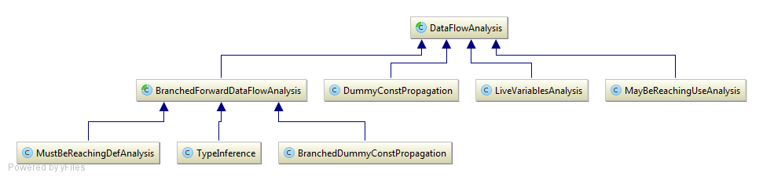

## Context
If I can reason about a program in any language, a computer should be able to do it too. Obviously, this implies and requires a lot of knowledge acquired over time, and in particular, the peculiarities of the language being reasoned on.

As I've been a PHP developer over many years, I decided to look into the currently available open source libraries on the topic of static code analysis, particularly oriented toward control flow analysis, data flow analysis, and potentially the ability to reason about a piece of code in order to prevent bugs and, tentatively, to automate the process of unit testing.

This analysis is based on [the legacy branch of PHP Analyzer, commit 896beb2d70](https://github.com/scrutinizer-ci/php-analyzer/commit/896beb2d70e05c438b539d507367ffaeed8969b1).

## Learned in this study

## Things to explore
* Describe the technique used to extract the data of interest during a pass

# Overview
* A run command
	* An analyzer which contains a pass config
		* A list of passes to be executed
		* There are 4 passes type
			* Initializing
			* Analysing
			* Reviewing
			* Fixing
	* The analysis consist of running each pass over all the given files

# Bootstrap
The collection of files to be parsed and analyzed is obtained by filtering a given directory.

Upon a PHP file being read, it is parsed/traversed and preprocessed (types namespace are fully qualified and nodes are normalized according to PHP Analyzer).

Normalizing encapsulates PHP-Parser nodes that have statements within a `BlockNode` (simply an array wrapper) as well as injecting the imported classes in the namespace node. Both of these could probably have been done in a initializing pass.

Finally, a second traversal is done in order to connect nodes together (set their parent and siblings (previous/next)).

At this point, our PHP file collection is ready to be processed by the analyzer. Its code has already been converted into an AST, which will be used over and over again during the process of analysis.

# Pass analysis
The passes do the following...

## Initializing
### TypeScanningPass
Finds all classes/interfaces/traits and add them to the registry. Find all functions and add them to the registry.

#### Uses
* [Class parser](#class-parser)
* [Comment parser](#comment-parser)

### TypeInferencePass
Builds a control flow graph (through control flow analysis) (intraprocedural) for each scope level. Using this CFG, we then go through a data analysis pass where we build a lattice that will represent the variables and their type at a given point in the code (type inference), given the paths that were taken.

#### Uses
* [Comment parser](#comment-parser)
* [Control flow analysis](#control-flow-analysis)
* [Function interpreter](#function-interpreter)
* [Scope creator](#scope-creator)
* [Semantic reverse abstract interpreter](#semantic-reverse-abstract-interpreter)
* [Type inference (data flow analysis)](#type-inference)
* [Type registry](#type-registry)

### MarkPassedByRefArgsPass
Based on the called function signature, annotates a function argument to indicate whether it is passed by reference or not. This is useful to determine whether a variable can be modified when passed as reference (mostly interesting for non-object types).

#### Uses
* [Type registry](#type-registry)

### VariableReachabilityPass
Computes the nodes that may/must be providing values to the node being examined.

The "maybe" cases are based on branches, initial variables and loops. In different branches, variables may be assigned different values, and thus code after the if/else has executed may depend on which branch was executed. In loops, a variable is generally initialized and used as a condition to terminate the loop. As the loop progresses, this variable's value might have come from the initialization or the update step.

The "must" cases are the linear cases, in other words, any sequence of code (no branches/loops).

#### Uses
* [Control flow analysis](#control-flow-analysis)
* [MayBeReachingUse Analysis](#maybereachinguse-analysis)
* [MustBeReachingDef Analysis](#mustbereachingdef-analysis)

### ReturnTypeScanningPass
Scans only functions and methods in order to determine the type of returned values. If no return is explicitly defined, returns null. Constructs a union of all potential types that could be returned by the analyzed function/method.

#### Prerequisites
* [TypeInferencePass](#type-inference-pass)
* [VariableReachabilityPass](#variable-reachability-pass)

#### Uses
* [Type registry](#type-registry)

### InferTypesFromDocCommentsPass
For any types that could not be inferred through code analysis (e.g., because the type was not specified in the function parameters), the php doc blocks are read in attempt to assign types to parameters and the return type of the function.

#### Uses
* [Comment parser](#comment-parser)
* [Type registry](#type-registry)

### CallGraphPass
Build a call graph (interprocedural) between functions/methods (what calls what).

#### Uses
* [Type registry](#type-registry)

## Analyzing
### CheckParamExpectsRefPass
Verifies that functions expecting a reference are indeed called with an argument that can be used as a reference.

#### Uses
* [Type registry](#type-registry)

## Reviewing
### CheckstylePass
Does basic style checks such as curly braces placement and name format for local variables, interfaces, classes, methods, functions, properties, etc.

### CheckUnreachableCodePass
Given a control flow graph, determines which nodes can/cannot be reached using fixed point graph traversal.

Appears to be inspired by [Google closure compiler fixed point graph traversal](https://github.com/google/closure-compiler/blob/master/src/com/google/javascript/jscomp/graph/FixedPointGraphTraversal.java).

#### Uses
* [Control flow analysis](#control-flow-analysis)

### CheckAccessControlPass
For all classes properties that are being accessed, determine whether the access is correct for the given context. Public properties are always accessible, protected properties are accessible from the declaring class and all descendants and private properties are only accessible from within the class (or trait).

#### Uses
* [Type registry](#type-registry)

### CheckForTyposPass
For all property fetch, static call or method call, we check if the given name exist, and if it does not, then a name fix is suggested (name similarity is computed using [similar_text](http://php.net/manual/en/function.similar-text.php) .

#### Uses
* [Type registry](#type-registry)

### CheckVariablesPass
Verifies the presence of a variable definition before it is being used.

### SuspiciousCodePass
Inspects the code in order to find common code constructs that leads to errors:

* Empty catch blocks without comment
* Fall-through switch cases without comment
* Assignment of null return value (no return value in called function)
* InstanceOf with non-existent class
* Catch block with non-existent class
* Overriding closure use (variable not used as reference)
* Use statement alias conflict

#### Uses
* [Type registry](#type-registry)

### DeadAssignmentsDetectionPass
Detects variables to which a value is assigned, but which are never used afterward.

See [Live variable analysis](https://en.wikipedia.org/wiki/Live_variable_analysis).

#### Uses
* [Control flow analysis](#control-flow-analysis)
* [LiveVariables Analysis](#livevariables-analysis)

### VerifyPhpDocCommentsPass
Analyzes functions and methods phpdoc blocks to make sure their params and return types are correctly defined and specific enough.

#### Uses
* [Comment parser](#comment-parser)
* [Type registry](#type-registry)

### LoopsMustUseBracesPass
A very basic, token stream based, analyzer that verifies that loops are always constructed with their block defined with braces.

### CheckUsageContextPass
Verifies that usage of a function or variable is appropriate given the context.

* Method calls on non-objects (null)
* Foreach expression is traversable
* Foreach variable as reference is valid reference
* Missing argument on function/method calls
* Argument type check

#### Uses
* [Argument checker](#argument-checker)
* [Type checker](#type-checker)
* [Type registry](#type-registry)

### SimplifyBooleanReturnPass
Attempts to simplify "simple" boolean expressions (`if ($x) { return true } else { return false; }` to `return $x;`).

### PhpunitAssertionsPass
Analyzes PHPUnit specific code in order to suggest more specific assertion functions to use.

#### Uses
* [Type registry](#type-registry)

### ReflectionUsageCheckPass
Analyzes `Reflection`-classes specific code due to issues present in PHP.

#### Uses
* [Type registry](#type-registry)

### PrecedenceChecksPass
Analyzes expressions which contain multiple expressions in order to avoid precedence issues.

* Assignments in conditions
* Comparisons with bit operations

### CheckBasicSemanticsPass
Verifies that a class with declared methods as abstract are declared as abstract or suggests that the modifier be removed or the method be implemented.

#### Uses
* [Type registry](#type-registry)

## Fixing
### DocCommentFixingPass
Looks at php doc blocks of functions in order to assess whether parameters typing is still correct and all parameters are described/typed. If there are missing parameters or their type is incorrect, uses call sites to infer the expected types.

#### Uses
* [Comment parser](#comment-parser)
* [Type registry](#type-registry)

### ReflectionFixerPass
Suggests code fixes for reflection bugs detected during the [reviewing pass](#reflectionusagecheckpass).

#### Uses
* [Type registry](#type-registry)

### UseStatementFixerPass
Removes unused use statements, splits multiple namespace imports (`use A, B;` to `use A; use B;`) and re-orders use statements alphabetically.

# Components
## Comment parser
Parses php doc blocks comments in order to accurately analyze a function with the additional information provided by the documentation (specifically parameter types for intrinsic values and return type).

The parsing is done through regexes.

#### Uses
* [Type registry](#type-registry)

## Class parser
Processes a class AST, constructing a model of it (properties, methods, extended class, implemented interfaces, used traits, etc.). It will also parse php doc blocks for magic properties and methods.

#### Uses
* [Type registry](#type-registry)

## Type registry
Big dictionary of all declared classes, functions and constants. The type registry serves many purposes such as:

* Storing all known types
* Retrieving the model representation of any class, function, constant during analysis
* Returning the AST of a given method if further analysis is required within another method (e.g., for intermethod call analysis/call hierarchy)

Interestingly, the type registry depends on a type provider, which may be either a null type provider (provides nothing), a memory provider (types are injected in memory for the duration of the application execution) or a package aware provider (in this case, a database backed storage).

I was expecting there would be a type provider that would read an `autoloader.php` in order to load classes. It might be implemented somewhere else (or not at all).

## Semantic reverse abstract interpreter
Infers the type of variables knowing the outcome to certain condition. It uses the semantics of PHP in order to establish typing properties between variables. Most of the inference is based on comparison operators (>, <, <=, >=, ==, ===, !=, !==).

## Function interpreter
Given the a function which supports different argument types and can return various output types, it may be possible to infer which arguments -> return type will result at a given callsite. This ability is used during data flow analysis in order to determine the return type of a function call which is then assigned to a variable.

## Scope creator
Creates the symbol table of variables available in the current scope and their types.

## Control flow analysis
Based on an AST, compute the control flow graph.

The graph is computed in a single pass without performing inter-procedural flow analysis.

## Type inference
Computes the data flow graph of a given AST.

The data flow is a lattice, which can be though of a graph where we represent the live variables and their possible type at each given point in the code.

In the case of php, a variable is created when it is assigned to it and destroyed at the end of a function scope (or by a call to unset). This differs from other languages such as C/C++/C#/Java, where the local variables are destroyed (but not necessarily garbage collected) at the end of a block scope.

## MayBeReachingUse analysis
Propagates variable definitions forward in order to construct a lattice of the points where an early variable definition may be available.

## MustBeReachingDef analysis
Propagates variable definitions forward in order to construct a lattice of the points where an early variable definition must be available. In constrast with the [MayBeReachingUse analysis](#maybereachinguse-analysis), this analysis will only indicate the variable's definition as available if it is 100% certain that it is this definition. This is generally the case in linear/branchless code, where if a variable is overwritten, we still know for certain what definition is being used at a later point in the code.

Basically, this is the difference between a maybe reaching and must be reaching is that there may be multiple definitions sources in the maybe case, while there is only one definition source in the must be.

## LiveVariables analysis
A simple type of analysis that is executed during the [Dead Assignments Detection Pass](#deadassignmentsdetectionpass). It uses the classical [live variable analysis](https://en.wikipedia.org/wiki/Live_variable_analysis)approach, which flags variables as live if it holds a value that may be needed in the future.

## Type checker
Given two types (an expected and an actual), determines if the type can be passed during a function call. For PHP versions under 7, this is particularly about the actual type being the type or subtype of the expected type, or that numbers are the expected type given the php doc block signature of the function.

As PHP Analyzer was written pre-PHP7, it does not analyze nor considers the newer intrinsic types as part of the function signature nor the given return type.

## Argument checker
Used to verify that a given function, with the given arguments, is properly called. This implies that the appropriate number of argument is given and that their type correspond to the function signature.

# Hierarchy
## DataFlow Analysis

# See also
* [Static analysis](../article.md)

# References
* [PHP Analyzer](https://github.com/scrutinizer-ci/php-analyzer/tree/legacy)
* [Scrutinizer-ci documentation on PHP Analyzer](https://scrutinizer-ci.com/docs/tools/php/php-analyzer/)
