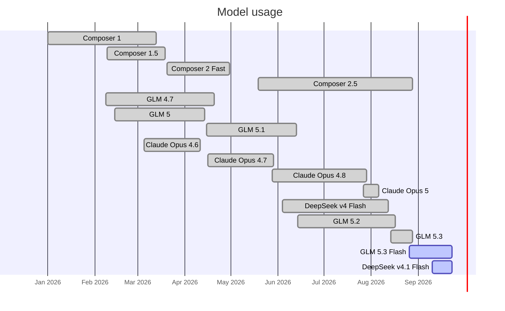

---

title: AI tools I have used
created: 2025-01-05
type: post
status: in-progress
tags: [ai, llm, code-generation, image-generation]
readability: 1
agent_sessions:
  - ses_0590765c4ffetN0D9poWYm0E82
---

In this article I list all the AI tools I've used.

I also try to keep this list up to date with regards to whether I'm still using the tool or not.

Legend:
* 🟢 Regularly using
* 🟡 Sometimes using
* 🔴 Not using

# Text generation
* 🔴 [Cerebas](https://inference.cerebras.ai/)
* 🟡 [Claude](https://claude.ai/)
* 🔴 [Cohere](https://coral.cohere.com/)
* 🔴 [DeepSeek](https://chat.deepseek.com/)
* 🔴 [DuckDuckGo AI](https://duckduckgo.com/?q=DuckDuckGo+AI+Chat&ia=chat&duckai=1)
* 🔴 [Gemini](https://gemini.google.com/)
* 🔴 [Groq](https://chat.groq.com/)
* 🔴 [Kimi](https://www.kimi.com/)
* 🔴 [Mercury](https://chat.inceptionlabs.ai/)
* 🔴 [Meta.ai](https://www.meta.ai/)
* 🔴 [MiniMax](https://chat.minimax.io/)
* 🔴 [Mistral AI](https://chat.mistral.ai/)
* 🔴 [NotebookLM](https://notebooklm.google.com/)
* 🔴 [Obsidian companion plugin](https://github.com/rizerphe/obsidian-companion)
* 🟡 [OpenAI ChatGPT](https://chat.openai.com/)
* 🔴 [Perplexity](https://www.perplexity.ai/)
* 🔴 [Poe](https://poe.com/)
* 🔴 [Qwen](https://chat.qwen.ai/)
* 🔴 [Reka.ai](https://chat.reka.ai/)
* 🟢 [Zhipu GLM](https://chat.z.ai/)

# Code generation
* 🔴 [Bolt](https://bolt.new/)
* 🔴 [Cerebas Coder](https://cerebrascoder.com/)
* 🔴 [Claude Code](https://claude.ai/code)
* 🔴 [Cursor](https://www.cursor.com/)
* 🔴 [GitHub Copilot](https://github.com/features/copilot)
* 🔴 [Tabnine](https://www.tabnine.com/)
* 🔴 [v0](https://v0.dev/)
* 🟢 [Zhipu GLM Coding Plan](https://z.ai/subscribe?ic=1VZOHEOBY1)

# Image generation
* 🟡 [Gemini](https://gemini.google.com/)
* 🔴 [Leonardo](https://app.leonardo.ai/)
* 🟡 [OpenAI ChatGPT](https://chat.openai.com/)

# Audio generation
* 🔴 [Suno](https://suno.com/)

# Task orchestration
* 🟢 [OpenChamber](https://github.com/btriapitsyn/openchamber) (web UI for OpenCode)
* 🔴 [OpenCode Web UI](https://opencode.ai/docs/web/)
* 🔴 [Vibe-Kanban](https://www.vibekanban.com/)

# Speech to text
* 🟢 [Handy](https://handy.computer/)
* 🔴 [MacWhisper](https://goodsnooze.gumroad.com/l/macwhisper)
* 🔴 [Superwhisper](https://superwhisper.com/)

# Desktop client
* 🔴 [BoltAI](https://boltai.com/)
* 🔴 [Claude Desktop](https://claude.com/download)

# Web client
* 🔴 [LibreChat](https://librechat.ai/)
* 🔴 [OpenWebUI](https://openwebui.com/)

# Models

* 🔴 Composer-1
* 🔴 Composer-1.5
* 🔴 Composer-2
* 🔴 Composer-2.5
* 🔴 Claude Fable 5
* 🔴 Claude Opus 4.1
* 🔴 Claude Opus 4.5
* 🔴 Claude Opus 4.6
* 🔴 Claude Opus 4.7
* 🔴 Claude Opus 4.8
* 🔴 Claude Opus 5
* 🔴 Claude Sonnet 4.5
* 🔴 Claude Sonnet 5
* 🔴 DeepSeek r1
* 🔴 DeepSeek v4 Flash
* 🟢 DeepSeek v4.1 Flash
* 🔴 Gemini 2.5 Pro
* 🔴 Gemini 3 Pro
* 🔴 GLM 4.6
* 🔴 GLM 4.7
* 🔴 GLM 5
* 🔴 GLM 5.1
* 🔴 GLM 5.2
* 🔴 GLM 5.3
* 🟢 GLM 5.3 Flash
* 🔴 GPT 3.5
* 🔴 GPT 4
* 🔴 GPT 4.1
* 🔴 GPT 4o
* 🔴 GPT 5
* 🔴 GPT 5.1
* 🔴 GPT 5.2
* 🔴 GPT 5.2
* 🔴 GPT 5.3
* 🔴 GPT 5.4
* 🔴 GPT 5.6 Sol
* 🔴 GPT OSS 120B
* 🔴 GPT OSS 20B
