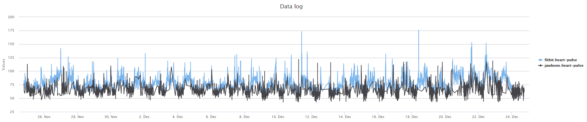

## Context

I've recently become interested in the [`Quantified Self`](https://en.wikipedia.org/wiki/Quantified_Self) and wanted to compare a few trackers in order to determine the quality of their solution.

In this study, I compare the Fitbit Charge HR, the Jawbone UP3 and the RS300X. The Fitbit and the Jawbone are known as `activity/fitness trackers` while the RS300X is an heart rate tracker.

## Learned in this study

## Things to explore

# Overview

Fitbit and Jawbone are known fitness brand trackers. It's been a couple of years now that these types of trackers are popular, so I'd expect them to have come to some level of maturity. The goal of this study is to evaluate the quality of the products, as much in term of hardware as software.

In my case, I will be testing the Android applications since I own a Nexus 5. I would expect the experience to be quite similar on iOS.

I've also bought an RS300X in order to test a *live* heart rate tracker.

# Fitbit Charge HR

## Pros
- Has a little OLED display.
- UI/UX is pretty straightforward.

## Cons
- The bracelet broke about 3 months after I purchased it. Fitbit support was excellent though and I received a replacement bracelet within 2 days.
- Website errored out when I tried to create an application (preventing people from creating apps?)
- Cannot get fine grained data.
- Heart rate day availability is very odd. Seems to lag out and may display only in chunks.
- Shows up in my android smart lock as a bluetooth device I could pair with, but I can't select it.

# Jawbone UP3

## Pros

- None at the moment.

## Cons
- The bracelet broke about 4 months after I purchased it.
- Cannot get fine grained data.
- Doesn't do real time heart rate tracking.
- Heart rate day availability is very odd. Seems to lag out and may display only in chunks.
- No idea why they decided to go with some weird buckle design. It looks like it's a nice point of failure.
- After about a month it feels like the buckle is becoming loose. It is more and more frequent that it becomes undone and comes close to falling and I have to attach it back...
- After about two months the buckle is becoming loose very frequently. I'd say I have to "re-buckle" it at least 10-20 times per day. That is ignoring the fact that it'll unbuckle while I sleep, making it pretty useless to sleep heart rate while sleeping.
- The four heart rate sensors on the lower part of the bracelet are uncomfortable.
- All the people I've shown the device to asked "why is there no display, show at least the time...".
- Terribly clunky UI/UX. Why can't I just swipe from day to day in any of the stats
- For that matter, why is it so hard to display the metrics I'm interested in and get rid of all those "pretty" suggestions cards?
- Why would you put unit selection (metric or imperial) as being configured through my height or weight? Is it to save me time or to confuse me?

# Fitbit Charge HR vs Jawbone UP3

## Heart rate

The following chart is the data I've collected over 3 days. In black is the Jawbone UP3 data and in blue the Fitbit Charge HR data.

Overall, the Fitbit Charge HR data is more consistent (every 5 minutes) while the Jawbone UP3 may end up having no data point for up to 2 hours. I assume this might be caused by how I've been wearing the bracelet but that is a weak argument.

## Pedometer

Accuracy between the two devices can vary a lot.

[Pedometer chart for comparison]

## Sleep monitoring

Both devices seem to measure approximately the same amount of sleep. However the Jawbone UP3 has a nicer chart that goes into the various stages of sleep while the Fitbit Charge HR only displays Asleep/Restless/Awake.

[Sleep monitoring chart for comparison]

# Polar RS300X

## Pros

- None at the moment.

## Cons
- Cannot get data out of device (for free).
- "If you want your data, pay us another 70\$ +taxes for a transmission device".
- "Oh, and by the way, you're going to send us those precious data over our web service so we can mine it for \$".
- Watch freaks out if too close from chest strap.
- Who thought of this terrible buckle design? If I want to break the strap, that's how I'd design the buckle.

# See also

# References
