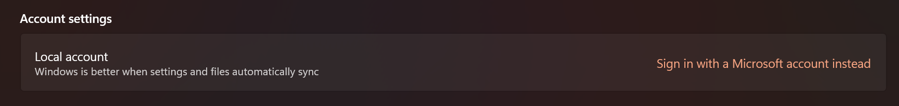

I recently moved to Windows 11.
I had created only a local account during creation but at some point I configured OneDrive to use my wife's account.
This resulted in her account being bound as the "primary" account of the computer.
This is not what I wanted.

I looked online for a solution but all the instructions I found didn't have the screen I had.
I initially tried a regedit fix but it didn't work.

Here is how I fixed it:

* Go to Settings > Accounts > Your info.
* This is the "weird part", click on "Sign in with a Microsoft account instead".

* Follow the instructions using a different account.
* The previous account will be "detached" from the computer and you will now be using a local account.
* If you go in Settings > Accounts > Email & accounts, you will see that the previous account is still listed under "Accounts used by other apps" but that you can now remove it (which you couldn't do previously).

Hope this helps!
