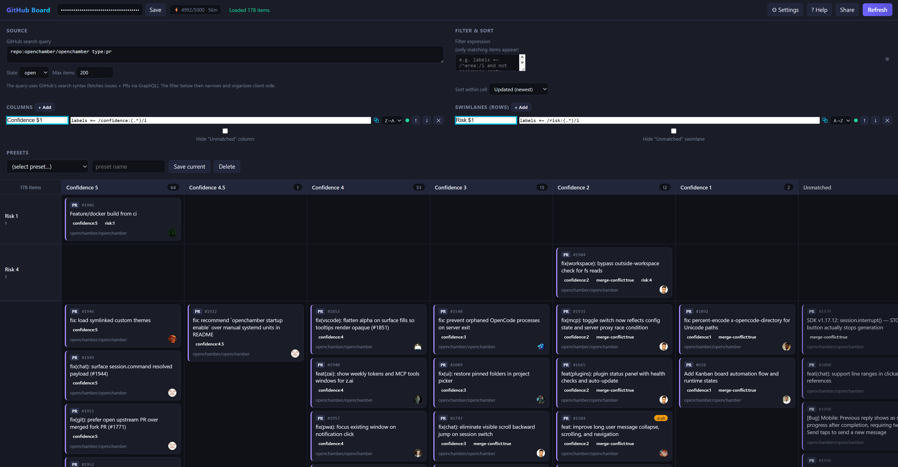

GitHub's issue and PR lists are flat.
When you're tracking a dozen repositories, or triaging hundreds of items, a flat list stops being a useful view of your work.
GitHub Projects exists, but it demands manual triage and won't adapt to an ad-hoc layout you want for the next ten minutes.

I built [github-board](https://github.com/TomzxCode/github-board) to fix this.
**It turns any GitHub search into a customizable kanban board, defined entirely by small filter expressions.**
There is no backend, no build step, and no framework.
You open `index.html` in a browser, paste a token, and sketch a board in seconds against live data.
Try it live at [tomzxcode.github.io/github-board](https://tomzxcode.github.io/github-board/).



## The problem

A GitHub issue list answers one question well: what is in this repo, in this state.
It answers almost every other question poorly.
Which of my open PRs are drafts, which are waiting on review, and which have gone stale?
How are issues spread across the `area:*` labels?
What does the backlog look like across an entire organization?

You can build a GitHub Project board to answer these, but each card has to be placed and maintained by hand.
**The board reflects triage you did, not the state of your data right now.**
For a recurring view that's worth the effort.
For a one-off question you want to answer in 30 seconds, it isn't.

## How it works

You give github-board a search query, the same syntax the GitHub search bar already understands.

```
repo:owner/name
```

Then you define columns with boolean expressions over the fetched items.
The board fetches up to 2000 issues and PRs through the GraphQL API with pagination, then groups them into columns entirely in your browser.

A default board ships with Draft PRs, Open PRs, Open Issues, and Closed columns.
Each column is just an expression, and the board re-renders live as you type.

## Columns and swimlanes as expressions

Every column is a filter expression against fields like type, state, labels, assignees, and dates.

```
type:pr and state:open and draft
type:issue and state:open and label:bug
state:closed and updated > -7d
```

The expression language supports the operators you'd expect: `==`, `=~`, `<`, `contains`, `in`, `exists`, `empty`, plus regex matching and relative date math like `-7d`, `-2w`, `-1y`.

You can add a second dimension with swimlanes (rows), so a board can group issues by assignee across the same set of status columns, all from one query.

## Auto-split with a $1 capture

This is the feature I use most.
If you put a `$1` capture in a column or lane rule, **github-board expands it into one bucket per distinct matched value.**

Name a lane `area:$1` matching `labels =~ /area:(.*)/i`, and you instantly get one row per area label that exists in your data.
Name a column the same way and you get one column per label.
No manual setup per bucket, and buckets with no items simply don't appear or stay empty depending on your preference.
It's the fastest way to see how work distributes across a category you didn't know you cared about until just now.

## Shareable links and presets

The entire view, query, filter, columns, swimlanes, and sort, is encoded in the URL hash.
Click Share, send the link to a teammate, and they see your exact board using their own token.
**The token is never included in the link**, so you can paste it anywhere.

For boards you return to, save the full configuration as a named preset.
Presets persist in `localStorage` alongside your token, so everything stays in your browser.

## Privacy and scope

`github-board` is read-only and has no backend.
Requests go directly from your browser to `api.github.com`.
You bring your own personal access token, which is stored only in your browser's `localStorage`.
There is no OAuth flow, no server logging, and no way for the tool to modify your issues or pull requests.

It is a view, not a project-management tool.
There is no drag-and-drop across columns, because the source of truth is your data, not where a card was dropped.

## Getting started

No install is required.

1. Open [tomzxcode.github.io/github-board](https://tomzxcode.github.io/github-board/) (or open `index.html` from the repo).
2. Paste a GitHub personal access token with read access to what you want to view.
3. Open Settings and enter a query like `repo:owner/name` or `org:your-org`.
4. Click Refresh and adjust the columns to match your workflow.

If you already use [gh-cached](../gh-cached/index.md) to browse issues without burning your rate limit, or [ghx](../ghx/index.md) for agentic code reviews, github-board is the visual counterpart: the same GitHub data, arranged the way you want to see it right now.

[Repository and source code](https://github.com/TomzxCode/github-board)

## See also

- [gh-cached](../gh-cached/index.md) - browse GitHub issues and PRs from a local cache to avoid rate limits
- [ghx](../ghx/index.md) - a CLI for the inline comment and review operations the `gh` CLI doesn't expose
- [Triaging open source pull requests](../triaging-open-source-pull-requests/index.md) - the kind of high-volume review work github-board is built to visualize
- [Backlog management best practices](../backlog-management-best-practices/index.md) - principles for keeping a backlog scannable that expression-driven boards make concrete
