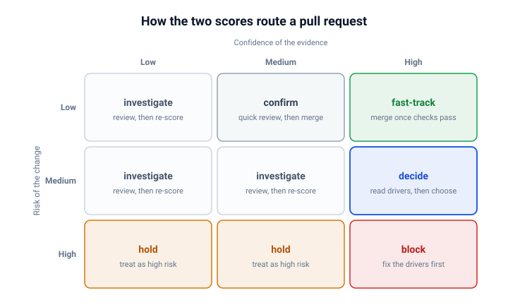

Agents on my machines now review every pull request that asks for my attention, and they produce more review than I can read.
That inverts the old problem: review used to be the scarce resource, and now the scarce resource is me.
Most agentic reviews end in a single verdict, approved or rejected, and a single verdict throws away the two things I need in order to decide what to do next.
**Every agentic review should end with two scores, one for risk and one for confidence, because the real question is never "is this pull request good" but "how much of my attention does it deserve".**

## One verdict answers two different questions

When an agent review ends in a bare verdict, the verdict hides as much as it reveals.
"Approved" can mean "I checked everything and found nothing", or it can mean "I glanced at the diff and found nothing", and those are very different claims.
The fix is to split the judgment in two.
**Risk is a judgment about the change: how much damage it does if it is wrong, and how hard it is to undo.**
**Confidence is a judgment about the review itself: how much of the risk judgment rests on evidence rather than on hope.**

The two scores combine into a routing decision that neither score can give alone.
A low-risk change with low confidence deserves a cheap second look, not a merge.
A high-risk change with high confidence deserves a human reading the named risk drivers, not a rubber stamp.
And a high-risk change with low confidence is the dangerous case: the review is saying "this could hurt us, and I could not check much of it", which deserves the strongest default.

## Risk scores the change

My [risk rubric](https://github.com/tomzx/agents/tree/main/skills), part of my agent skill library, scores seven factors, each Low, Medium, or High.
Blast radius asks who calls the changed code, and whether the effect crosses package boundaries.
Public interface asks whether the change breaks or removes a contract that other code depends on.
Security sensitivity asks whether it touches authentication, authorization, cryptography, secrets, or input validation.
Reversibility asks whether a revert undoes it, or whether it is a migration with no way back.
Operational exposure asks whether the changed behavior sits on a hot path or behind a flag.
Coverage gap asks whether tests cover the changed behavior.
Churn asks how often the touched files changed in the past year, a cheap proxy for fragility.

Two rules keep the scores grounded.
Every score above Low must cite file and line evidence, so a suspicion the agent did not confirm does not count.
Every High score must name the concrete failure it makes expensive, and if the agent cannot name one, the score comes down to Medium with an explanation.
The rollup is deliberately blunt: any High factor makes the change High risk, two or more Medium factors make it Medium, and everything else is Low.
**The bluntness is a feature, because the goal is not a precise number, it is a defensible triage call.**

## Confidence scores the evidence

Confidence is not the reviewer's gut feeling about its own work, it is an audit of what the review could actually verify.
My rubric counts six evidence points: a current validation report, a current verification report, runtime proof of its must-have criteria, a current code-craft review, a linked issue that states the intent, and a diff small enough to have been read in full.
The caps matter as much as the points.
No linked issue caps confidence at Medium, because there is nothing to check the change against.
Verification that never ran the code caps confidence at Medium, because reading is not proof.
A diff of a thousand lines or more caps confidence at Medium, and the report must say which areas were sampled rather than read.

The sentence I require most in the report names what would raise confidence.
"Running the verification skill would add two points" turns the score from a vague judgment into a list of concrete actions.
Because the scores are pinned to a commit, the assessment can be re-run when the evidence lands, and the same pull request climbs from Low to High confidence without anyone re-arguing the risk.
**Confidence is not a number you state once, it is a number that should rise as evidence lands.**

## The routing table turns scores into attention

The two scores route each pull request to one of six verdicts: fast-track, confirm, investigate, decide, block, and hold.

fast-track means I owe the change minutes: merge once checks pass.
confirm means pay for one cheap review first, then fast-track.
investigate means the evidence is too thin to route on, so run the full review pipeline and score again.
decide is the interesting middle: the risk is Medium but the evidence is strong, so I read the named drivers and choose with findings in hand.
block and hold are the expensive verdicts: the drivers must be resolved, or the change is treated as high risk until proven otherwise.

Each verdict names its next action, and that is what puts a price tag on attention.
A queue of forty pull requests becomes a triage sheet: fast-tracks to clear immediately, a hold to schedule an evening for, and one decide to actually think about.
**The scores do not review the code, they decide where the scarce reviewer hours go.**

## The score routes the human, never the pipeline

The verdicts never gate the agent pipeline.
A block verdict does not halt the chain of validation, verification, and craft review, and the chain never halts the risk assessment, which runs concurrently so the triage signal exists before the deep review finishes.
The scores are advisory on purpose: the pipeline's job is to produce evidence, the human's job is to spend attention, and merging those jobs is how automation starts overruling people quietly.
The verdict travels in a machine-readable marker pinned to the commit, so my orchestrator displays the risk and confidence columns without parsing a word of prose.

The same design is what makes the system scale.
One script discovers every pull request across every repository that asks for my review, a fan-out gives one agent session to each pull request, and the orchestrator session collects a summary table for triage.
The agents burn tokens, which are cheap, and I spend attention, which is not.
**Everything that can be mechanical is pushed to the machines, and what reaches me is a short list of decisions that cannot be.**

## What it looks like in practice

Three illustrative scenarios, the same ones I use as worked examples in the skill itself, show the range.
A small internal fix, covered by tests, in files that change once a year: every risk factor Low, but no pipeline reports exist yet, so confidence is Medium and the verdict is confirm, one cheap review then merge.
An authentication change with the full pipeline behind it: security sensitivity High, but runtime proof of every must-have criterion, so confidence is High and the verdict is block until the named session-invalidation gap is fixed.
A 1200-line billing migration with no linked issue: reversibility and coverage both High, confidence Low and capped, so the verdict is hold, and the same pull request re-scores to decide once the full review lands.
**Same rubric, three very different amounts of reviewer time.**

## What to do next

If you run agent reviews, force every review to end with both scores, not one verdict.
A five-minute rubric beats a bare approval: three risk factors and three evidence points are enough to start.
Ban unverifiable confidence language: if the score cannot cite the evidence behind it, it is not a score.
Make every verdict name its next action, so the queue reads as a budget rather than a pile.
And track the mis-routings, because a fast-tracked pull request that burns your evening is calibration data, and the rubric should get stricter wherever it fails.

## See also

- [A Pull Request Is a Claim, Not Evidence](../a-pull-request-is-a-claim-not-evidence/index.md) - confidence scoring is the systematic answer to a claim that arrives without evidence attached.
- [Abandoning Code Review in the Age of Agents](../abandoning-code-review-in-the-age-of-agents/index.md) - the throughput argument for why human attention, not review, is the constraint to manage.
- [Developer Trust Profiles: Earned Scrutiny for Automated Code Review](../developer-trust-profiles/index.md) - varies scrutiny by the author's track record, as risk scores vary it by the change itself.
- [You Already Review Code Without Reading It](../code-review-without-reading-the-code/index.md) - the attention asymmetry that makes explicit scoring necessary in human review too.

## References

- [agents skill library](https://github.com/tomzx/agents/tree/main/skills) - where the assess-pr-risk rubric behind this article lives, alongside the two skills below.
- [review-pr-full skill](https://github.com/tomzx/agents/blob/main/skills/review-pr-full/SKILL.md) - how the risk assessment runs concurrently with the review chain without gating it.
- [review-requested-prs skill](https://github.com/tomzx/agents/blob/main/skills/review-requested-prs/SKILL.md) - the fan-out that turns per-pull-request scores into a portfolio triage view.
