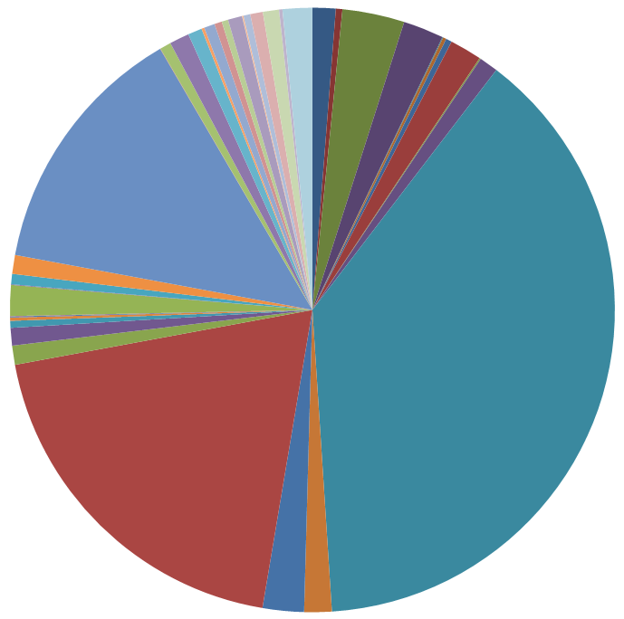

## Context

## Learned in this study
* Cast to integer in python
* Parameterized optimizers (for smaller learning/decay rates)
* Normalize input data
* Output classes imbalance

## Things to explore
* Can you have a network automatically deal with class imbalances?

# Problems faced
* Validation loss that increases right from the start
* Validation loss/Accuracy that plateaus at a certain value, even when applying various changes to the network architecture

# Overview
Most of today was spent on trying to improve the model I've built yesterday. I went on ##machinelearning and asked the help of others in an attempt to improve my model.

I was able to fix one problem which was that my validation loss would increase (diverge) as soon as training started, which is not something I expected. Normally, during training you would expect a "reverse-s" shaped curve to occur, meaning that initially the improvements are small, then bigger, and finally revert to being small as we reach the point of optimization. In order to fix that, I had to move away from using the default values used by the optimizers, more specifically their learning rate, which were from 10-100 times bigger than the value I set up on using.

After trying many different architectures (only dense layers, varying layer sizes, introducing dropout, using different activation functions), optimizers(sgd, adam, nadam) and input formats (straight data, normalized data, one-hot categories) and not seeing much improvement from the initial 40-50% accuracy, I tried to think a little bit about why that would be the case.

I converted the data I was reading from MySQL into the data that was read by the network and saved this data as a csv file. I then opened that file in Excel and created a pivot graph, which basically displayed how many times a given label was used. The graph looked as follow:

As you can see, there are 3 main output classes that represent more than 50% of the total output.

One problem with class imbalance is that if the network were to always output the same value for that biggest class, it would be correct a good amount of the time (approximately the same percentage that this class represents).

One can artificially introduce "class balance" by replacing the problem with a newer problem declared as "this big class VS the rest". Once that decision has been made, then the following network can be either another "this big class VS the rest" if it is imbalanced, or a "regular" classifier if all the classes are fairly balanced.

# See also

# References
