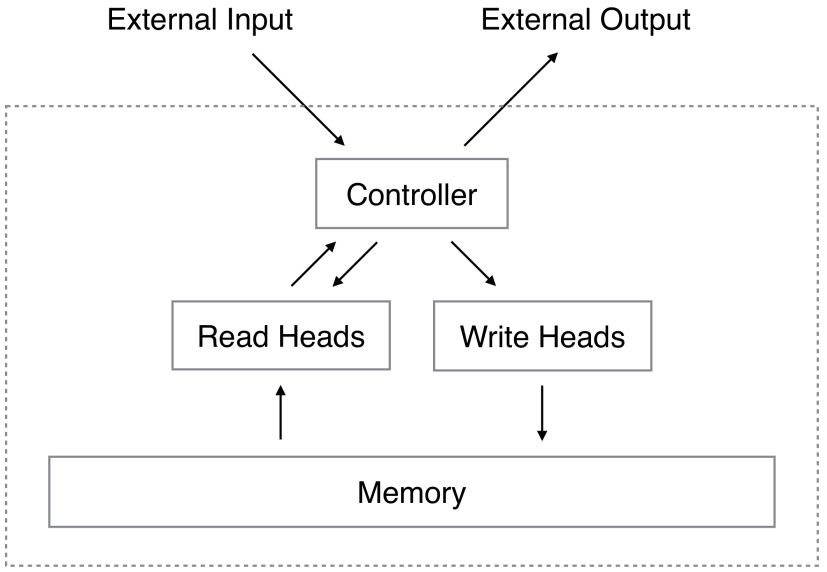

## Context

## Learned in this study

## Things to explore

## 1 Introduction
* Computer programs make use of three fundamental mechanisms: elementary operations (e.g., arithmetic operations), logical flow control (branching), and external memory, which can be written to and read from in the course of computation
* Modern machine learning has largely neglected the use of logical flow control and external memory

## 2 Foundational Research

## 2.1 Psychology and Neuroscience
* A "central executive" focuses attention and performs operations on data in a memory buffer
* The limitations of working memory is often quantified by the number of "chunks" of information that can be readily recalled

## 2.2 Cognitive Science and Linguistics
* In the early 1980s, both fields considered recursive or procedural (rule-based) symbol-processing to be the highest mark of cognition
* The Parallel Distributed Processing (PDP) or connectionist revolution cast aside the symbol-processing metaphor in favour of a so-called "sub-symbolic" description of thought processes
* Fodor and Pylyshyn claimed that connectionist theories were incapable of variable-binding, or the assignment of a particular datum to a particular slot in a data structure
* They also claimed that neural networks with fixed-length input domains could not reproduce human capabilities in tasks that involve processing variable-length structures

## 2.3 Recurrent Neural Networks
* A broad class of machines with dynamic state
* Their state depends on both the input to the system and on the current state
* A crucial innovation to recurrent networks was the Long Short-Term Memory (LSTM)
* This architecture was developed to address the "vanishing and exploding gradient" problem, which we might relabel as "vanishing and exploding sensitivity"
* LSTM ameliorates the problem by embedding perfect integrators for memory storage in the network
* With a mechanism that allows an enclosing network to choose when the integrator listens to inputs, we can selectively store information for an indefinite length of time

## 3 Neural Turing Machines

* Contains two basic components
	* a neural network controller
	* a memory bank
* The controller interacts with the external world via input and output vectors
* The controller also interacts with a memory matrix using selective read and write operations
* Every component of the architecture is differentiable, making it straightforward to train with gradient descent
* "Blurry" read and write operations that interact to a greater or lesser degree with all the elements in memory
	* The degree of blurryiness is determined by an attentional "focus" mechanism that constraints each read and write operation to interact with a small portion of the memory, while ignoring the rest

# See also

# References
* [arXiv:1410.5401v2](http://arxiv.org/abs/1410.5401v2) [cs.NE]
