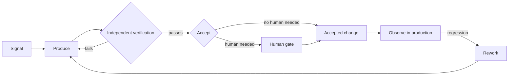
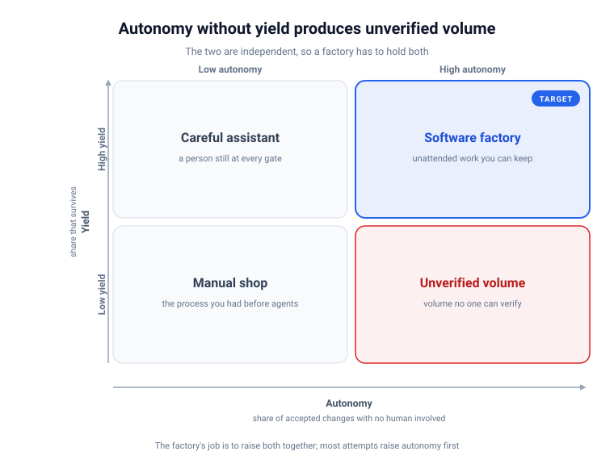
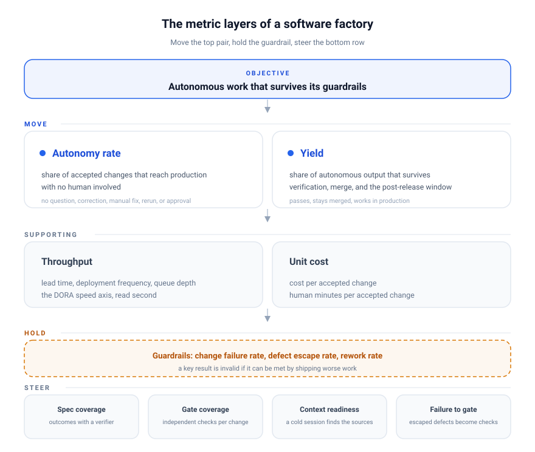

A software factory is the infrastructure that lets LLM agents carry a change through the whole software lifecycle, from an observed signal to a shipped fix, instead of handing one step to a model and the rest to me.
Once the factory exists, the question that decides whether it was worth building is how much of that lifecycle runs without me.
**The metrics I put on it decide what it optimizes for, and the obvious ones (agents spawned, tokens burned, pull requests merged, lines written) are the ones an agent can increase without producing anything I can use.**

## Output metrics measure the wrong thing

Every measurement I inherited from human development counts effort.
Tickets closed, story points burned, pull requests merged, lines written: each one counted human activity because human activity was the expensive part, which is the argument I made in [Outcome-Driven Development](../outcome-driven-development/index.md).
An agent produces all of it at almost no cost.
Point one at a backlog and it will empty the backlog, open fifty pull requests before lunch, and every one of them will look like a morning of work.

This is [Goodhart's law](https://en.wikipedia.org/wiki/Goodhart%27s_law) at its most extreme.
When a measure becomes a target it stops being a good measure, and an agent can turn any output metric into a target within a single run.
The failure is not theoretical.
[Armin Ronacher's 35 hours with GPT-6 Astra](https://lucumr.pocoo.org/2026/9/7/astra-why/) produced 79 commits, 75,000 lines, about a billion tokens, and roughly $1,200 of API spend over a weekend.
By volume alone it looked like his most productive weekend ever.
His verdict was that it delivered nothing of value.

The problem is not only that volume misleads.
It is that volume looks like progress to the person running the factory too.
[METR's randomized trial](https://metr.org/blog/2025-07-10-early-2025-ai-experienced-os-dev-study) found that experienced developers using early-2025 AI tools took 19% longer on their own tasks, and those same developers still believed the tools had made them 20% faster.
**When measured time and perceived speed disagree about the same work, self-reported productivity measures a feeling, not a result.**

The first step in building a factory is therefore to retire the output metrics, because an agent can increase every one of them for free.

## Measure the factory the way a plant is measured

Manufacturing has measured itself for a century and almost never treats gross output as success.
A plant that ships a thousand units at 10% yield produces 900 units nobody can use, and what matters is good units per unit of input, not units.
[Yield](https://en.wikipedia.org/wiki/First_pass_yield) is the fraction of what enters a process that comes out usable on the first pass.
A software factory has the same two numbers with different names.

**Autonomy rate** is the share of accepted changes that reach production with no human intervention: no question answered mid-run, no correction, no manual fix, no human-triggered rerun, and no approval.
**Yield** is the share of the autonomous output that survives: it passes verification, stays merged, and remains valid during the observation window after release.
Multiply the two and you get the number the factory exists to raise, **the rate of trustworthy unattended work.**

Autonomy is easy to raise without doing the work, so the definition has to be strict about what counts as intervention.
A change that needed one clarification at hour three is not autonomous, and counting it as autonomous is how a dashboard reaches 90% while I am still involved in every hard case.

A signal is an observed event that starts work: a bug report, a failing test, a support ticket, a security alert, or a request from a customer.
The loop below starts from that signal and shows where each metric is read.

Autonomy counts the changes that travel from Produce to Accepted change without passing through the Human gate.
Yield counts the accepted changes that survive Observe.
Cost divides the whole path by the accepted changes, which is why the word "accepted" matters.

Armin priced his run at about $15.50 per commit.
A commit is output, not a usable unit, so that price counts work whether or not it survived.
The denominator that survives is the accepted change: the change that passed verification and held up in production, not the change that got written.
**Cost per commit counts output.
Cost per accepted change counts results.**

## The guardrail that keeps autonomy trustworthy

Autonomy is easy to raise by shipping worse work, so it cannot be the only metric.
The [DORA program](https://dora.dev/) spent years showing that delivery performance has two independent axes, throughput and stability, and that a team can improve one while the other gets worse.
Stability is change failure rate and time to restore, and in a factory it also includes defect escape rate, the defects that reach production past the gates, and rework rate, the accepted changes that had to be redone.

The failure mode when stability goes unmeasured is well documented.
Addy Osmani documents a ["dark" factory](https://addyosmani.com/blog/software-factories/) that shipped for about four months with no human reading the code, passed its own tests the whole way, and then needed painstaking manual debugging to recover.
The tests passed because the factory wrote both the code and the tests, and the loop had no independent signal to catch what that matching pair got wrong together.
**A factory with high autonomy and low yield produces unverified volume, and it accumulates comprehension debt faster than anyone can repay it.**

The two metrics are not interchangeable, and the grid shows why.

The rule that keeps a factory out of the bottom-right quadrant is to pair the metrics.
**Never set an autonomy target without a stability guardrail, because the cheapest way to raise autonomy is to lower the standard for done.**
DORA's 2025 report found that 90% of the technology professionals it surveyed now use AI and more than 80% believe it made them more productive, while 30% report little or no trust in the code it generates, which is the gap between the two metrics stated as a statistic.

## The two numbers that decide whether the factory is worth running

Once autonomy and yield are high enough, two more numbers decide whether the factory is a good use of money.

Throughput comes first: lead time from signal to production, and deployment frequency.
The DORA speed axis still applies, but in a factory it is a consequence, not a goal.
Raising throughput without raising verification capacity only grows the queue in front of the gate, which is the back-pressure problem Osmani names: generation runs without limit while verification stays slow, so the extra output becomes waiting, not more usable code.
**Track queue depth alongside throughput, because a growing backlog of unverified changes is the first sign that the factory produces faster than it can check.**

Unit cost comes second, and it has two parts.
The metered part is tokens and compute divided by accepted changes.
The part that matters more is human minutes per accepted change, because the point of the factory is to remove my minutes, and a factory that ships cheap code while I spend the same hours supervising it has automated only part of the work.
Armin's run is the cautionary version of both: a weekend of compute for a yield near zero, with nobody supervising because supervising nobody was the point.

## The leading indicators you can control

Outcome metrics lag by weeks.
Autonomy and yield tell me where I ended up, not what to do on Monday, so the OKR needs a layer of inputs that change first.
Four inputs predict the outcome metrics well enough to act on.

- **Spec coverage** is the share of work items that carry a machine-checkable outcome (what becomes true, how it is checked, what it may cost) rather than a task description.
- **Gate coverage** is the share of change types covered by an independent machine check, as opposed to a check the producing agent wrote for itself.
- **Context readiness** is whether a cold session dropped into the project can find everything it needs, the exit condition I use in [Nine Months of LLM Agents on Large Projects](../nine-months-of-llm-agents-on-large-projects/index.md).
- **Failure-to-gate capture** is the share of escaped defects that become a new automated check, the only mechanism that makes a factory improve instead of merely run.

These are the inputs that turn model capability into stable throughput.
It is the same argument I made in [Team Maturity Explains the Friction, the Foundation Predicts the House of Cards](../the-foundation-predicts-the-house-of-cards/index.md): verification infrastructure is the highest-return investment for a team shipping with agents, and in a factory it separates a loop that improves from one that only repeats.

The layers stack like this, with the guardrails holding the two primary metrics in place.

## Writing the OKR

An OKR made of autonomy numbers alone will produce the wrong behavior before the quarter ends.
The version that works pairs one key result that moves against another that holds, and adds one that steers.

One workable objective, with the numbers as placeholders until you have your own baseline, is **shift more of the software lifecycle into trustworthy unattended work.**

- **Move:** touchless share of accepted changes rises from 20% to 50%.
- **Move:** human minutes per accepted change fall from 45 to 20.
- **Hold:** defect escape rate and change failure rate stay at or below the pre-factory baseline.
- **Steer:** the share of work items carrying a machine-checkable outcome rises from 30% to 90%.

The touchless-share result is the most visible and the easiest to raise without doing the work, which is why it is not alone.
The human-minutes result is the one that matters most, and it is hard to lower without removing the work, because it measures my minutes.
The stability result keeps the factory from trading trust for autonomy, and it cannot be met by shipping worse work.
The spec-coverage result is the input I can change this week, and it makes the other three possible.

Write the baseline down before the first factory run.
Without a baseline, anyone who preferred the old process can dispute the comparison, and the argument becomes about the numbers rather than the result.

One metric sits above the factory, and it is not a factory metric: the product outcome.
If the product outcome is flat while autonomy climbs, the factory is producing the wrong thing faster.
**The factory metrics multiply a product metric, they never replace it.**

## The Goodhart problem, and how to limit it

Autonomy rate is now a target, so the system and the people running it will find the cheapest work that satisfies it.
Trivial changes, tiny diffs, safe files, and a narrow definition of intervention all raise the number without improving the factory.
Five rules are worth adding from the start.

1. Report autonomy by change class, because a touchless migration and a touchless typo fix are not the same result.
2. Measure on production traffic rather than a curated set, because a curated set misses the rare cases where the factory fails.
3. Set a cap on trivial work, because an autonomy score built from work that never needed verifying is not a factory score.
4. Keep a human-owned roadmap and a written invariant list, since an autonomous loop optimizes whatever its signals measure and only a human-edited direction corrects the drift, the argument in [The Self-Evolving Repository](../the-self-evolving-repository/index.md).
5. Audit the gates themselves, because a gate whose value was never measured only adds time, and [The Merge Gate](../the-merge-gate/index.md) asks whether a gate is worth its cost.

## What not to measure

- Number of agents, sessions, or concurrent workers, since more agents producing the same output is a more expensive factory.
- Tokens consumed, since it is an input and the factory's job is to spend fewer per accepted change.
- Pull requests merged and lines written, since volume is what an agent gets for free.
- Story points and velocity, since they measure effort from an era when effort was scarce.
- AI adoption percentage, since using a tool is not an outcome.
- Self-reported speedup, since it contradicted the measured time in the METR trial.
- Benchmark scores, since they measure the model rather than the factory, and your repository's cost and yield are the benchmark that matters.

## What to Do Next

1. Instrument the change lifecycle with an id, a start, an end, and a human-intervened flag on every change, because nothing else works until this exists.
2. Compute two numbers this week, the touchless share of accepted changes and the defect escape rate, by hand from the last fifty changes if you have to.
3. Add the two economic numbers once ids exist: cost per accepted change, and human minutes per accepted change.
4. Write one paired OKR: move autonomy, hold stability, steer spec coverage.
5. Record the baseline before the next factory run.
6. Track queue depth, and treat a growing review backlog as a stop signal.
7. Read the result plainly: autonomy up with stability flat means the factory is working, and autonomy up with stability down means you fix the gates before adding agents.

**A factory is not fast because it produces a lot.
It is fast because it finishes work you did not have to touch.**

## See also

- [Outcome-Driven Development](../outcome-driven-development/index.md) - why effort metrics stop being useful once agents execute, and how to write an outcome a machine can check
- [Zero Touch Engineering](../zero-touch-engineering/index.md) - the limit case where autonomy reaches 100% and the human authors the system instead of the change
- [Verifying Code Without Reading It](../verifying-code-without-reading-it/index.md) - the checks that make yield measurable without reading diffs
- [Team Maturity Explains the Friction, the Foundation Predicts the House of Cards](../the-foundation-predicts-the-house-of-cards/index.md) - the DORA two-axis argument and why verification is the highest-return investment
- [The Self-Evolving Repository](../the-self-evolving-repository/index.md) - the human-owned roadmap and invariants that keep an autonomous loop from drifting
- [Nine Months of LLM Agents on Large Projects](../nine-months-of-llm-agents-on-large-projects/index.md) - the context-readiness exit condition and the steering-time cost of under-provisioning
- [The Shifting Bottleneck](../the-shifting-bottleneck/index.md) - why automating production moves the constraint to verification, the layer a factory's yield measures
- [The Merge Gate](../the-merge-gate/index.md) - the cost a gate has to justify, the test a factory's automated checks have to pass
- [Software factory](../agents/software-factory/_index.md) - the agent-maintained research section that tracks working factories and their designs

## References

- [DORA, "State of AI-assisted Software Development 2025"](https://dora.dev/research/2025/dora-report/) - the 90% adoption, 80% perceived-productivity, and 30% distrust figures, and the finding that AI amplifies the system it is used in
- [DORA, "DORA's software delivery metrics: the four keys"](https://dora.dev/guides/dora-metrics-four-keys/) - the throughput and stability axes a factory inherits and reads as speed and guardrails
- [METR, "Measuring the Impact of Early-2025 AI on Experienced Open-Source Developer Productivity"](https://metr.org/blog/2025-07-10-early-2025-ai-experienced-os-dev-study) - the 19% slowdown and the 20% perceived speedup that make self-reported productivity unusable as a metric
- [Becker, Rush, Barnes, and Rein, "Measuring the Impact of Early-2025 AI on Experienced Open-Source Developer Productivity"](https://arxiv.org/abs/2507.09089) - the paper behind the METR trial
- [Armin Ronacher, "Astra for Coding: Why Are We Doing This Again?"](https://lucumr.pocoo.org/2026/9/7/astra-why/) - the documented factory run: 79 commits, 75,000 lines, about $1,200, nothing of value, and the per-commit price that motivated "cost per accepted change"
- [Addy Osmani, "Software Factories, Light and Dark"](https://addyosmani.com/blog/software-factories/) - the review gate as the bottleneck, back pressure, and the dark factory that ran four months before its comprehension debt appeared
- [Addy Osmani, "Agentic Autonomy Levels"](https://addyosmani.com/blog/agentic-autonomy-levels) - the metric set this article's autonomy and yield definitions overlap with, including token cost and defect escape rate per accepted change
- [Vercel, "Building a Software Factory for the AI SDK"](https://vercel.com/blog/building-a-software-factory-for-ai-sdk) - a lit factory with mandatory human review, where agents authored 25 to 35% of merged pull requests within four weeks
- [Wikipedia, "Goodhart's law"](https://en.wikipedia.org/wiki/Goodhart%27s_law) - why every autonomy and output target degrades once the system can optimize it directly
- [Wikipedia, "First pass yield"](https://en.wikipedia.org/wiki/First_pass_yield) - the manufacturing definition of yield as the share that passes without rework, the framing a software factory borrows
- [Wikipedia, "OKR"](https://en.wikipedia.org/wiki/OKR) - the objective and key results format the paired OKR above follows
