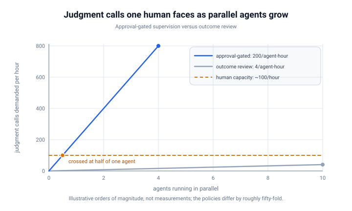

Watch someone run an LLM agent for the first time and you will often see a familiar figure: the manager who initials every form.
Management science named that figure decades ago, diagnosed the failure, and prescribed the cure, and none of that work expired when the reports stopped being human.
**Micromanagement does not scale, and the worker it fails first is the agent.**

## The Same Behavior in Two Bodies

[Micromanagement](https://en.wikipedia.org/wiki/Micromanagement) is the management pattern where the supervisor keeps decision rights over small steps instead of delegating outcomes and constraints.
On a human team you recognize it instantly: the manager who approves every purchase, sits in every meeting, and rewrites every email before it ships.
With agents you recognize it just as fast: the operator who approves every tool call, watches the output stream in real time, interrupts to argue about which file to read, and rewrites the plan twice before the first task finishes.
The behaviors map one to one across the two worlds:

| Micromanaged employee | Micromanaged agent |
|---|---|
| Approves every expense, however small | Approves every tool call |
| Sits in on every meeting | Watches the output stream live |
| Rewrites every email before it ships | Corrects the plan mid-run |
| Demands a check-in before each step | Permission prompt on every command |
| Redoes the work at their own desk | Aborts the run and does it by hand |

**The mapping is not a loose analogy.**
In both cases one person inserts their judgment between every small decision and its execution, which is a statement about workflow structure, not about trust.
Anything true of that workflow for humans stays true when the executor is a model.

## The Arithmetic Kills It First

Management's own term for the limit is [span of control](https://en.wikipedia.org/wiki/Span_of_control): the number of reports one manager can effectively supervise.
The limit exists because a supervisor's attention is a fixed budget, and every decision escalated to the supervisor spends some of that budget.
Step-level delegation makes the team's throughput equal to the supervisor's evaluation throughput, since every step now waits on one person.

Agents sharpen the arithmetic.
One agent in a normal working hour issues on the order of two hundred small decisions in my sessions: which file to open, which command to run, whether a result is good enough to build on.
A human evaluates meaningfully at one or two decisions per minute, and the quality of those evaluations collapses long before the count runs out.
**Step-level supervision has a span of control below one agent: you cannot fully micromanage even a single one.**

The two supervision styles pull apart as soon as more than one agent runs:

The fatigue has a known endpoint.
Once approval prompts outrun attention, people stop reading the prompts and start clicking allow, and step-level supervision ends in the rubber-stamp failure that [You Are the Bottleneck](../you-are-the-bottleneck/index.md) works out in queue-math form.

The economics fail alongside the arithmetic.
**An approval-gated agent runs at your evaluation speed, not the model's, so you have bought machine-speed execution and re-capped it at human speed.**
The reason to hire an agent was to break the link between your attention and the work's progress.
Step-gating restores the link at every tool call.

## It Also Corrodes What It Touches

Throughput is only the first cost.
Micromanaged employees show the classic [learned helplessness](https://en.wikipedia.org/wiki/Learned_helplessness) pattern: initiative collapses, problems stay hidden until they are unhideable, and judgment never develops because it never gets exercised.
The manager pays too: never observing unassisted results, the manager cannot learn which reports handle which autonomy, so distrust stays calibrated to nothing.

Agents reproduce every line of that, at higher frequency.
Constant interruption churns the agent's context, output quality drops, and the drop seems to justify more hovering.
An operator burned by mid-run questions starts specifying work in tiny increments, which guarantees the agent never runs long enough to produce a reviewable outcome.
I caught myself doing exactly that after one bad run, tightening the loop until the agent could barely fetch a file, and the tightening felt like diligence the whole time.
And the operator never builds the one calibration that matters: which task types, which models, and which risk levels can run alone.
**That calibration is the core skill of working with agents, and it can only form from watching end-to-end outcomes, the exact observations micromanagement prevents.**
Micromanagement keeps the one activity that does not scale, per-step evaluation, and starves the two that do, the worker's initiative and the supervisor's calibration.

## Why Smart People Do It Anyway

The justifications transfer intact.
The worker is unproven: the new hire has no track record yet, and neither does the model you have never run on this task type.
A past failure looms: the intern who dropped a production table, the agent that once deleted the wrong directory.
The credit asymmetry pushes the same direction: catching a small error early is visible credit, while an outcome failure arrives late with your name attached, so hovering is individually rational at every moment even though it is collectively ruinous.

The deepest cause is unfinished specification.
When the supervisor can state what done looks like, steps are safe to delegate, because the check exists at the end.
When the supervisor cannot state it, steps are the only thing left to inspect.
**Most micromanagement is not a trust problem with the report; it is a missing definition of done on the supervisor's side.**

## What Scales in Both Worlds

The cure is decades old and ports without changes.
[Management by objectives](https://en.wikipedia.org/wiki/Management_by_objectives) says define the outcome and the constraints, then let the report choose the steps; for an agent, that is the specification and the acceptance criteria, ideally the tests.
Verify at boundaries instead of continuously: milestones for people, the pull request for agents.
[Situational leadership](https://en.wikipedia.org/wiki/Situational_leadership_theory) says match supervision to demonstrated maturity, directing at first and delegating later.
Agents deserve the same schedule: a new model on a new task type gets a tight loop, a proven pattern on a reversible task gets autonomy.
Make autonomy affordable by scoping the blast radius: the unproven report gets the cheap, reversible work, and the agent gets the sandbox and the throwaway branch, so a failure costs a review cycle instead of an incident.
Then reinvest the freed supervision hours upstream, into the specification, which is the act that multiplies rather than the act that caps.

Every item on that list was worked out on human teams, at human speeds, over decades of trial and error.
Agents run the same experiment with faster workers and cheaper failures.
**A fleet of agents is the cheapest management simulator ever built, and its first lesson is the oldest one: govern outcomes, not steps.**

## But My People Are Not Experts

The cure in the last section rests on delegation, and the first objection is always the same: the team is not staffed with world experts, just regular developers, and regular developers make mistakes.
Agents make more of them.
The objection is legitimate, and it still does not justify step-level control, because the step-level trade fails on its own arithmetic.

Start with what delegation actually assumes.
**Delegation does not assume competence; it is the only way to observe it.**
Span of control and situational leadership were worked out for ordinary people, and ordinary people make mistakes.
A supervisor who never lets a regular developer run alone never learns what that developer can handle, so the supervision level never moves off maximum, and the corrosion loop keeps running on clean intentions.

Then move the safety mechanism from the person to the system.
**Step-watching is one way to catch mistakes, and the most expensive one ever tried.**
Boundaries catch them for a fraction of the cost: tests, small pull requests, staging.
Blast-radius limits make the ones that slip through reversible: feature flags, sandbox, rollback.
Every mistake that recurs becomes a gate, which catches that class forever without spending supervisor attention.
The gates compound; the watching never does.

When a mistake lands anyway, recalibrate instead of escalating.
Classify the failure: a one-off gets absorbed, a knowledge gap gets training, a pattern gets encoded as a check.
Then autonomy returns to where it was, because the system now catches that class instead of you.
Blanket step-control after every failure is how one bad day becomes a permanent surveillance regime.

Run the numbers and the objection collapses.
Suppose step-watching catches twice as many mistakes as boundary review at fifty times the cost.
The trade collapses your span of control and manufactures learned helplessness, which raises the mistake rate it was meant to suppress.
**Boundary review wins even when it is worse per mistake, because you can afford to run it forever and improve it every week.**
The imperfect model gets the same answer: its mistakes justify tests, a sandbox, small reversible tasks, and promoting every observed failure class into a gate, never approval on every tool call.

## What to Do Next

Count your interventions on your next agent run.
Past a handful, the interruptions mark missing specification, not a failing agent, and each one belongs in the next prompt or the skill file ([Say It Once](../say-it-once/index.md) covers the conversion).

Write the acceptance criteria before you launch anything.
Every impulse to hover converts into a check: the test you would have eyeballed, the log line you would have watched, the property of the diff you would have scanned for.

Give one low-stakes task a fully unsupervised run and grade the outcome.
That grade is your first calibration point, and calibration points are how autonomy gets widened with a clear conscience.

Widen autonomy the way you would with a junior: task type by task type, on evidence, never on faith.
The manager who cannot say which reports run alone has been micromanaging, and the operator who cannot say which tasks run alone is in the same place.
**Micromanagement is not a personality quirk, it is a supervision policy, and it stops working the moment the worker outproduces the supervisor's judgment.**
Your agents crossed that line on day one.

## See also

- [Say It Once](../say-it-once/index.md) - the workflow conversion this article implies: turn each interruption into pre-written specification
- [Outcome-Driven Development](../outcome-driven-development/index.md) - the positive program in full: manage the outcome, not the agent
- [You Are the Bottleneck](../you-are-the-bottleneck/index.md) - the same one-human capacity limit, worked out as queue math on the review queue
- [Scaling Yourself Horizontally](../scaling-yourself-horizontally/index.md) - the general law underneath: attention does not scale, leverage does
- [The Colleague Who Arrives With the Plan](../the-colleague-who-arrives-with-the-plan/index.md) - the same control instinct applied to plans instead of steps, and why it keeps getting rewarded

## References

- [Micromanagement](https://en.wikipedia.org/wiki/Micromanagement) - the named pattern and its documented costs on human teams
- [Span of control](https://en.wikipedia.org/wiki/Span_of_control) - the classical limit on how many reports one manager can supervise
- [Management by objectives](https://en.wikipedia.org/wiki/Management_by_objectives) - Drucker's delegate-outcomes framing, the human-team version of spec plus acceptance criteria
- [Situational leadership theory](https://en.wikipedia.org/wiki/Situational_leadership_theory) - matching supervision level to the maturity of the report
- [Learned helplessness](https://en.wikipedia.org/wiki/Learned_helplessness) - what step-level control teaches the worker over time
