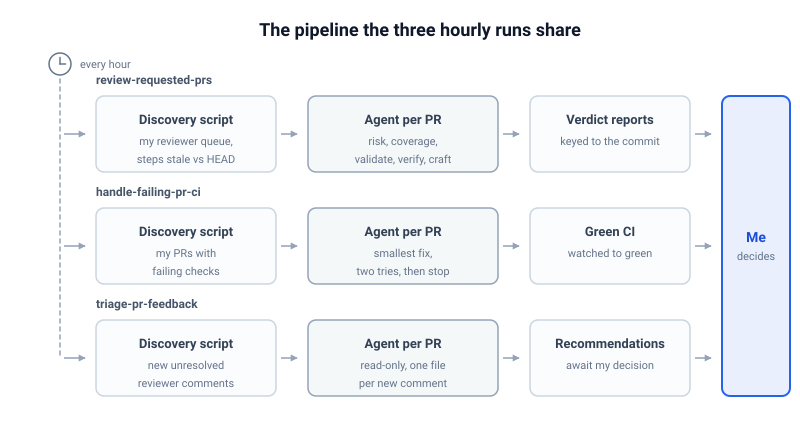

Three skills run on my machines every hour, whether I am working or not.
One prepares the review of every pull request waiting on me, one repairs the failing CI on my own pull requests, and one drafts my replies to reviewer comments.
Each one is a skill file that fans out agents to do the reading, wired to a scheduler, and I have stopped doing the corresponding work by hand.
**The schedule is what turned them from tools I have to remember to use into infrastructure that works while I am away, and it reduced my part of the job to reading prepared options and deciding.**

## The trigger is the missing piece

An interactive agent session starts when I remember to start it.
That ordering makes the work wait for me, and it makes me the one component in the system that can forget.
[Loops as Files](../loops-as-files/index.md) makes the point generically: a skill with no trigger leaves the human as the trigger.
These three loops are my version of taking the cron off me.

The waiting is the other half of the problem.
An interactive session is synchronous: I trigger it, then I sit there while it reads, runs, and reports.
A single analysis takes between 2 and 15 minutes depending on its complexity, and triggering them one at a time would spend my day waiting.
The scheduled runs are asynchronous: they prepare the information a decision needs while I am away, and the decision is the only part left that happens with me in the room.
**One benefit of the workflows is that the information for a decision is ready when I sit down, instead of arriving only after I trigger an agent and wait for its output.**

A schedule, rather than GitHub events, is a deliberate choice.
Most pull requests I touch live in repositories I do not control, so I cannot install workflows, webhooks, or bots there.
A local scheduler is the one trigger I own everywhere.
Hourly is the cadence that works: fast enough that queues never age overnight, slow enough that each run is cheap and usually finds nothing new to do.
(The triage loop could safely run every fifteen minutes; hourly keeps the three aligned.)

## The three hourly runs

All three run from my [agent skill library](https://github.com/tomzx/agents/tree/main/skills), each as a markdown skill file plus a small deterministic discovery script.
The skills are reusable by hand at any time; the schedule is just what keeps them from waiting for me to remember.

### Preparing other people's code reviews

The first run (`review-requested-prs`) prepares the pull requests waiting on my review, where I am the requested reviewer or already have.
A script lists them all, then checks which review steps are already done for each pull request's current commit, because every finished step leaves a report keyed to the commit SHA.
Only the stale steps get dispatched, one agent per pull request, running up to five checks: risk assessment, test-coverage analysis, product validation, conformance verification, and code-craft review.
The agents run in parallel, so a slow build on one pull request never delays the others.
When I sit down to review, the verdicts and findings are already there, computed against the exact commit I am about to look at.
**The run does not approve anything; it does the reading so my part of the review starts at the decision.**

### Keeping my own CI green

The second run (`handle-failing-pr-ci`) lists my open pull requests and their combined CI status.
Every pull request with failing checks gets its own agent in its own [git worktree](https://git-scm.com/docs/git-worktree), so concurrent fixes never collide.
The agent reads the failing logs, diagnoses the root cause, pushes the smallest fix that addresses it, and watches the checks settle.
The autonomy is bounded: transient failures get a rerun, an unclear root cause comes back to me as a written diagnosis instead of a guess, and two failed fix attempts stop the loop.
**My pull requests arrive green, or they arrive with an explanation of why they are not.**

### Drafting my replies to reviewer comments

The third run (`triage-pr-feedback`) scans the pull requests I authored for reviewer comments still awaiting a response.
For each pull request with new comments, a read-only agent checks out the pull request head and writes one recommendation file per comment: what the reviewer is asking, whether the claim holds against the code with file and line evidence, whether to implement or decline, how confident the analysis is, and a draft reply in my voice.
State is one file per comment id, so a re-run only sees genuinely new feedback and never re-analyzes something I already decided.
I read the resulting decision table, choose implement, decline, or defer, and only then does an executor skill post replies or push changes.
**Nothing reaches GitHub from this loop without my decision.**

## The pipeline they share

The three runs look different from the outside, but they are the same pipeline wearing three sets of labels.

Four properties make the pipeline safe to leave running.

**Discovery is deterministic.**
A script, not a model, decides what needs work and what is already done.
Discovery runs on every tick, so mistakes there compound, and judgment belongs in the per-item agents instead.

**Work is fanned out one agent per pull request.**
Each pull request gets its own agent, its own worktree, and its own failure domain, so a slow or broken run stays contained.

**State lives in files, not in an agent's memory.**
Verdict reports keyed to commit SHAs and one file per comment id mean a re-run is a [no-op](https://en.wikipedia.org/wiki/Idempotence) unless something changed.
That is the property that makes an hourly cadence quiet instead of expensive.

**Write access is bounded and layered.**
The triage loop never writes to GitHub at all; it produces recommendation files.
The review loop writes only step markers, so a later run knows which checks are done.
The CI loop pushes, with pre-approval scoped to the smallest fix and explicit abort conditions that route back to me.
Merging and replying stay mine.

## What changed in practice

Review stopped being interrupt-driven: prepared material waits for me instead of the other way around, and I pick the moment to sit down to it.
That is the batching [You Are the Bottleneck](../you-are-the-bottleneck/index.md) argues for, minus the fixed timetable.
CI failures stopped interrupting me because an agent picks them up within the hour, and I hear about one only when its diagnosis needs a human.
Replying to reviewer comments became choosing between prepared options, which takes minutes instead of a context switch per thread.

The costs show up anyway.
Skills drift as repositories and CI systems change under them, so the library needs tending.
Correlated errors are possible: all three runs share one skill library, so one bad edit degrades all of them at once.
And preparation is not judgment, which is why the risk-and-confidence routing from [How Much Attention Does This Pull Request Deserve?](../how-much-attention-does-this-pull-request-deserve/index.md) matters once the agents produce more review than I can read.
**Every loop is designed so the taste decision (merge this, decline that) stays with me.**

## What to Do Next

Pick the queue you check most often; for most engineers that is pull requests or CI.
Encode the discovery as a script: what needs work, and for each item, what is already done.
Wrap the per-item work in a skill that one agent can run alone.
Fan out one agent per item and write per-item state so re-runs are no-ops.
Then schedule it, read-only first.
Add write access last, scoped, with abort conditions that route back to you.

## See also

- [Loops as Files](../loops-as-files/index.md) - the argument that the trigger layer deserves the same treatment as the prompt layer; these three loops are my concrete loops
- [LLM-Augmented Workflows](../llm-augmented-workflows/index.md) - the event-driven engine for repositories I do control; the hourly schedule covers the ones I do not
- [You Are the Bottleneck](../you-are-the-bottleneck/index.md) - the queue math that says review must batch; the schedule is the batching mechanism
- [How Much Attention Does This Pull Request Deserve?](../how-much-attention-does-this-pull-request-deserve/index.md) - the risk and confidence scores the review-preparation run produces
- [Managing Many Concurrent LLM Agent Sessions](../managing-many-llm-agent-sessions/index.md) - checking agent work at fixed intervals instead of watching it; the production version of that habit
- [Scaling Yourself Horizontally](../scaling-yourself-horizontally/index.md) - the leverage argument for systems that act in your absence, which is what a schedule buys
- [Continuous Research](../continuous-research/index.md) - the same scheduled-agent pattern applied to knowledge instead of pull requests

## References

- [Wikipedia, "Cron"](https://en.wikipedia.org/wiki/Cron) - the time-based scheduler these loops run on
- [Wikipedia, "Idempotence"](https://en.wikipedia.org/wiki/Idempotence) - the property that makes hourly re-runs quiet instead of expensive
- [Git, "git-worktree"](https://git-scm.com/docs/git-worktree) - the isolation mechanism that lets one agent per pull request work concurrently
