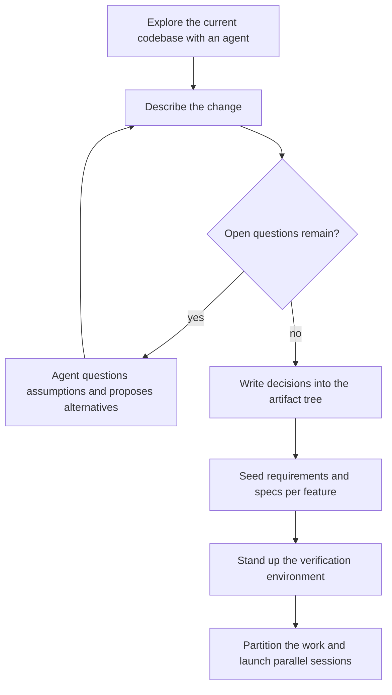

Over the past nine months I have run LLM agents against the largest projects I have ever worked on alone: the open source tools I use and maintain daily, and the automated pipeline that publishes part of this blog.
The models improved underneath me the whole time, and that helped less than I expected.
**What actually helped was learning to handle four challenges: providing the right context, iterating through non-obvious design decisions, managing the scale of the work, and keeping artifacts consistent while decisions change.**
None of the four is about getting a model to write better code.
All four decide whether the code the model writes turns into a finished project.

## What the nine months covered

GitHub gives the scale better than my memory does: since January I have contributed 1,338 commits across 51 repositories, along with 66 pull requests and 181 issues.
By mid September, 9 months in, the session counter read 3,400 sessions, 82,000 messages, and 6.8 billion tokens, 6.5 billion of them served from cache, spread across 63 projects and 33 models, on a path that had moved from Claude Sonnet 4.5 to GLM 5.3 Flash.
The volume is not the point.
The point is that the same four challenges appeared in every project, and how I answered them changed more than any model upgrade did.

## Challenge 1: Providing the Right Context

Nine months ago my working assumption was that a capable agent would gather whatever it needed by exploring the repository.
On a small project, that assumption holds.
On a large one, it fails quietly: a session is generally scoped to a single location, one repository or directory, and a large project rarely fits inside one, so each session sees a narrow slice of the project, and the knowledge outside that slice might as well not exist.
The cost showed up as steering time.
I would launch a session, come back, and find it had built on a wrong assumption, then spend the next half hour correcting course.
Worse, the corrections sometimes left the written context inconsistent, one artifact updated while the artifacts that depend on it stayed stale, and later sessions inherited the contradiction as ground truth.
**On a large project, under-provisioned context does not just slow one session down, it poisons the sessions that follow.**

What I do now is treat context provisioning as a phase with an exit condition, not a chore.
Access first: every source the answers live in gets a way in and a pointer, which is the setup I described in [Teach Your Agent Where Everything Lives](../teach-your-agent-where-everything-lives/index.md).
Then the map: which repositories exist, how they relate, where decisions live, written down so a cold session can orient in minutes.
**The exit condition: a cold session, dropped into the project with only its instructions file, can find every source it needs without asking me.**
I test it by handing the session a question whose answer I know lives in one of the mapped sources, and provisioning is done when it comes back with the answer and the trail instead of a question.
The principle underneath is the one I keep coming back to, that [context quality dominates model choice](../the-importance-of-context-when-interacting-with-llms/index.md).
**Every session I launch inherits the preparation, and every session I under-provision collects the tax in steering time.**

## Challenge 2: Iterating Through Non-Obvious Design Decisions

The decisions that sink large projects are rarely the ones I can state up front.
They are the non-obvious ones: how two modules should share a data format, what happens when a change is abandoned halfway through, whether a behavior belongs in a shared library or in the calling code.
I cannot enumerate those in a prompt, and an agent cannot discover them from the code alone, because half of them are not written down anywhere.

What I do now is iterate.
Before any implementation session launches, I work with an agent to understand the current codebase and describe the changes we need to make, and we go back and forth until most open questions are resolved.
The agent is a design partner, not a typist: it restates my description, catches the cases I glossed over, and proposes the alternatives I did not consider.
**The exit condition is simple: when the questions the implementing agent would ask have already been asked and answered, the design conversation is done.**
Answering a design question in conversation costs minutes.
Answering it mid-implementation costs a stalled session, a wrong branch, or a refactor, and the stalls compound on every long run.
This is the principle behind [Say It Once](../say-it-once/index.md), that every question an agent would ask mid-run should be answered before the run, applied one phase earlier: not just the standing rules, but the design itself.

Here is the loop as it runs today, from first contact with the codebase to the moment parallel sessions can safely start:

## Challenge 3: Managing the Scale of the Work

A large project carries more work than one session can absorb, and more than I can supervise.
On the most feature-heavy project I have run through my pipeline, [the features outnumbered my attention within weeks](../three-gaps-my-sdlc-pipeline-hit-on-a-machine-learning-platform/index.md): creating a directory per feature was cheap, walking each one through design personally was not.
The answer is delegation and parallelism, but both have to be earned.
[Parallel sessions collide](../speeding-up-llm-work-on-a-single-codebase/index.md) unless the work is partitioned along real seams, and the seams only become visible through the design iteration of the previous section.

The preparation is what makes scale manageable.
Each feature keeps its own artifact directory, seeded before any implementation session starts.
Owning agents take features as far as they can and stop at the gates that need a human decision.
Sessions get their own worktrees, so parallel work never steps on itself.
Tasks that share a file serialize; everything else runs in parallel.
**Parallelism is earned at partition time, not at spawn time.**
Spawning ten sessions on an unpartitioned codebase produces ten half-features and a merge conflict.
Spawning ten sessions along the seams the design conversation exposed produces a project.

The other half of scale is me.
With a dozen sessions running, I become the bottleneck unless decisions are batched and gates are explicit, which is the supervision problem I worked through in [Managing Many Concurrent LLM Agent Sessions](../managing-many-llm-agent-sessions/index.md).

## Challenge 4: Keeping Artifacts Consistent While Decisions Change

The final challenge never stops.
On a project with dozens of interlocking features, decisions keep changing, and every change ripples.
A revision to one feature's specification forces updates in the requirements and plans of the features that consume what it produces.
A session forked last week works from a snapshot that the sessions around it have already moved past.

Nine months ago I treated consistency as something to check at review time.
Review time is too late: the stale artifacts have already fed other sessions by then.
What I do now comes in two layers.
Artifacts declare what they depend on, so the ripple has a map, and a propagation pass follows the map when an artifact changes, updating dependents or raising questions where a decision is needed.
I worked out that mechanism in detail in [What Needs Updating When Agents Do the Work](../what-needs-updating-when-agents-do-the-work/index.md).
Verification environments catch whatever the map misses: an hour spent making the environment catch the inconsistency beats an hour reading diffs hoping to see it, which is the trade I laid out in [My AI Workflow](../my-ai-workflow/index.md).
**Consistency on a large project is not a milestone you reach, it is a loop you run, and only a machine can run it at the frequency the project changes.**

## What to Do Next

1. Before launching implementation, run the design loop with an agent until the open questions are resolved, and write the answers where the implementing sessions will read them.
2. Treat context provisioning as a phase with an exit condition: access, map, pointers.
3. Seed the artifact tree per feature before the first implementation session starts.
4. Partition along the seams the design work exposed, isolate with worktrees, and serialize whatever shares a file.
5. Add dependency declarations and a propagation pass so artifact consistency is maintained by loop, not by review.
6. Watch your steering time: if you correct sessions more than you review them, the context was under-provisioned.

## See also

- [Three Gaps My SDLC Pipeline Hit on a Machine Learning Platform](../three-gaps-my-sdlc-pipeline-hit-on-a-machine-learning-platform/index.md) - the failures that produced the scale and consistency challenges
- [What Needs Updating When Agents Do the Work](../what-needs-updating-when-agents-do-the-work/index.md) - the pull-request-node version of the artifact graph and propagation pass described in Challenge 4
- [Speeding Up LLM Work on a Single Codebase](../speeding-up-llm-work-on-a-single-codebase/index.md) - the parallelism mechanics this article summarizes, in full detail
- [Say It Once](../say-it-once/index.md) - standing rules that replace mid-run questions, the runtime twin of the design loop
- [My AI Workflow](../my-ai-workflow/index.md) - where the skills and verification environments come from
- [Six Months with OpenChamber](../six-months-with-openchamber/index.md) - the tooling that made running thousands of agent sessions practical
- [Managing Many Concurrent LLM Agent Sessions](../managing-many-llm-agent-sessions/index.md) - the supervision side of scale
- [The Importance of Context When Interacting with LLMs](../the-importance-of-context-when-interacting-with-llms/index.md) - the principle underneath the first challenge

## References

- [METR, "Measuring AI Ability to Complete Long Software Tasks"](https://metr.org/blog/2025-03-19-measuring-ai-ability-to-complete-long-tasks/) - the reliability gap on long tasks that makes preparation and verification mandatory
- [Anthropic, "Effective Context Engineering for AI Agents"](https://www.anthropic.com/engineering/effective-context-engineering-for-ai-agents) - attention budgets and just-in-time retrieval, the theory behind the context phase
- [git worktree](https://git-scm.com/docs/git-worktree) - the isolation mechanism behind the parallel sessions
