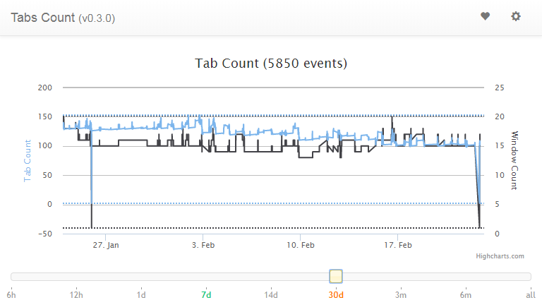

# Problem
I'm a tab hoarder and I would like to keep my tab count under control. How do I do that?

# Solution
In January 2015 I wrote an extension for Chrome that allowed me to track how many tabs I had open. I called it the [Chrome tabs count extension](https://github.com/tomzx/chrome-tabs-count). It displays the number of currently opened tabs in the extension bar and when you click on the extension button itself, a chart is displayed with shows the tabs and windows count at each point a tab was opened/closed. This allows you to see the patterns of tabs creation/closing you have.

Such a tool will not help you reduce your tab count, but awareness is the first step toward reducing the number of tabs you have open at all times.

The second step is to taper (slowly reduce) the number of tabs you have open at all times. My strategy has been to reduce by 10 tabs each week the maximum number of tabs I had open. I started with over 160 tabs and I am now at 100 tabs after 6 weeks. I use the [Loop Habit Tracker](https://play.google.com/store/apps/details?id=org.isoron.uhabits) app to set up a daily reminder to make sure my tabs count is under the limit specified for this week and I try as hard as possible to finish the day with the number of tabs open below or at this limit.

# Reference
* https://github.com/tomzx/chrome-tabs-count
