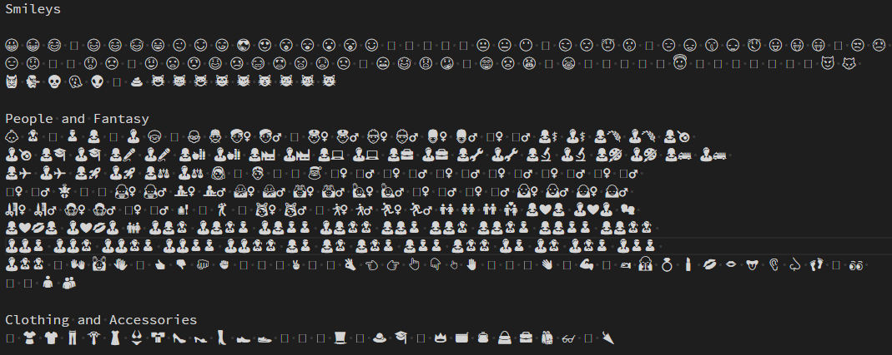
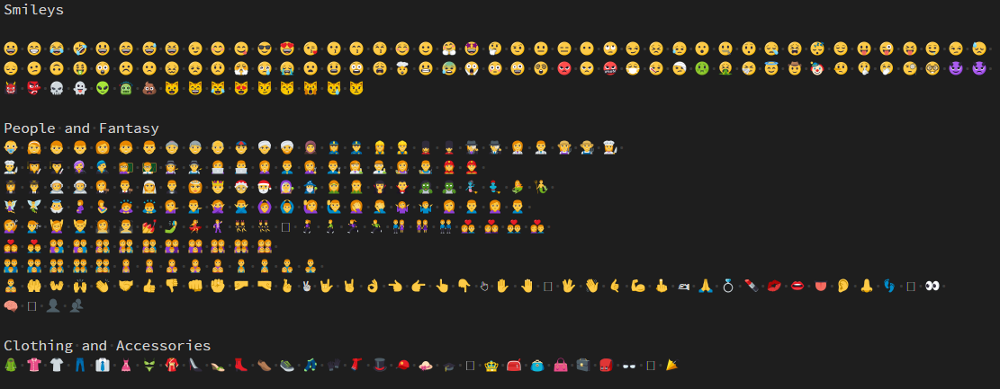

# Problem
I use Visual Studio Code as my main editor and I am on Windows 7. I like to use emojis but those aren't properly rendered under Windows 7. Can I have pretty emojis in Visual Studio Code somehow?

# Solution
I developed an extension in 2018 called [Emoji](https://marketplace.visualstudio.com/items?itemName=tomzx.emoji) which uses [EmojiOne](https://github.com/joypixels/emojione) emojis to replace their non rendered equivalent in Visual Studio Code.

To do this, the extension makes use of the `createTextEditorDecorationType` method available on the `window` object in order to inject CSS that adds a background image where the text emoji would be rendered.

The extension listens to two events to determine in which editor it needs to do the replacement: `window.onDidChangeActiveTextEditor` and `workspace.onDidChangeTextDocument`. In the first case we update the editor that is now the active one, in the second, we update the active document when the text content changed.

# Demo
## Without the extension (before)

## With the extension (after)

# Reference
* [Visual Studio Marketplace - Emoji extension](https://marketplace.visualstudio.com/items?itemName=tomzx.emoji)
* [Github repository - Emoji extension](https://github.com/tomzx/vscode-emoji)
