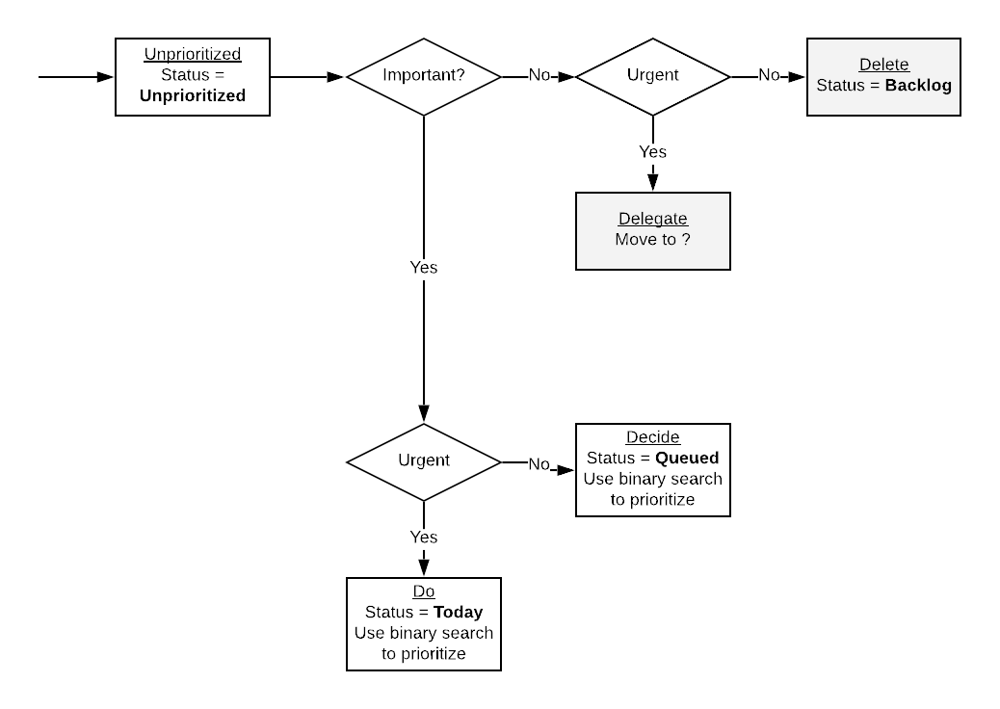
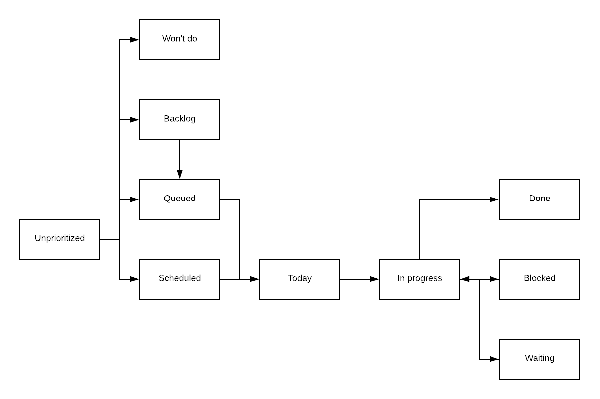
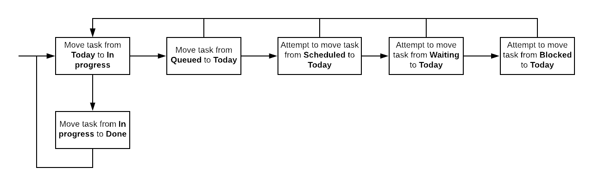

# Steps to create a task
* Give it a title
* Give it at least one label
* Give it an assignee
* Decide if it's important or not
* Decide if it's urgent or not
* Give a rough estimate of effort
* Give a description if necessary
* Set a deadline if possible
* Set status to Unprioritized

# During a workday
* Go through the tasks in the Do section, then the Decide section, then Delegate

# Important/Urgent
Use Eisenhower matrix to determine task importance/urgency
* Tasks that are not important/not urgent are moved to the backlog
* Tasks that are not important/urgent are delegated to someone else
* Tasks that are important/not urgent should be scheduled
* Tasks that are important/urgent should be done ASAP

# Task processing
* Unprioritized tasks should be moved to Queued, given their priority compared to already queued tasks
* You should attempt to keep the Unprioritized tasks count to 0
* A task that is Queued should have a deadline date
* Work on tasks In progress first, then take tasks from Today, then from Queued

