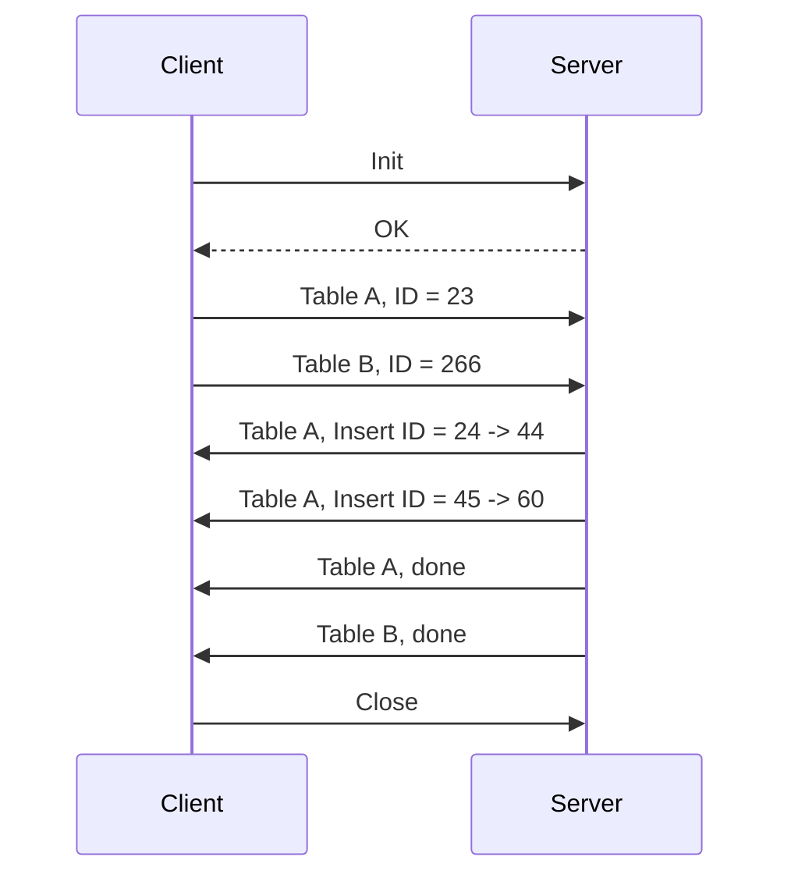
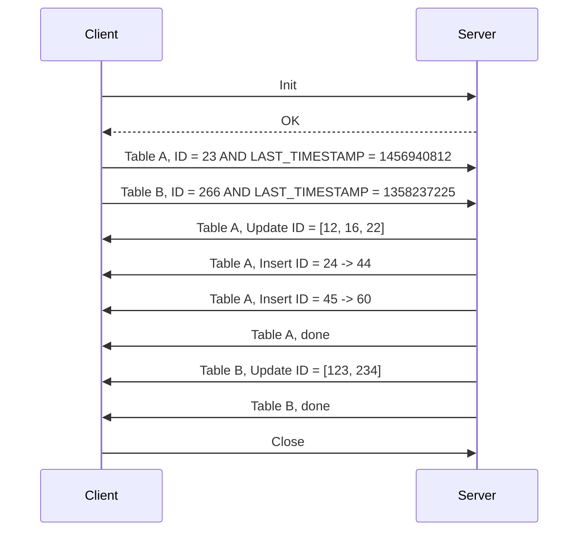
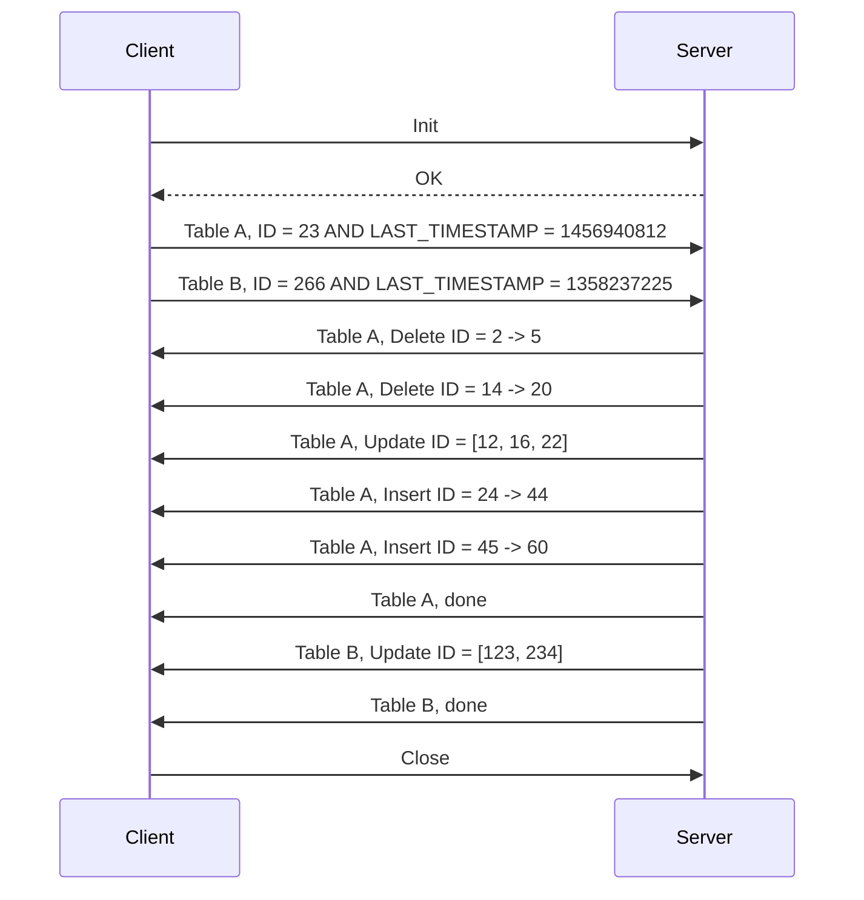

## Context

## Learned in this study

## Things to explore

* How should the client inform the server of which tables it wants updates?
* Is it possible to only ask for a partial database considering there might be foreign key relations?
* How to do batched sync instead of a "massive" big synchronization
* How can we only send the appropriate operations to update a row with many large fields so that only the updated fields are sent to the client?

# Overview

There is three types of updates:
* Insertion at the end of the table (new IDs)
* Update of existing data
    * In order to know we need the data, we'd have to assume that the time is properly synchronized between devices and has an  `updated_at` column which is using a timestamp field
* Removal of existing data

There are two types of SQL sync we'd like to achieve:
* Server-client relation, where the client will let the server know it has data from ID = 1 up to X
* Distributed, where clients are all communicating with one another in an asynchronous manner and want to share some sort of state

# Things we'll assume

* No schema changes: There will be no change to the structure of the tables, otherwise this would require to have access to migration scripts.
* No triggers will be executed when updating data

# Things we want

* Easily server multiple databases through a single endpoint

# Things we have to consider

* Updated and deleted rows
	* Should we "force" the users to have `updated_at`/`deleted_at` columns and to keep the data or have to go through the whole tables to determine missing IDs

# Client-Server architecture

Let's get started with what should be the simplest architecture, a client-server architecture.

In this particular case, we assume that the server is authoritative and that if any schema change were to occur, the server is the one that will be pushing the schema update to the client and not the other way around. Furthermore, we'll assume that the client isn't writing any data to the table. In other words, it is a read-only/replication client (also know as master/slave).

First, the server is configured to host a database with any number of tables.

Then, a client is configured to point to this given server in order to establish a connection with it in order to update its local data.

When the client is configured, it will call the server to inform it it wants to start a synchronization process.

The following sequence diagram represents the communication between a client and a server in the case that there are only inserts being done on the server data and the client wants to sync this data locally.

This simple case sadly does not cover updates nor deletes.

In order to support updates, we need to have an `updated_at` column that is updated when the data itself is updated.

If the table also supports `deleted_at`, then it should work in the same fashion as with `updated_at`. Here, we could have a setting to determine whether `updated_at` would be updated on a `deleted_at`, and if it is not, then it means that we have to do a separate set of operations for delete operations. The simplest case is to "force" the users to update their `updated_at` field when they set one of their rows `deleted_at` attribute (so that they both match).

With this simple system it is easy to ask for a delta of the changes that have occurred on the server since the client last synchronized with it. It does not require any additional tables to support the synchronization process other than having incrementing IDs and `updated_at`/`deleted_at` fields.

When the clients want to determine what to send to the server, it will have to obtain the `MAX(id)` and the `MAX(updated_at)` of the table it wants to sync. The client will then provide this information to the remote server so that the server can then query its own database and build the set of changes that it will be transmitting to the client.

At this point, this solution means that:
* Removal of data from the database has to be done by setting the `updated_at`/`deleted_at` columns to the time of deletion. If one deletes a row from the table, then we are not aware of this change

One of the biggest challenges with synchronizing removal of rows is that there is no data which can be retrieved in order to determine the list of rows that have been removed. At best, we can start the synchronization process of a table by computing the number of existing rows on the client and asking the server if the count matches. If it does, then no row has been deleted. If it doesn't, then we have to figure out which rows are gone. The problem is figuring out this list of rows, since they are no more in the server's database. Thus, we're left with iterating over the database IDs to find when the consecutivy is broken.

It is possible to query SQL and ask for the non-consecutive blocks of IDs using a query such as the following one:

<pre><code class="language-sql line-numbers">
select l.id lValue, c.id cValue, r.id rValue
  from
  test l
  right join test c on l.id=c.id-1
  left  join test r on r.id=c.id+1
where 1=1
  and c.id > 0
  and (l.id is null or r.id is null)
order by c.id asc;
</code></pre>

**Source:** http://stackoverflow.com/questions/4340793/how-to-find-gaps-in-sequential-numbering-in-mysql

For example, given the following table:

| id |
| -: |
| 3 |
| 4 |
| 5 |
| 6 |
| 7 |
| 16 |
| 17 |
| 23 |
| 25 |

The query will return us with:

| lValue | cValue | rValue |
| -: | -: | -: |
| null | 3 | 4 |
| 6 | 7 | null |
| null | 16 | 17 |
| 16 | 17 | null |
| null | 23 | null |
| null | 25 | null |

An alternative query could be

<pre><code class="language-sql line-numbers">
select l.id + 1 as start, min(fr.id) - 1 as stop
from test as l
    left outer join test as r on l.id = r.id - 1
    left outer join test as fr on l.id < fr.id
where r.id is null and fr.id is not null
group by l.id, r.id;
</code></pre>

**Source:** http://www.xaprb.com/blog/2005/12/06/find-missing-numbers-in-a-sequence-with-sql/

But such query does not return us missing IDs from 1 to X, it only returns us with missing IDs between the first existing ID to the last existing ID. In our particular case, we'd like to give the query a from-to range that will be tested and which will let us know the IDs that are missing (that the client will have to remove).

Given we can receive a list of from-to of deleted rows, we should be able to fully update our client.

One of the downside of this method is that the server will have to compute and send over the list of deleted rows on every request. We could compute the list of missing rows on the client and send it to the server so that they may not be sent back, but it is putting more burden on the client than we probably might want.

## A trigger-based approach

If we do not want to go through the trouble of adding a `updated_at`/`deleted_at` columns and triggers are available in the database we're using, then we could make use of this feature to record transactions occurring on the tables we care about.

In this particular case, we have the choice between two designs: a log table per table of interest or a shared log table between all tables.

### One log table per table

| id | operation | target_id |
|----|-----------|-----------|
| 1 | insert | 1001 |
| 2 | update | 1002 |
| 3 | delete | 1003 |

**id:** operation identifier
**operation:** insert/update/delete operations
**target_id:** the id of the row in the given table

The log table for a table called `table` should be named `table_log`.

### One shared log table

| id | table | operation | target_id |
|----|-------|-----------|-----------|
| 1 | a | insert | 1001 |
| 2 | b | update | 1002 |
| 3 | c | delete | 1003 |

**id:** operation identifier
**table:** indicates the target table
**operation:** insert/update/delete operations
**target_id:** the id of the row in the given table

The interesting aspect of using log tables is that we can give its last ID to the server and the server will send over its own log of transactions since that ID. The disadvantage is that we're storing a lot of meta-data in one or many log tables. As we've seen before, we do not particularly care about inserts and updates as we could recover their information through other means (given we have an `updated_at` column).

What can be done to mitigate the need of having transaction logs on the client is to have the log(s) table(s) only on the server. All the client would need to remember is the last transaction ID it has seen and the server would send to the client all the rows it needs to insert/update/delete.

## Two-way synchronization

In the previous section we've only been concerned with one-way synchronization between a client and its server. It is a very useful approach for speeding up local querying and diminishing the load on the given server. It would however be interesting to be able to use this database locally and to insert/update to it and have these changes reflected on the server when they are synchronized.

This proves to be an immense challenge if we aren't ready to update our tables schema. For one, if multiple clients insert data in table A and synchronize with the server, their insert will collide. Which row should be kept? Should only the last one be preserved or are all inserts valid? The same question can be asked about updates. If one client increases the value of an entry in a row while another client decreases this same entry and they synchronize with the server, which one should be preserved?

# Distributed architecture

* Create a table of devices (id|device-identifier)
* Each device gets assigned a unique id
* Each row of each table is assigned a device id
* When syncing, the process is done sequentially (updating the oldest data first up to the newest)
	* This assumes that no older data will get added by the remote device
* A table records the latest record that was inserted for each device and table (id|device_id|table)

# See also

# References

* Microsoft Sync Framework: https://msdn.microsoft.com/en-us/sync
* MySQL replication: http://dev.mysql.com/doc/refman/5.7/en/replication.html
