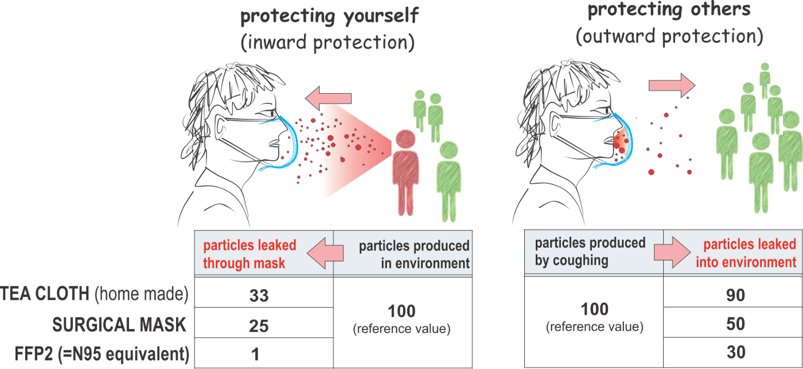

# Question
Should I wear a face mask against COVID-19 if I'm not sick?

# Answer

Source: https://medium.com/@Cancerwarrior/covid-19-why-we-should-all-wear-masks-there-is-new-scientific-rationale-280e08ceee71

If you have masks already, wear one. It will protect you from others and others from you.

The official answer from the [Government of Canada](https://www.canada.ca/en/public-health/services/diseases/2019-novel-coronavirus-infection/prevention-risks.html#wm) and the [CDC](https://www.cdc.gov/coronavirus/2019-ncov/about/prevention.html) is that wearing a face mask is not an effective solution to protect yourself against the virus.

If you are sick and you need to go out in public, wearing a face mask will help reduce the chances of spreading the virus to others.

If you want to avoid being ill due to the virus, the best way to do so is to avoid being exposed to the virus. This means staying at home in isolation.

# References
* https://www.canada.ca/en/public-health/services/diseases/2019-novel-coronavirus-infection/prevention-risks.html#wm
* https://www.theguardian.com/world/2020/mar/15/can-a-face-mask-stop-coronavirus-covid-19-facts-checked
* https://www.livescience.com/face-mask-new-coronavirus.html
* https://time.com/5794729/coronavirus-face-masks/
* https://www.businessinsider.com/wuhan-coronavirus-face-masks-not-entirely-effective-2020-1
* https://www.cdc.gov/coronavirus/2019-ncov/about/prevention.html
