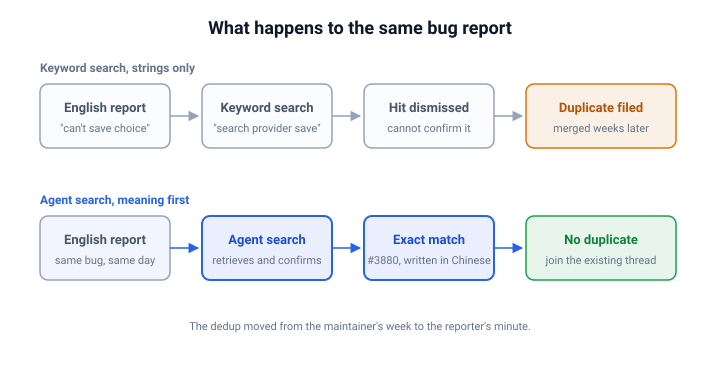

This morning I hit a bug and asked my agent to file an issue for it.
It came back with a stop sign instead.
The exact bug had already been reported, a few hours earlier, in Chinese.
**The agent did the one thing a decade of keyword search never did for me: it read a Chinese bug report and knew it was mine.**

## The Bug and the Request

The app is [OpenChamber](https://github.com/openchamber/openchamber) 2.0.0.
In Settings, under Web Search, every option failed the same way.
I picked a search provider, a toast appeared saying "Couldn't save the web search choice.", and the selection rolled back.
Textbook bug report material.

I typed what I knew to my agent: create an issue, the web search choice cannot be saved, it happens when switching the search provider.
Notice what I did not do.
I did not search GitHub first, and I did not open the source.
I dumped a half-formed report on the agent and moved on, the way you dictate to an assistant who handles the rest.

## The Skill That Fired

The skill my agent runs when I ask it to file an issue starts with one instruction: search for duplicates before any codebase investigation.
It followed the skill without being asked.
One grep tied my words to the app's own UI strings, and then it ran three GitHub searches: "web search provider", "search provider save", and "websearch settings".
The first returned four unrelated issues, and the second returned the Chinese report as its top result.
The queries were plain English, and the hit was still a Chinese report.
The bridge was the report's body: the Chinese reporter had listed the failing endpoint, /api/config/websearch, and the frontend store, useWebSearchStore, and English identifiers like those match an English query no matter what language surrounds them.
Retrieval was never the hard part, because code identifiers are already language-neutral.
The agent opened the thread, read the Chinese, and did the translating after the hit, not before.

## The Match

The match was issue [#3880](https://github.com/openchamber/openchamber/issues/3880), titled "[Bug] v2.0.0 网页搜索选择无法保存，切换任何选项都会报错" ("the web search selection cannot be saved, switching any option shows an error").
It had been filed by a reporter I had never interacted with, and its prose was written entirely in Chinese.
Same component, same toast, same rollback on every option.
The Chinese reporter had even done their own careful investigation of their machine and listed the API calls involved.

The agent read the full report, compared it against mine, and concluded it was an exact match.
Then it stopped.
No new issue was filed, and it told me why in plain terms: a duplicate already exists, so it did not create one.
It went one step further, checked the current source to confirm the bug was still live, and corrected a wrong guess in the existing thread's comments.

## Why This Was New to Me

**Duplicate detection was never bounded by retrieval, it was bounded by confirmation, and confirmation is reading.**
GitHub search matches strings, and it matches them in the issue body too.
No English query matches the title 网页搜索选择无法保存, but the English identifiers in that report's body match an English query fine.
So a keyword search can surface a foreign-language report.
What it cannot do is tell you the report is your bug, because judging the match means reading it.
An English speaker looking at a Chinese-titled search result skips it or files anyway, and both paths end in a duplicate.
I would have filed mine at exactly that step, not out of laziness, but because confirming the hit meant translating it by hand.
The old workflow was not broken, it stopped one step short, and the step it stopped at was the language wall.

The result in the old world is familiar to anyone who has maintained a project.
The same bug arrives three times in three languages, a bilingual maintainer or a patient contributor eventually connects them, and the duplicates get merged weeks later, after the maintainers have already triaged each copy.
The dedup always happened, but it happened on the maintainer's time.

An LLM agent reads GitHub in any language it knows, Chinese as easily as English.
The string search still does the retrieval, the reading does the confirmation, and both happen in the same minute of the same session.
The dedup moves from the maintainer's week to the reporter's minute.
**The first useful thing my agent did that morning was refuse to do the work I asked for.**

## What to Do Next

If agents file issues for you, put duplicate-first at the top of the issue-filing skill, and make the language point explicit: tell the agent to treat translation as part of the search and to read candidate issues before dismissing them.
A search that only matches your own language is a search that misses half the issues on GitHub.
If your agent ever fails to catch a cross-language duplicate, check whether its search was string-bound.

If you maintain a project, expect the mirror image.
Fewer copies of the same bug reach your queue, because the reporter's agent catches them at filing time.
The comments that still arrive can carry more than a symptom: an agent that finds an existing issue reads the thread, checks the current source, and can correct a wrong theory already sitting in it, as mine did on #3880.

## See also

- [Issues Are Free Now: Send the Implementation, Not the Idea](../send-implementation-not-issue/index.md) - the economics of filing issues when agents make reports nearly free, and why a withheld duplicate is a contribution.
- [The Bot Reads the Queue First: How OpenClaw Processes Thousands of Issues and Pull Requests](../openclaw-triage-pipeline/index.md) - what changes when a machine reads the issue queue before any human does.
- [Say It Once: How to Delegate Tasks to Agents Without Supervision](../say-it-once/index.md) - how standing conventions like "search duplicates first" get encoded so agents act on them unprompted.
- [Iterating on Agent Skills: The Loop That Keeps Them Improving](../iterating-on-agent-skills/index.md) - where an instruction like duplicate-first comes from, and the loop that keeps a skill correct after it ships.

## References

- [OpenChamber issue #3880](https://github.com/openchamber/openchamber/issues/3880) - the Chinese-language report my agent matched, including the reporter's own investigation of the failing save.
