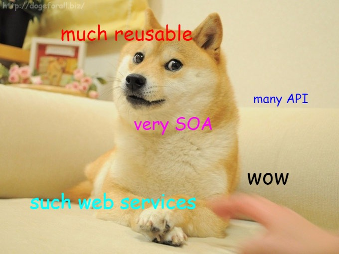
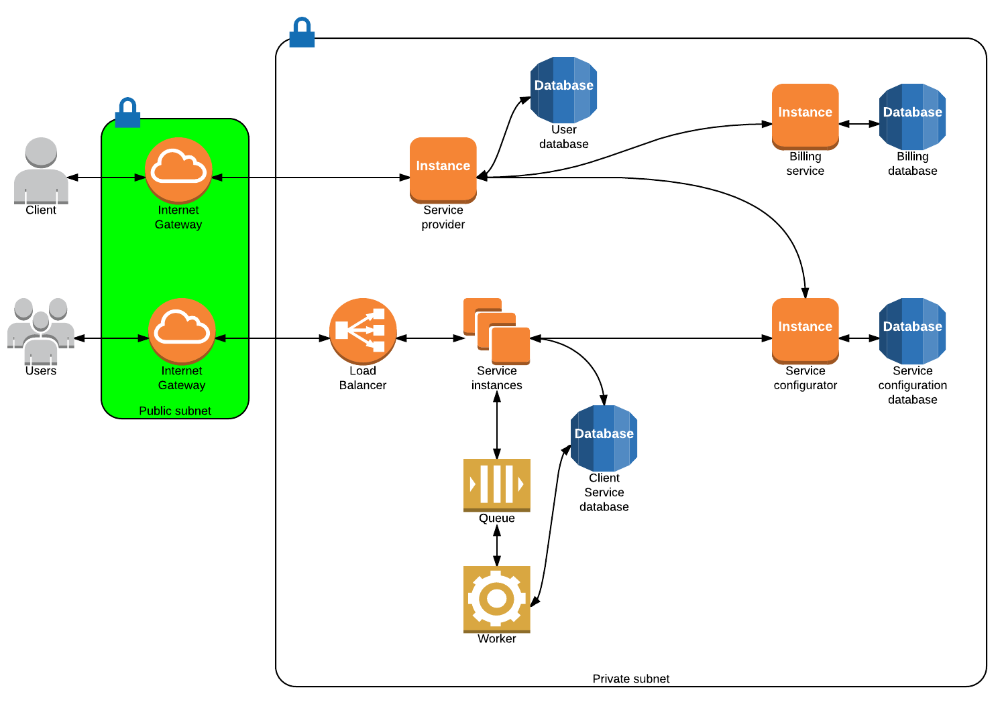

## Context

## Learned in this study

## Things to explore

* What creates a service database?
* What should happen if a service removes a feature? How should that change propagate to the billing service?
* How to do a single queue for all services? Or should there be a queue per service?
	* Workers are generally bound to an app, is it possible to have them run commands on apps available on their disk?

# Overview

Goal: produce a system that reproduces how amazon *internal* API works.

# The ingredients

You will need:
* authentication
* authorization
* a way to bill based on usage
* one or many services *serviced* by the previously listed components

Services should be written such that tracking their usage is secondary (it can be bolted on later on). Develop them as if you were not developing them within an ecosystem that has authentication, authorization and billing in mind.

In the context of this article, we'll think of the following systems:

* An authentication & authorization API
* A billing API
* A service A
* A service B

# Authentication

Authentication is a simple mean to get recognized as a particular user within a system. Once authenticated, you can grant/deny authorizations within the context of the authenticated user.

# Authorization

Authorization makes it possible to do specified things within a service.

If I give you the ability to add users on service A through the `A.addUsers` authorization, then you can do that.

? Where are the authorization defined? Is it the responsibility of the A&A API to know the available list?

What seems the most appropriate convention for naming authorization is a schema that is namespaced, such that service A starts with `A.` and service B with `B.`:

* `A.addUsers`
* `A.removeUsers`
* `B.addUsers`
* `B.runTasks`
* `...`

Depending on how granular you get with permissions, you may end up with as little as 3-5 permissions per app to a hundred or more.

# Billing

The billing service purpose is to know who users what service. It has to track when a service is to expire. It has to be able to explain in enough details how a bill was incurred by a user.

* Features are comparable to various instances of EC2

# Database-based service

Say you offer a service which can run off a database: a small customizable store or a forum. The code is always the same, but clients can customize it to their liking (and enable features they want).

You want to be able to run your service on new servers if demand increases. Furthermore, you'd rather not tie down a user to a specific server for load balancing purposes. What does this imply?

* You need to move sessions out of the service server onto a database
* You have to be able to connect to the appropriate database based on the `HOST` you received

## Sessions

Sessions can be moved to a key-value store such as redis.

## Connecting to the appropriate database

To determine the database credentials to use for your service, you will have to query a database. However, doing this for every request will obviously add an unwanted lag to your requests. At this point, multiple solutions exists:

* Query on a need-to-know basis and cache for X minutes/hours (easiest)
* Poll the configuration database server (where database credentials for every user instance are stored) every X minutes/hours and cache it for that period (easy)
* Construct a network with publisher/subscriber where the configuration database server publishes any changes and services subscribe to those events (hard)

# Uses cases

## The whole process from the perspective of a new client

The following depicts what the process of obtaining `service A` would be like for a client. (in italic are the actions the system will take)

1. Register on `my super services`
	1. *Create a new user*
2. Enable `service A`
	1. Configure `service A` to have modules `X` and `Y`
		1. *Create database for service A AND/OR update its settings to provide modules X and Y*
		2. *Notify billing that a new billing cycle may begin*
3. Done

At the end of the month, the client is billed.

## The whole process from the perspective of a user of a client's service

The following depicts what the process of using `service A` from our previous client looks like.

1. Go to `service-a.com`
	1. *Find which user instance is linked to service-a.com*
		1. *Cache the given result for further use*
	2. *Configure the database connection to use the given user instance database credentials*
2. Register to use `service a`
3. Done

## Service instance creation

A client wants to create a new instance of a service we offer. Once he has decided on the modules he wants with his service, the following occurs:

1. The `Service provider` sends a request to the `Service configurator` to let it know of a service configuration change, in this case, the creation of a new `Service instance`.
2. The `Service configurator` creates a new database instance as well as a user for that instance. At this point, the database is empty.

Now we have a instance settings stored in the `Service configuration database`, which can be requested through the `Service configurator` API.

## Service instance setup

A database instance has been generated for the client, however it is empty and needs to be configured. The client goes onto his instance and fills in a small setup page (create an admin user, decide the system language, etc.).

1. Upon submitting the form on the `Service instance`, the `Service` queues a job to have the instance migrated and seeded.
2. A `worker` picks up the job, connects to the appropriate database. It runs the appropriate migration scripts as well as the initial seeder script.

Our client now has his service available for use.

## Deployment and service updates

### Service updates

#### Overview

A service update can consist of different things:

* Code changes
* Code changes affecting jobs
* Database migrations

#### Code changes

`Service instances` and `Workers` have to update their code.

#### Code changes affecting jobs

`Service instances` and `Workers` have to update their code.

#### Database migrations

`Workers` have to update their code.

#### Overall process

Since many servers may have the service available, the easiest solution to simplify updates is to prevent users from accessing the service during the update.

One *safe* way to do this is to start rolling the update on all `Service instances` in the background. Once all the `Service instances` are ready to enable to update, they simply replace their symlink pointing to the newest code revision.

* Developer decides he wants to promote a revision to promotion
	* For example: pushes the changes onto a `production` branch
* `Service instances` and `Workers` are notified that a new version is available. They pull the changes and begin building the dependencies. Another option is that a single server holds a deployable package which all other `Service instances` and `Workers` simply download and unpack.
* Through some dashboard, the developer can see all `Service instances` and `Workers` status and see if there were any issues. If everything appears fine, he can send a signal to let all instances that they are free to update to the newest code version.

The same process can be used for `Workers`. However there is one caveat: queued jobs.

There are a few ways this could be dealt with:

* Workers are stopped. Code is updated. Worker are restarted. Engineers pray nothing broke. (easy/risky)
* Jobs that have changed are removed from the queue forcefully. (easy/loss of work)
* Disable queuing of jobs in preparation for an update. Once the queue has emptied out (how long should we wait for the queue to empty?), workers can be safely stopped, code swapped and then restarted. (moderate/slow)
* Jobs are versioned. The code executed for the job will switch based on the given version (no version = v1). This is done if the API (data sent as job) is different from the one that was initially written. This solution has to be mixed with one of the previously mentioned options. (moderate)

Database migrations require `Service instances` to be temporarily disabled during the migration of the instance. Thus, while the worker is going through the migration, the `Service instance` must prevent users from accessing the service. Once the migration process is complete, the users are allowed again on the `Service instance`.

### Documentation updates

`TODO`

### Service provider updates

`TODO`

### Service configurator updates

`TODO`

### Worker updates

`TODO`

### Billing updates

`TODO`

### Adding a new service instance

Adding a new `service instance` is very easy. Let's consider that we are given a new server which has no other service on it. Each service should declare a unique vhost, where each service uses a different port number. So if we have two services `A` and `B`, we may use port 1000 for service `A` and 1001 for service `B`.

Once the `Service instance` has the service configured, it informs the `Load balancer` it is available for use.

# Responsibilities

## Service provider

* Authenticate users
* Add/Modify/Delete services for a given user
	* Configure properties of services (additional features)
* Communicate with the billing service about changes in provided services to a user

## Billing service

* Track service usage (usage begins/ends, rate, features, discounts)
* Provide/Generate bills
* Store user billing details

## Service instances

* Offer value to the customer
* Provide a mean to enable features through an API. Only the service configurator may call this API
* Publish a list of modules users can opt-in

## Service configurator

* Configures the service with the given modules/parameters
* Provide the service with the database credentials of the running instance

## Worker

* Execute any long running background job

## Load balancer

* Receive requests and redirect the request to an appropriate `Service instance` based on the `HOST` of the request

# See also

# References

* https://www.digitalocean.com/community/tutorials/how-to-use-haproxy-to-set-up-http-load-balancing-on-an-ubuntu-vps