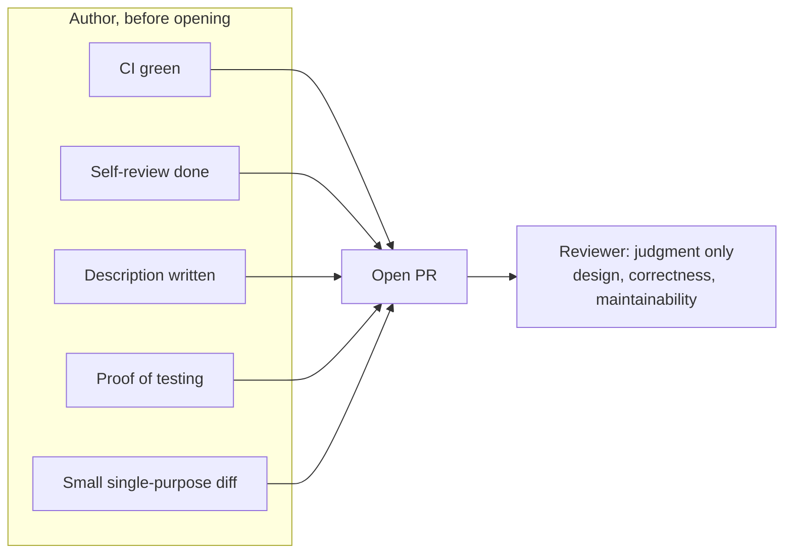

When a senior engineer opens a pull request, the reviewer should be able to start judging the change, not excavating it.
**The standard is that everything which did not require a second brain is already done before the review request goes out.**
CI is green, the diff is small and single-purpose, the description explains the change, the author has already read their own diff, and the proof that it works is in the PR.
Anything less quietly converts review time into discovery time, and discovery is the most expensive way to use a reviewer.

## The Standard Expectations

Stripped of argument, here is what a reviewer can assume when a senior engineer opens a PR:

- CI is green on the latest commit.
- The diff does one thing; refactors and behavior changes live in their own PRs.
- Stray logs, commented-out code, and unrelated reformatting are gone.
- The author has read the full diff as a stranger would and annotated the lines that need context.
- The description answers what changed, why, and how it was tested, and points at where to look closely and what is out of scope.
- Proof that it works is in the PR: tests for new behavior, plus written manual verification when tests are impractical.
- The requested reviewers own the subsystem you are touching, not whoever is idle.

**Each of these assumptions a reviewer has to re-verify by hand is attention taken away from judging the change.**
When one of them breaks, the reasonable response is not a comment, it is returning the PR to draft.

## The Handoff Contract

Review is a handoff, and a handoff has two sides.
The author's side is logistics: prove the change works, make it easy to read, explain why it exists.
The reviewer's side is judgment: design, correctness, and whether the code will still make sense in a year.
When the author skips their half, the reviewer inherits it.
**A PR that forces the reviewer to reconstruct the intent is a PR that was opened too early.**

The division of work looks like this:

## Small, Single-Purpose Diffs

The highest-leverage habit is also the dullest one: keep the diff small.
[Google's engineering practices](https://google.github.io/eng-practices/review/developer/small-cls.html) make the case from experience, small changes get reviewed faster and more thoroughly, and reviewers miss fewer defects.
Size is not the only variable though, purpose is.
**A senior engineer separates refactoring from behavior changes, because a diff that does two things forces the reviewer to review both at once and catch neither.**
If a PR needs a live walkthrough before anyone can understand it, that is usually a sign the PR is several PRs wearing a trench coat.

There are legitimate exceptions, a generated-code migration or a mechanical rename can be large and still easy to review.
The mark of a senior engineer is knowing which kind of large diff they have, and saying so in the description.

## A Description That Answers the Obvious Questions

The description exists so the reviewer never has to ask questions the author could have answered in writing.
The questions are predictable:

- What does this change do, and why is it needed?
- How was it tested?
- What should the reviewer look at most closely?
- What is deliberately out of scope?

Screenshots for UI changes, before-and-after output for behavior changes, and a link to the ticket all belong here.
**The ticket link is a pointer, not a description.**
A reviewer who has to read the ticket to know what the PR does has been given homework instead of a review request.

## Self-Review Before Anyone Else Reviews

Before requesting review, the author reads their own diff on the same screen the reviewer will use, the Files Changed tab, end to end.
This pass has two jobs.
The first is debris removal: stray logs, commented-out code, leftover debugging, unrelated reformatting that inflates the diff.
The second is annotation: leaving comments on the lines that need context, "this mirrors the logic above", "this limit matches the upstream API", so the reviewer does not have to ask.

**Self-review is also where a senior engineer catches the embarrassing stuff, and catching it yourself is the whole point of being senior.**
Every defect the author removes before the review is a round trip that never happened.

## Proof That It Works

The author's job is to demonstrate the change works, not to believe it works.
That means tests for new behavior, updated tests for changed behavior, and a written note on manual verification when tests are impractical ("ran the migration against a copy of staging, 4.2M rows, 90 seconds").
I put this in the description under "How I tested this".
The reviewer's job is then to audit the proof: are the tests real assertions or tautologies, do they cover the failure modes, is the manual claim plausible.
**An author who ships "seems to work" is asking the reviewer to do QA on a hunch, and most reviewers will price that in with a request for changes.**

## After You Open It

**The standard does not end when the PR is opened.**
Watch CI and fix failures immediately; a PR with a red build is blocking a reviewer for nothing.
Respond to comments within a day, even if the answer is "I'll get to this Thursday".
Push fixes as commits so the reviewer can see what changed since their last pass, and say when the PR is ready for a re-review.
When a comment thread passes about twenty back-and-forths, take it to a call and write the conclusion back into the PR.
And when you disagree with a reviewer, either convince them, accept the change, or escalate; a senior engineer does not let a PR rot in a stalemate.

## What to Do Next

Before you click "Request review" next time, walk the seven expectations in the list above one last time, in order.
Confirming them takes minutes, and the two that are expensive to fake, the small diff and the proof, are exactly where reviewers look first.
None of this requires talent.
**It is the difference between treating review as a service you consume and a contract you enter, and seniority is mostly showing up on the right side of that contract.**

## See also

- [Reviewing code](../processes/reviewing-code/index.md) - the reviewer-side counterpart of this piece, a checklist for what to actually check in the diff.
- [Rethinking Code Review in the Age of LLMs](../rethinking-code-review-in-the-age-of-llms/index.md) - how the review contract changes when an LLM writes most of the code being reviewed.
- [You Already Review Code Without Reading It](../code-review-without-reading-the-code/index.md) - the signals reviewers rely on when they cannot read every line, which is why author-side trust building matters.
- [You Are the Bottleneck](../you-are-the-bottleneck/index.md) - what happens on the receiving end when author output outpaces review capacity.

## References

- [Google, "Writing a CL Description"](https://google.github.io/eng-practices/review/developer/cl-descriptions.html) - grounds the description section: what a description must contain.
- [Google, "Small CLs"](https://google.github.io/eng-practices/review/developer/small-cls.html) - grounds the case for small, single-purpose diffs.
