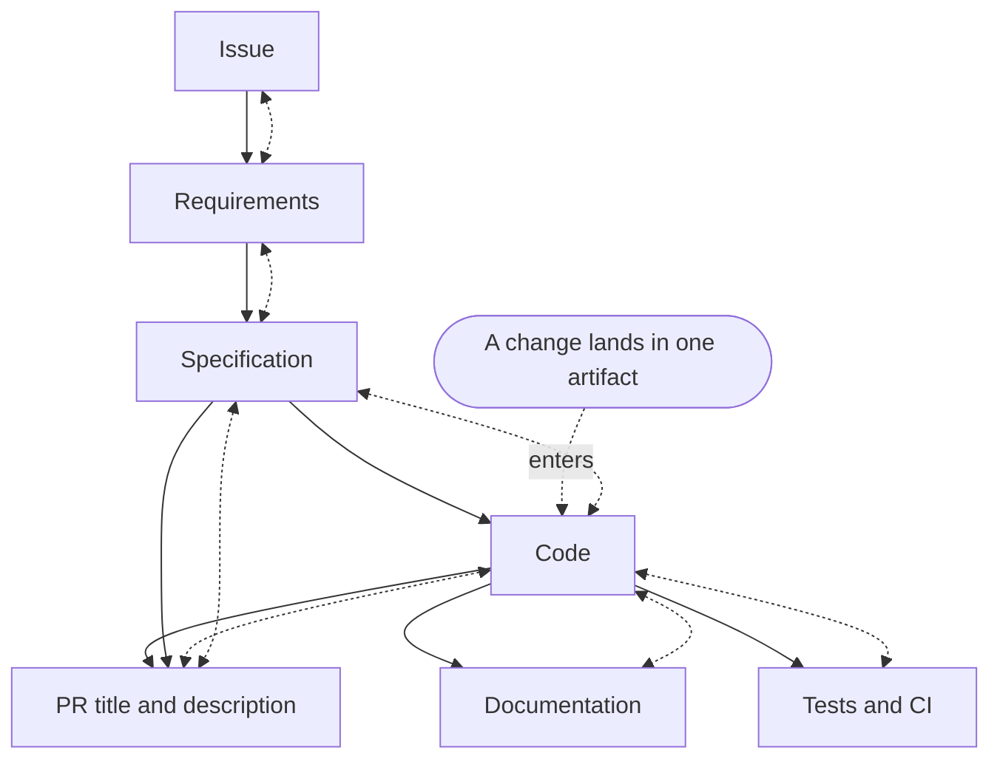
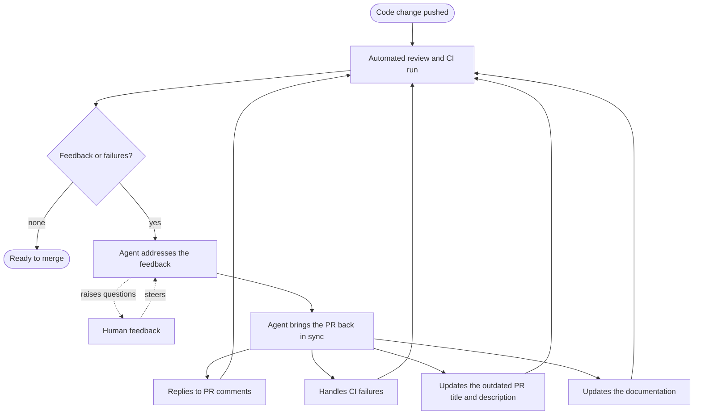

When an agent pushes a code change, the change itself is the fastest thing in the pipeline.
The PR title and description written before the second revision, the review comments nobody answered, and the red CI run all become outdated and inconsistent with the code.
**Agentic work does not end when the code is written, it ends when a change has propagated through the graph of records in both directions.**

## The Push Is Never Final

In human-paced development, a push was a statement of completion.
The author finished the work, wrote the PR title and description last, and pushed once.
The PR title and description were accurate because they were written after the code settled.

Agentic development breaks that ordering.
An agent pushes a first draft, receives feedback, addresses it, and pushes again.
Then it rebases, fixes a failing test, and pushes again.
Each push improves the code and invalidates the records describing the previous version.
**The diff updates itself on every push, the PR title and description do not.**

That asymmetry is the whole problem.
After three iterations, a pull request can contain correct code wrapped in a wrong story.
The PR title and description explain a feature that no longer exists.
The comments hold questions the final code already answers.
The last CI run failed before the final fix landed, and nothing explains why the failure no longer matters.
Nothing in the code is broken, and everything around the code is stale.

## A Graph of Artifacts, Not a Checklist

These stale records present themselves as a checklist: walk the pull request and fix each one.
The checklist view fails because the records are not independent, each one was written from another.
The artifacts around a change form a directed acyclic graph.
The issue feeds the requirements, the requirements feed the specification, the specification feeds the code, and the code feeds the tests, the PR title and description, and the documentation, and no artifact feeds back into itself.
**Each artifact should declare what it depends on, because the declarations are the map that a propagation pass follows.**

Here is the structure, with a change entering at the code node:

Solid arrows are declared dependencies: an artifact is built from the artifacts its solid arrows come from.
Dotted double arrows are propagation, and they run along every edge in both directions.
Downward, a changed artifact updates its dependents: the PR title and description must be rewritten, the documentation must describe the new behavior, and the test expectations must assert it.
Upward, a changed artifact questions its premises: if the code had to deviate from the specification to work, the specification is now wrong, the requirements it satisfied are in doubt, and the issue behind them may be wrong too.
No matter where the change lands, the two walks visit every artifact the declared edges connect.

**Propagation has to run in both directions, because each direction catches a different kind of staleness.**
Downward-only propagation keeps the record aligned with the change while leaving the premises unexamined, which produces a consistent account of the wrong decision.
Upward-only propagation questions everything and updates nothing.
An agent runs both walks mechanically: it follows the declared edges, applies every update whose resolution follows from the change, and raises a question wherever two connected artifacts disagree in a way that admits more than one resolution.

**A single forward pass is the ideal [Say It Once](../say-it-once/index.md) argues for.**
The issue produces the requirements, the requirements produce the specification, the specification produces the code, and the code produces the rest, with every question answered before the next artifact starts.
In most cases, though, the forward pass cannot complete in a single iteration, because some gaps become visible only when a downstream artifact is produced.
Writing the code is how you learn the specification never said what happens when the input is empty.
Writing the documentation is how you learn that nobody decided what the feature is called.
**Producing a downstream artifact is also a probe: it tests the artifacts before it, and every gap it finds sends the walk back upward.**

## The Update Loop

The loop below is the graph in motion at the pull request node, the place where every agent-authored change lands first.
Automated review reads the diff and produces feedback.
An agent addresses that feedback, with a human steering when judgment is needed.
The agent then brings the pull request back in sync: it replies to the review comments, handles the CI failures, and updates the PR title and description if the latest push made them outdated.
The documentation that describes the changed behavior is updated in the same pass.
Then review runs again.

**Every station in this loop has an owner, and the default owner is the agent.**
Assigning any station to a human by default re-serializes work the machine could finish in minutes, the same mistake made at pipeline scale when human review gates machine-rate output in [Rethinking Code Review in the Age of LLMs](../rethinking-code-review-in-the-age-of-llms/index.md).
The update loop runs several times per pull request, so any station handled by hand multiplies by the number of iterations, not the number of pull requests.

## The Three Update Jobs

At the pull request node of the graph, the propagation pass takes the form of three jobs.
Documentation is a dependent of code too, and it is updated in the same pass, inside the same pull request as the code change.

### Every comment gets a reply

An unanswered review comment is ambiguous.
The reader cannot tell whether the agent missed it, disagreed with it, or resolved it silently in a later push.
The agent should reply to every comment with what it changed and why, including an explicit "declined, because" when it rejects a suggestion.
**The reply is not politeness, it is what turns the thread into a record.**
A thread where every comment has an answer reads later as a decision log, and the human who scans it before merging reads conclusions instead of mysteries.

### A CI failure is input, not a verdict

For a human author, a red build is a judgment to react to.
For an agent, it is input to consume.
The agent reads the failure, fixes the code, reruns the suite, and pushes.
The loop continues without a human ever opening the log.
Escalation stays reserved for the cases that need a decision: the same failure returning across pushes, a flaky test worth deleting, or a fix that changes behavior the specification did not authorize.
**A CI failure routed to a human queue is a decision the pipeline refused to make.**

### The PR title and description follow the code

The PR description is written when the pull request opens, which means it describes draft one.
The title goes stale the same way: it names the purpose the change opened with, and the purpose may have moved by the third revision.
By the time the code merges, both can be documents about a version that no longer exists.
The agent should rewrite the description after significant revisions, and update the title whenever the purpose of the change moved, so both always describe the current diff: what changed, why, and which suggestions were rejected and why.
**A PR title and description are a promise about what the diff does, and an agent that stops updating the promise is asking the reader to audit the diff to find out.**

## Where the Human Fits

The human feedback in the loop enters as steering, not as typing.
The human does not write the replies, fix the builds, or reword the PR titles and descriptions.
The human reviews the agent's proposed resolutions and decides the contested suggestions.
The human also ends disagreements, because an agent arguing with an automated reviewer can cycle forever, and only a human can call the argument.
And the human answers what propagation cannot settle: an update either follows from the change or it does not, and when it does not, the upward walk stops and hands the human a decision instead of a diff.
**The human's job is not to answer the comments, it is to decide what the answers mean.**
Attention spent typing replies is attention not spent steering, and steering is the part of the loop a machine cannot do, which is the same division of labor argued in [The Acceptance Gap](../the-acceptance-gap/index.md).

I run this loop on my own work.
When I open one of my agent's pull requests, the threads are answered, the failures are explained, and the PR title and description match the diff.
The judgment calls are still mine, which is exactly where my attention is worth the most.

The division also has an upstream payoff.
When review feedback keeps revealing the same misunderstanding, the fix is not a better reply, it is a better specification, and the human is the only one positioned to write it.

## What to Do Next

1. Make "reply to every review comment" a standing rule in your agent's instructions, with an explicit declined-and-why format for rejected suggestions.
2. Have an agent handle PR feedback asynchronously: when a piece of feedback lands, it is already addressed by the time you look, and your part is to immediately pick the action to take instead of manually triggering an agent to address it.
3. Route CI failures to the agent before they reach a human, and escalate to you only on repeat failures or ambiguous fixes.
4. Add a PR title and description refresh as a required step before every re-review request and before merging, so both always match the latest diff.
5. Declare the dependencies between your artifacts: which issue a requirements document answers, which requirements a specification satisfies, which specification a change implements, which code a PR title and description describe. Propagation without a map is guesswork.
6. After every change, run the propagation pass in both directions: update what depends on the change, and re-check what the change depends on.
7. Watch the loop for livelock: when the same feedback returns twice, stop the agents and make the design call yourself.
8. Audit the artifact graph occasionally: check whether every artifact still matches what it depends on, across issue, requirements, specification, code, tests, PR title and description, and documentation, and treat the mismatch rate as the measure of how much of this loop you are still running by hand.

## See also

- [Rethinking Code Review in the Age of LLMs](../rethinking-code-review-in-the-age-of-llms/index.md) - the argument that verification moved from human reading to automated gates, the context that makes an agent-owned update loop necessary.
- [Abandoning Code Review in the Age of Agents](../abandoning-code-review-in-the-age-of-agents/index.md) - reason 11, that review comments no longer land anywhere, is the record half of the gap this loop closes.
- [Say It Once](../say-it-once/index.md) - the same principle applied around a run: answer the questions before the run, and answer every comment once, in the thread, after it.
- [Nine Months of LLM Agents on Large Projects](../nine-months-of-llm-agents-on-large-projects/index.md) - the project-scale version of the artifact graph, where artifacts declare dependencies and a propagation pass follows the map when one changes.
- [The Acceptance Gap](../the-acceptance-gap/index.md) - why acceptance, not review, is the gate between an agent and production, and where the human in this loop should spend attention.
- [My AI Workflow](../my-ai-workflow/index.md) - where the skills and verification environments that automate this loop come from.

## References

- [GitHub, "About GitHub Copilot cloud agent"](https://docs.github.com/en/copilot/concepts/agents/cloud-agent/about-cloud-agent) - evidence that agent-driven changes with iterate-through-review cycles are shipped product behavior, not a personal experiment.
