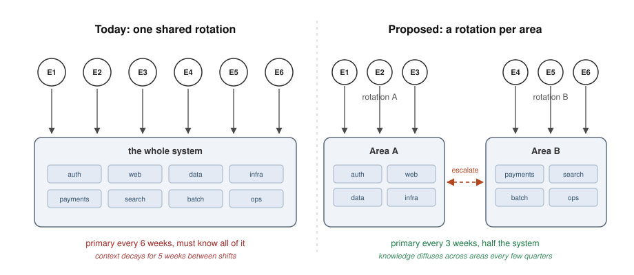

A team of six engineers runs the on-call rotation for an entire system, and the request for more people goes nowhere.
The instinct is to treat this as a hiring problem and wait for management to fix it.
**Hiring is the slowest and least controllable lever you have, so the rotation has to get lighter first, and the case for headcount has to become a business case instead of a complaint.**
Here is what I would do in that position, in order.

## The Rotation Is a Relearning Machine

Start with the arithmetic of a six-person rotation.
Each engineer is primary once every six weeks and secondary once in the same window.
Every primary shift demands enough context to triage, mitigate, and escalate a failure anywhere in the system.
Between shifts, five weeks pass with little reason to touch the parts of the code you only see when they break.
Memory of unfamiliar subsystems decays in days, not months, so by the time your shift arrives you are substantially relearning the system.

**When every shift requires remembering everything and the gaps between shifts let the memory rot, you have not designed a rotation, you have designed a scheduled relearning exercise.**

The [Google SRE book, "Being On-Call"](https://sre.google/sre-book/being-on-call/) states the standard explicitly: an on-call engineer should feel capable of swift, effective action, and high page load or long post-shift recovery is treated as a defect of the system design, not of the person.
The [SRE Workbook's on-call chapter](https://sre.google/workbook/on-call/) makes the same point operationally: burden has to be balanced, or the rotation quietly converts engineers into ex-engineers.
A six-person full-system rotation where nobody feels capable of acting is not a staffing failure yet, it is a design failure.

## Count the Pain Before You Name the Cure

Instrument the pain first, because adjectives do not move management and you need the numbers for the later steps anyway.
Export four weeks of paging data and compute a handful of numbers:

- Pages per shift, split by primary and secondary, and by day versus night.
- The actionable ratio: the fraction of pages that required genuine human judgment rather than a restart, a throttle bump, or an acknowledgment and nothing.
- Time to mitigate, and specifically how long it took the responder to have enough context to act at all.
- Repeat incidents: the same failure mode paging more than once.
- Re-entry ramp: how long it took each engineer to be fully productive on their normal work after coming off a shift.

Most teams that run this exercise discover that half or more of their pages were noise, and that the re-entry ramp after every shift costs a day or more of productive work per engineer.
**You cannot make a rotation lighter if you cannot say what it currently weighs.**

## Shrink the Load the System Puts on People

With the data in hand, reduce what pages and what a page demands.

Apply the alerting standard from the [SRE Workbook's "Alerting on SLOs"](https://sre.google/workbook/alerting-on-slos/): a page is for a user-visible symptom that needs human judgment right now.
Everything else becomes a ticket, a dashboard entry, or nothing.
The alert that fires twice a week and is always dismissed is not information, it is an alarm nobody heeds, and it is eroding the reflex you need at 3 a.m.

For the pages that survive, write runbooks so the responder can act without tribal knowledge.
A page with a runbook is a procedure, and a procedure survives the five-week memory gap.
A page without one is a puzzle, and puzzles are what burn people out at night.
The [PagerDuty Incident Response guide's "Being On-Call"](https://response.pagerduty.com/oncall/being_oncall/) chapter treats runbooks and escalation paths as core equipment of the on-call, not nice-to-haves.

Then standardize the machinery behind the alerts: one deployment path, one logging format, one dashboard layout per service.
**Most of the weight of on-call is not the size of the system, it is the size of the system minus what is written down.**
You do not control headcount this quarter, but you control this, and it compounds.

## Split the Territory Instead of Stretching the People

If six people cannot hold the whole system, stop asking six people to hold the whole system.
Partition ownership into two or three areas, by product surface or by subsystem, and rotate on-call within an area.
The primary for another area becomes the escalation target when a page turns out to cross boundaries, which the incident review will catch and correct.

But there is a trade-off: each area develops less cross coverage than one shared pool.
You mitigate it by pairing the secondary from a neighboring area on big changes, and by rotating engineers between areas every few quarters so knowledge diffuses.

[Team Topologies](https://teamtopologies.com/) makes the underlying principle explicit: team cognitive load is the limit on what a group can own, so territory should be handed out in proportion to absorption capacity.
Six people whose absorption capacity covers half the system are not underperforming, they are correctly reporting the size of the system.

There is a second benefit that matters for the hiring fight: if the system genuinely needs two rotations to be covered safely, you now have the strongest possible evidence for your headcount case, in the org's own vocabulary.

## Escalate as a Business Case, Not a Complaint

Headcount requests die as complaints and survive as cost calculations.
Convert your measured pain into money: incident minutes multiplied by their revenue impact, engineer hours spent on re-entry ramps, and the replacement cost of an engineer who leaves, which [Gallup puts at half to two times annual salary](https://www.gallup.com/workplace/247391/fixable-problem-costs-businesses-trillion.aspx).
Attrition is the number that lands, because a burned-out on-call engineer does not just handle pages badly, they take their context with them when they quit.

Then present the ask as a trade-off management has to accept in writing, not a favor it has to grant.
With current staffing, one of three things happens: the team accepts a higher incident risk, the team accepts reduced coverage or slowed delivery, or the team gets help.
**If management reads that page and still does nothing, the pain has been priced and accepted, and you should operate knowing that.**

Operate knowing it means this: keep doing the work you unilaterally control, the alert pruning, the runbooks, the territory split, and decide for yourself how long the residual risk is worth absorbing with your own nights.

## What to Do Next

- Export four weeks of paging data and compute the actionable ratio and re-entry cost.
- Delete or downgrade every alert that is not a user-visible symptom needing judgment now.
- Write a runbook for each of the top five recurring pages.
- Propose two or three ownership areas with a rotation per area, and run it as an experiment for one cycle.
- Put the one-page business case in front of management with an explicit accept-or-fix decision requested.

Headcount may well be the right answer eventually, but a rotation you made lighter and a case you made undeniable are the only two things you control this quarter.

## See also

- [Code Factories: The RollerCoaster Tycoon Perspective](../code-factories-rollercoaster-tycoon/index.md) - the patrol zone framing of giving an on-call engineer too many services to cover.
- [The Codebase Gardener](../the-codebase-gardener/index.md) - why trying to personally hold every line is the fastest route to burnout.

## References

- [Google SRE Book, "Being On-Call"](https://sre.google/sre-book/being-on-call/) - the standard that on-call quality is a designed property, including page load limits and post-shift recovery.
- [Google SRE Workbook, "On-Call"](https://sre.google/workbook/on-call/) - operational guidance on balancing on-call burden across a team.
- [Google SRE Workbook, "Alerting on SLOs"](https://sre.google/workbook/alerting-on-slos/) - the criteria for what deserves a page versus a ticket.
- [PagerDuty Incident Response, "Being On-Call"](https://response.pagerduty.com/oncall/being_oncall/) - runbooks, escalation paths, and preparation as core on-call equipment.
- [Skelton and Pais, "Team Topologies"](https://teamtopologies.com/) - team cognitive load as the limit on how much territory a team can own.
- [Gallup, "This Fixable Problem Costs U.S. Businesses $1 Trillion"](https://www.gallup.com/workplace/247391/fixable-problem-costs-businesses-trillion.aspx) - the half to two times salary figure for replacing an employee.
