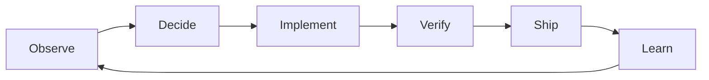

"Zero touch" has been a goal in software-adjacent fields for over a decade.
Networks provision themselves, deployments ship on green, and operations teams have been shrinking toward a vanishing point.
**The one stage that resisted zero touch was the engineering itself: deciding what to build, writing it, and deciding it is good enough to ship.**
That is the part LLM agents are now closing.

Zero Touch Engineering (ZTE): a change travels from an observed signal to a deployed fix with no human keystroke, no human review, and no human approval in the path.
It has a clear lineage in networking and operations, and that lineage tells you exactly why software engineering was the last holdout, and what it takes to close the gap.

## Where "zero touch" already lives

The phrase has a precise home, and it is not software development.

**Zero-touch provisioning (ZTP)** remotely configures network devices, switches, routers, access points, with no per-device manual setup, standardized by the IETF as Secure ZTP in [RFC 8572](https://datatracker.ietf.org/doc/rfc8572/).
Plug a device in, it fetches its configuration, authenticates, and joins the network on its own ([Wikipedia, "Zero-touch provisioning"](https://en.wikipedia.org/wiki/Zero-touch_provisioning)).

The telecom world generalized this into [ETSI's Zero-touch network and Service Management (ZSM)](https://www.etsi.org/committee/zsm), a standards group formed in 2017 with the explicit goal of "100% automation" of operational processes, now actively working on closed-loop, AI-agent-driven architectures.

Closer to software, two more ideas occupy the same ground.
[NoOps](https://www.techtarget.com/searchitoperations/definition/NoOps), coined by Forrester in 2011, is the vision that IT operations becomes so automated that developers never need to talk to an operations engineer again.
[Continuous deployment](https://en.wikipedia.org/wiki/Continuous_deployment) removes the last human gate from delivery: every change that passes its checks goes to production, automatically.

Notice what these four have in common.
Every one of them automates a stage that is deterministic.
Given a desired state and an event, the correct action is fully specified.
Provision this device.
Deploy this artifact.
Page this on-call.
There is no judgment left to encode, because the procedure was already mechanical, we just had humans performing it.

That is exactly why none of them touched engineering.
**Engineering is the stage that is not deterministic.**
Deciding what to work on, judging whether a change is worth shipping, choosing between two reasonable designs, these are judgments, not procedures.
You cannot automate a judgment you cannot first write down.

## What "zero touch" actually requires

Most discussion of AI in software focuses on the wrong stage.
It focuses on the agent writing code.
That is the easy part, and it was never the part that made a process touchless.

A touchless process is a closed loop.

Every stage must run without a human, and the output of the last stage must feed the first.
Continuous deployment automates Ship.
NoOps automates the runtime half of Observe and Learn.
ZTP automates a specific kind of Implement.
**ZTE is what you call it when the entire loop closes, including Decide, the stage that requires judgment.**

The agent writing the code is one sixth of the loop.
If you automate Implement and leave a human approving the result, you have an efficient assistant, not zero touch engineering.
The "zero touch" claim only becomes true when a bug report can become a production fix with no human at the gate, and when the system decides for itself that the fix is worth shipping.

## Why engineering was the holdout

The reason ZTE lagged ZTP by a decade is not that writing code was hard.
Writing code was always the most automatable part of engineering, which is why templates, code generation, and scaffolding existed long before LLMs.

The holdout was Decide.

Deciding what to work on is a sequence of judgments: which problems are worth solving, which are urgent, which should be declined, which need an architectural change versus an incremental fix.
As I argued in [The Shifting Bottleneck](../the-shifting-bottleneck/index.md), every time AI removes a constraint at one stage, the next constraint appears one level higher up the decision chain.
Producing code dissolved into verification.
Verification dissolved into deciding what to implement.
Deciding what to implement dissolved into deciding what to build.

The bottleneck climbed until it landed on the one thing that could not be mechanized: judgment about direction.
That is the gate ZTE has to remove, and removing it is qualitatively different from removing a deploy button.
A deploy button is a procedure.
Direction is taste, context, and tradeoff.

So ZTE is not a tool you install.
**It is a measure of how much of your engineering judgment you have managed to make explicit.**

## ZTE is proportional to encoded judgment

This gives a useful test for how close a team or project is to zero touch engineering.
Measure how much of the decision loop is encoded versus sitting in someone's head.

The projects closest to ZTE encode five things, the same five I described in [The Self-Evolving Repository](../the-self-evolving-repository/index.md), because that article was about ZTE without using the word.

**A machine-readable roadmap** that lets the system distinguish work that matters from work that does not.
Most triage decisions are not subtle architecture calls.
They are straightforward: this bug affects users, fix it; this request is out of scope, decline it; this dependency has a vulnerability, patch it.
If those decisions are written down, the system can make them.

**A verification pipeline** that replaces human review with multiple independent layers: tests, static analysis, property tests, mutation tests, scenario validation, adversarial probing.
Human review of agent-written code is the lowest-leverage activity in the loop, as I argued in [Rethinking Code Review in the Age of LLMs](../rethinking-code-review-in-the-age-of-llms/index.md).
You do not trust the code, you trust the verification system.

**A decision policy** that ranks competing work the way a competent maintainer would.

**Guardrails** that bound the blast radius: budget limits, rollback on regression, escalation when a fix loop appears.

**A learning loop** that turns every failed change into a future constraint.

When all five are in place, the loop closes and the process is touchless.
When any one is missing, a human has to step back in at that gap.
The degree of zero touch is exactly the degree of encoded judgment, nothing more.

## Where the human re-enters

A fully closed loop still has a leak, and the leak is direction.

A ZTE system that only reacts to observable signals will optimize for whatever those signals measure.
Bug reports as the only signal produces a system excellent at fixing bugs and terrible at anything else.
Feature requests as the only signal produces a system that accumulates features and loses coherence.
This is Goodhart's law applied to engineering: when a signal becomes the target of an autonomous system, it stops being a good signal.

The roadmap is what counteracts the drift, but the roadmap itself goes stale.
User needs shift, the ecosystem moves, a roadmap written in January can be wrong by July.
**Updating the roadmap means making a judgment about what the project should become, and that judgment is the one thing current models can approximate but not fully replicate.**

The pragmatic answer is not to solve this perfectly but to bound it.
Let the system make small direction adjustments based on observed signals.
Require large directional changes to pass through a human.
This keeps the loop touchless for the vast majority of decisions while preserving human oversight for the small fraction that set long-term trajectory.

The human in a ZTE system does not write code, review changes, or approve deploys.
The human authors the system that does all of those things, and intervenes only when the system's judgment and the project's direction diverge.
That is a different job from the one most engineers have today, but it is the job ZTE leaves behind.

## The real question

The networking world reached zero touch because the stages it automated were procedures.
ZTE is the claim that the remaining stages, the judgment stages, can be made procedural enough to automate too.

That claim is only partly true.
You can encode most engineering judgment, enough to close the loop for routine work.
You cannot encode all of it, and the part you cannot encode is exactly the part that determines whether the project moves in a direction worth moving.

**Zero touch engineering is not about removing humans from writing code.
It is about discovering, precisely, which of your judgments were ever more than procedure, and which were just procedure you had not bothered to write down yet.**

## See also

- [The Self-Evolving Repository](../the-self-evolving-repository/index.md) - the end-state ZTE describes, explored as a GitHub project running every maintainer function on an automated loop
- [The Shifting Bottleneck](../the-shifting-bottleneck/index.md) - why the constraint climbs toward judgment as each lower stage is automated
- [Scaling the LLM Agent Company](../scaling-the-llm-agent-company/index.md) - what changes when the entire workforce, not just the pipeline, is automated agents
- [Rethinking Code Review in the Age of LLMs](../rethinking-code-review-in-the-age-of-llms/index.md) - why human review is the gate ZTE has to remove, and how verification replaces it
- [The Future of Code Review](../the-future-of-code-review/index.md) - the verification-system-over-human-trust framing ZTE depends on
- [llm-augmented-workflows](../llm-augmented-workflows/index.md) - a concrete engine for closing the observe-to-ship loop on GitHub

## References

- [Wikipedia, "Zero-touch provisioning"](https://en.wikipedia.org/wiki/Zero-touch_provisioning) - the networking origin of "zero touch", including ZTP and the ETSI ZSM lineage
- [IETF RFC 8572, Secure Zero Touch Provisioning (SZTP)](https://datatracker.ietf.org/doc/rfc8572/) - the IETF standard showing "zero touch" as an established, standardized concept
- [ETSI, Zero-touch network and Service Management (ZSM)](https://www.etsi.org/committee/zsm) - the standards body owning "zero touch", now working on closed-loop, agent-driven automation
- [TechTarget, "NoOps"](https://www.techtarget.com/searchitoperations/definition/NoOps) - the Forrester-coined vision of fully automated operations, the prior art ZTE extends from ops into engineering
- [Wikipedia, "Continuous deployment"](https://en.wikipedia.org/wiki/Continuous_deployment) - the established zero-touch last mile of delivery that ZTE carries backward through review and authoring
- [Wikipedia, "Autonomic computing"](https://en.wikipedia.org/wiki/Autonomic_computing) - IBM's self-managing systems vision, the intellectual ancestor of the closed-loop ZTE depends on
